## **STEP1 数据预处理和分析**

### <span style="color:deepskyblue">**1.数据预处理(扩样+划分训练集和验证集)**


```python
import pandas as pd
import numpy as np
import matplotlib.pyplot as plt 
import seaborn as sns
from sklearn.preprocessing import OneHotEncoder, StandardScaler
from sklearn.compose import ColumnTransformer
from sklearn.model_selection import train_test_split
```


```python
#导入数据与所有初步的数据处理都保存在原始表df0，此后所有的分析都是从这个表中抽取数据
df0 = pd.read_csv(r'C:\Users\HONOR\Desktop\统计建模比赛\csv\tripv2pub.csv')
#我们初步对出行方式做了分类，TRPTRANS值落入“pubgroup”数组的是小组认为的公共交通，ISPUB值为1；其他小组认为并非公共交通，ISPUB值为0
pubgroup=[8,9,11,12,15,16,17,18,20,22]
df0['ISPUB']=df0['TRPTRANS'].apply(lambda x:1 if x in pubgroup else 0)
df0['AVPUB']=1
df0['AVXPUB']=1

def clean_data(df1):

    df1 = df1[df1['DRIVER'] != -1]
    df1 = df1[df1['TRIPPURP'] != -9]
    df1 = df1[df1['TRPMILES'] != -9]
    df1 = df1[df1['TDWKND'] != -9]
    df1 = df1[df1['WORKER'] != -1]
    return df1
df0 = clean_data(df0)
# 挑选出所有所需的列名，保存至组“selected_columns”中
selected_columns = ['ISPUB','PUBTRANS','WTTRDFIN','WTTRDFIN5D','WTTRDFIN2D','WORKER', 'WALK', 'URBRUR', 'TRPMILES', 'TRIPPURP', 'TDWKND', 'R_AGE', 'DRIVER','HHFAMINC_IMP','AVPUB','AVXPUB',
                    'NUMONTRP','GASPRICE','RAIL','DRVRCNT','HHVEHCNT','HHSIZE']

# 调用函数clean_df_totest清理原始表df0
df0 = clean_data(df0)
df0 = df0[selected_columns]

df0['PUBTRANS']=df0['PUBTRANS'].apply(lambda x:1 if x==1 else 0)
df0['RAIL']=df0['RAIL'].apply(lambda x:1 if x==1 else 0)
df0['DRIVER']=df0['DRIVER'].apply(lambda x:1 if x==1 else 0)
df0['WORKER']=df0['WORKER'].apply(lambda x:1 if x==1 else 0)
df0['URBRUR']=df0['URBRUR'].apply(lambda x:1 if x==1 else 0)
df0['TDWKND']=df0['TDWKND'].apply(lambda x:1 if x==1 else 0)

```


```python
df0['frequency']=(1.20878e-07 * df0['WTTRDFIN']).astype(int)
df0['frequency'] = df0['frequency'].apply(lambda x: 1 if x < 1 else x)
df0
```


```python
# 扩样
df_replicated = df0.loc[np.repeat(df0.index.values, df0['frequency'])]
df_rep0=df_replicated

df_rep0.to_csv('data_whole.csv', index=False) # 洗过、扩样过的，还未分训练集和测试集的数据

# 分类变量和连续变量
categorical_features = ['WORKER', 'URBRUR', 'TRIPPURP', 'TDWKND', 'DRIVER', 'RAIL', 'AVPUB', 'AVXPUB']
numeric_features = ['WALK', 'TRPMILES', 'HHFAMINC_IMP', 'NUMONTRP', 'GASPRICE', 'DRVRCNT', 'HHVEHCNT', 'HHSIZE','R_AGE']

# 划分训练集和测试集
X_train, X_test, y_train, y_test = train_test_split(df_rep0[categorical_features + numeric_features], df_rep0['PUBTRANS'].values, test_size=0.2, random_state=42, shuffle=True)

# 将y_train添加到X_train df_totestFrame中作为一列
X_train['PUBTRANS'] = y_train
X_test['PUBTRANS'] = y_test

# 输出CSV文件
X_train.to_csv('data_train.csv', index=False)
X_test.to_csv('data_test.csv', index=False)
```

### <span style="color:deepskyblue">**2. 数据探索**


```python
# 变量关联发掘(对于df1)
categorical_features = ['WORKER', 'URBRUR', 'TRIPPURP', 'TDWKND', 'DRIVER', 'RAIL']
numeric_features = ['WALK', 'TRPMILES', 'HHFAMINC_IMP', 'NUMONTRP', 'GASPRICE', 'DRVRCNT', 'HHVEHCNT', 'HHSIZE','R_AGE']
y_feature=['PUBTRANS']
selected_columns=numeric_features+categorical_features+y_feature

df1 = df_rep0[selected_columns]

#由于数据集包含了分类变量和连续变量，所以我们可以使用Kendall's Tau相关系数来计算相关性。
# 计算Kendall's Tau相关系数
corr = df1.corr(method='kendall')

# 创建一个热力图
plt.figure(figsize=(12, 10))
sns.heatmap(corr, annot=True, fmt=".2f", cmap='coolwarm', cbar=True, square=True)
plt.xticks(rotation=45)  # 旋转x轴标签
plt.yticks(rotation=45)  # 旋转y轴标签
plt.show()
```

## **STEP2 离散选择模型-logit & probit**

### <span style="color:deepskyblue">**0. 数据导入**


```python
import pandas as pd
import numpy as np
import matplotlib.pyplot as plt 
import biogeme.biogeme as bio
import biogeme.results as res
from biogeme import models
import biogeme.database as db
import biogeme.version as ver
from biogeme.expressions import Variable
from biogeme.expressions import Beta
import seaborn as sns
from sklearn.metrics import accuracy_score, recall_score, precision_score, f1_score, roc_auc_score, confusion_matrix
from biogeme.expressions import bioNormalCdf, log, Elem
```


```python

def build(df0, positive_features, negative_features, model_type, model_name):
    # 建立数据库
    database = db.Database('data', df0)
    globals().update(database.variables)

    ASC = Beta('ASC', 0, None, None, 0) 

    # positive features
    positive_betas = {f"B_{feature}": Beta(f"B_{feature}", 0, None, None, 0) for feature in positive_features}

    # negative features
    negative_betas = {f"B_{feature}": Beta(f"B_{feature}", 0, None, None, 0) for feature in negative_features}

    V1 = ASC + sum([positive_betas[f"B_{feature}"]*globals()[feature] for feature in positive_features])
    V2 = sum([negative_betas[f"B_{feature}"]*globals()[feature] for feature in negative_features])

    av = {1: AVPUB, 0: AVXPUB}
    V = {1: V1, 0: V2}

    if model_type == 'logit':
        logprob = models.loglogit(V, av, PUBTRANS)
    elif model_type == 'probit':
        P = {1: bioNormalCdf(V1-V2),
             0: bioNormalCdf(V2-V1)}
        logprob = log(Elem(P, PUBTRANS))
    else:
        raise ValueError("Invalid model type. Choose either 'logit' or 'probit'.")

    biogeme = bio.BIOGEME(database, logprob)
    biogeme.modelName = model_name
    results = biogeme.estimate()
    print(results)
    return results

def calculate_metrics(y_test, y_pred):
    accuracy = accuracy_score(y_test, y_pred)
    recall = recall_score(y_test, y_pred)
    precision = precision_score(y_test, y_pred)
    f1 = f1_score(y_test, y_pred)
    roc_auc = roc_auc_score(y_test, y_pred)
    cm = confusion_matrix(y_test, y_pred)

    print(f"Accuracy: {accuracy}")
    print(f"Recall: {recall}")
    print(f"Precision: {precision}")
    print(f"F1 Score: {f1}")
    print(f"ROC AUC Score: {roc_auc}")
    
    # 绘制混淆矩阵的热力图
    plt.figure(figsize=(10, 7))
    sns.heatmap(cm, annot=True, fmt='d', cmap='Blues')
    plt.xlabel('Predicted')
    plt.ylabel('True')
    plt.show()

def softmax(x):
    e_x = np.exp(x-np.max(x))
    return e_x / e_x.sum(axis=0)

def eval(beta_values, positive_features, negative_features,df_totest):
    
    # 从模型结果中获取参数值
    ASC = beta_values['ASC']
    positive_betas = {f"B_{feature}": beta_values[f"B_{feature}"] for feature in positive_features}
    negative_betas = {f"B_{feature}": beta_values[f"B_{feature}"] for feature in negative_features}

    # 计算V1和V2
    df_totest['V1'] = ASC + sum([positive_betas[f"B_{feature}"] * df_totest[feature] for feature in positive_features])
    df_totest['V2'] = sum([negative_betas[f"B_{feature}"] * df_totest[feature] for feature in negative_features])

    # 计算概率
    df_totest[['p1', 'p2']] = df_totest.apply(lambda row: softmax([row['V1'], row['V2']]), axis=1, result_type='expand')

    # 进行选择
    df_totest['choice'] = np.where(df_totest['p1'] > df_totest['p2'], 1, 0)

    # 评估
    return calculate_metrics(df_totest['PUBTRANS'], df_totest['choice'])
```


```python
# 全部的基本features（没有经过变换）
#positive_features = ['TRPMILES', 'GASPRICE', 'URBRUR', 'RAIL']
#negative_features = ['WORKER','TRIPPURP','TDWKND','DRIVER','WALK','HHFAMINC_IMP',
#                    'NUMONTRP', 'DRVRCNT', 'HHVEHCNT', 'HHSIZE','R_AGE']
```

### <span style="color:deepskyblue">**1. 基础模型**


```python
#探索性 logit

#（1）选指标
#（如果要做指标变换，请对训练集和测试集都进行变换！！，并将其新的列名加入positive_features和negative_features）
positive_features = ['TRPMILES', 'GASPRICE', 'URBRUR', 'TRIPPURP','RAIL']
negative_features = ['WALK','HHFAMINC_IMP','NUMONTRP','DRVRCNT','HHVEHCNT','HHSIZE','R_AGE','WORKER','TDWKND','DRIVER']

#（2）读训练集
df0 = pd.read_csv('data_train.csv')

#（3）建模结果
results=build(df0, positive_features, negative_features, 'logit','logit-discover')

#（4）获取估计参数
parameters=results.getEstimatedParameters()
print(parameters)
beta_values=parameters['Value']
parameters.to_csv('logit-discover-parameters.csv')# 保存参数

#（5）评测
df1=pd.read_csv('data_test.csv')# 读测试集
eval(beta_values, positive_features, negative_features, df1)
df1=pd.read_csv('data_test1.csv')# 读测试集
eval(beta_values, positive_features, negative_features, df1)
df1=pd.read_csv('data_test2.csv')# 读测试集
eval(beta_values, positive_features, negative_features, df1)
df1=pd.read_csv('data_test3.csv')# 读测试集
eval(beta_values, positive_features, negative_features, df1)
df1=pd.read_csv('data_test4.csv')# 读测试集
eval(beta_values, positive_features, negative_features, df1)
df1=pd.read_csv('data_test5.csv')# 读测试集
eval(beta_values, positive_features, negative_features, df1)
```

    File biogeme.toml has been created
    

    
    Results for model logit-discover
    Output file (HTML):			logit-discover.html
    Nbr of parameters:		16
    Sample size:			27448
    Excluded data:			0
    Init log likelihood:		-19025.5
    Final log likelihood:		-1166.541
    Likelihood ratio test (init):		35717.93
    Rho square (init):			0.939
    Rho bar square (init):			0.938
    Akaike Information Criterion:	2365.082
    Bayesian Information Criterion:	2496.603
    Final gradient norm:		0.05410666
    ASC            : -4.17[0.544 -7.67 1.67e-14][0.522 -7.99 1.33e-15]
    B_DRIVER       : 1.66[0.177 9.37 0][0.175 9.48 0]
    B_DRVRCNT      : -0.615[0.114 -5.39 6.87e-08][0.114 -5.38 7.5e-08]
    B_GASPRICE     : 0.00482[0.000889 5.42 5.85e-08][0.0008 6.03 1.68e-09]
    B_HHFAMINC_IMP : 0.106[0.0237 4.45 8.62e-06][0.0254 4.16 3.17e-05]
    B_HHSIZE       : 0.094[0.0485 1.94 0.0524][0.0502 1.87 0.0609]
    B_HHVEHCNT     : 1.6[0.108 14.9 0][0.116 13.8 0]
    B_NUMONTRP     : -0.0172[0.00876 -1.96 0.0502][0.0106 -1.62 0.106]
    B_RAIL         : 1.35[0.133 10.1 0][0.131 10.3 0]
    B_R_AGE        : 0.00273[0.00389 0.702 0.483][0.00398 0.686 0.493]
    B_TDWKND       : 1.26[0.174 7.25 4.04e-13][0.188 6.73 1.74e-11]
    B_TRIPPURP     : -0.0105[0.0418 -0.252 0.801][0.0438 -0.241 0.81]
    B_TRPMILES     : 0.000309[0.000812 0.38 0.704][0.000303 1.02 0.308]
    B_URBRUR       : 0.174[0.279 0.622 0.534][0.292 0.595 0.552]
    B_WALK         : 0.189[0.013 14.5 0][0.0119 15.8 0]
    B_WORKER       : -0.693[0.145 -4.8 1.62e-06][0.155 -4.47 7.81e-06]
    ('B_DRIVER', 'ASC'):	-0.00393	-0.0408	10.1	0	-0.00397	-0.0434	10.5	0
    ('B_DRVRCNT', 'ASC'):	0.0055	0.0887	6.52	7.02e-11	0.00654	0.109	6.81	9.75e-12
    ('B_DRVRCNT', 'B_DRIVER'):	-0.0125	-0.619	-8.63	0	-0.0112	-0.561	-8.84	0
    ('B_GASPRICE', 'ASC'):	-0.000329	-0.681	7.67	1.67e-14	-0.000265	-0.633	7.99	1.33e-15
    ('B_GASPRICE', 'B_DRIVER'):	1.57e-05	0.0996	-9.35	0	1.22e-05	0.0869	-9.45	0
    ('B_GASPRICE', 'B_DRVRCNT'):	-9.48e-06	-0.0934	5.43	5.55e-08	-1.09e-06	-0.012	5.42	5.95e-08
    ('B_HHFAMINC_IMP', 'ASC'):	0.000139	0.0108	7.86	3.77e-15	-0.00166	-0.125	8.13	4.44e-16
    ('B_HHFAMINC_IMP', 'B_DRIVER'):	0.000242	0.0576	-8.76	0	0.00063	0.142	-8.96	0
    ('B_HHFAMINC_IMP', 'B_DRVRCNT'):	-0.000502	-0.185	5.97	2.36e-09	-0.000558	-0.192	5.92	3.3e-09
    ('B_HHFAMINC_IMP', 'B_GASPRICE'):	1.06e-06	0.0505	4.25	2.13e-05	9.23e-07	0.0455	3.97	7.06e-05
    ('B_HHSIZE', 'ASC'):	0.00642	0.244	7.99	1.33e-15	0.00678	0.259	8.34	0
    ('B_HHSIZE', 'B_DRIVER'):	0.00332	0.386	-9.51	0	0.00326	0.371	-9.59	0
    ('B_HHSIZE', 'B_DRVRCNT'):	-0.00256	-0.463	4.96	7.17e-07	-0.00225	-0.392	5	5.66e-07
    ('B_HHSIZE', 'B_GASPRICE'):	-1.82e-06	-0.0421	1.84	0.0659	-2.65e-06	-0.0659	1.78	0.0757
    ('B_HHSIZE', 'B_HHFAMINC_IMP'):	0.000158	0.138	-0.225	0.822	0.000254	0.2	-0.223	0.824
    ('B_HHVEHCNT', 'ASC'):	-0.0058	-0.0991	10.2	0	-0.00641	-0.106	10.6	0
    ('B_HHVEHCNT', 'B_DRIVER'):	0.00215	0.112	-0.296	0.767	-8.8e-05	-0.00433	-0.277	0.782
    ('B_HHVEHCNT', 'B_DRVRCNT'):	-0.0066	-0.537	11.4	0	-0.00583	-0.44	11.3	0
    ('B_HHVEHCNT', 'B_GASPRICE'):	1.16e-05	0.121	14.8	0	9.61e-06	0.104	13.8	0
    ('B_HHVEHCNT', 'B_HHFAMINC_IMP'):	-0.000514	-0.201	13	0	-0.000659	-0.224	12.1	0
    ('B_HHVEHCNT', 'B_HHSIZE'):	-4.02e-05	-0.00769	12.7	0	-0.00102	-0.176	11.2	0
    ('B_NUMONTRP', 'ASC'):	0.000338	0.071	7.65	2e-14	0.000395	0.0714	7.97	1.55e-15
    ('B_NUMONTRP', 'B_DRIVER'):	6.65e-06	0.00429	-9.46	0	7.28e-05	0.0392	-9.58	0
    ('B_NUMONTRP', 'B_DRVRCNT'):	-6.71e-05	-0.0671	5.2	1.97e-07	-0.000166	-0.137	5.14	2.72e-07
    ('B_NUMONTRP', 'B_GASPRICE'):	-5.6e-07	-0.0718	-2.48	0.0132	-5.27e-07	-0.062	-2.06	0.0398
    ('B_NUMONTRP', 'B_HHFAMINC_IMP'):	-1.08e-05	-0.0518	-4.77	1.82e-06	-1.48e-05	-0.055	-4.38	1.2e-05
    ('B_NUMONTRP', 'B_HHSIZE'):	1.01e-05	0.0238	-2.27	0.0234	1.82e-05	0.0342	-2.18	0.029
    ('B_NUMONTRP', 'B_HHVEHCNT'):	4.89e-05	0.0518	-15	0	0.000102	0.0828	-14	0
    ('B_RAIL', 'ASC'):	0.00289	0.0399	9.96	0	0.00599	0.0873	10.5	0
    ('B_RAIL', 'B_DRIVER'):	-0.000265	-0.0112	-1.39	0.166	-0.000409	-0.0177	-1.4	0.162
    ('B_RAIL', 'B_DRVRCNT'):	-0.000705	-0.0464	11	0	-0.000476	-0.0317	11.1	0
    ('B_RAIL', 'B_GASPRICE'):	-4.57e-06	-0.0385	10.1	0	-1.52e-05	-0.144	10.2	0
    ('B_RAIL', 'B_HHFAMINC_IMP'):	0.00119	0.375	9.86	0	0.00108	0.324	9.92	0
    ('B_RAIL', 'B_HHSIZE'):	-3.35e-05	-0.00518	8.85	0	0.000531	0.0805	9.18	0
    ('B_RAIL', 'B_HHVEHCNT'):	-0.000843	-0.0587	-1.42	0.155	-0.0013	-0.0854	-1.37	0.17
    ('B_RAIL', 'B_NUMONTRP'):	3.77e-05	0.0323	10.3	0	3.48e-06	0.0025	10.4	0
    ('B_R_AGE', 'ASC'):	0.000928	0.439	7.7	1.33e-14	0.00104	0.501	8.02	1.11e-15
    ('B_R_AGE', 'B_DRIVER'):	-0.000159	-0.23	-9.3	0	-0.000162	-0.232	-9.41	0
    ('B_R_AGE', 'B_DRVRCNT'):	8.17e-05	0.184	5.45	5.05e-08	0.000105	0.232	5.44	5.23e-08
    ('B_R_AGE', 'B_GASPRICE'):	-2.75e-07	-0.0795	-0.516	0.606	-1.91e-07	-0.0601	-0.51	0.61
    ('B_R_AGE', 'B_HHFAMINC_IMP'):	-8.07e-06	-0.0875	-4.22	2.46e-05	-1.94e-05	-0.193	-3.89	9.99e-05
    ('B_R_AGE', 'B_HHSIZE'):	3.08e-05	0.164	-1.9	0.0571	4.77e-05	0.239	-1.85	0.0644
    ('B_R_AGE', 'B_HHVEHCNT'):	-5.44e-05	-0.13	-14.8	0	-6.34e-05	-0.137	-13.7	0
    ('B_R_AGE', 'B_NUMONTRP'):	3.16e-07	0.00928	2.08	0.0374	5.6e-07	0.0133	1.76	0.078
    ('B_R_AGE', 'B_RAIL'):	-8.02e-06	-0.0155	-10.1	0	-8.73e-06	-0.0167	-10.2	0
    ('B_TDWKND', 'ASC'):	-0.0025	-0.0264	9.45	0	-0.0133	-0.136	9.4	0
    ('B_TDWKND', 'B_DRIVER'):	0.0022	0.0711	-1.66	0.0977	0.00349	0.106	-1.63	0.103
    ('B_TDWKND', 'B_DRVRCNT'):	-0.00236	-0.119	8.57	0	-0.00461	-0.215	7.83	4.88e-15
    ('B_TDWKND', 'B_GASPRICE'):	1.32e-05	0.0852	7.23	4.85e-13	2.28e-05	0.152	6.7	2.02e-11
    ('B_TDWKND', 'B_HHFAMINC_IMP'):	-0.000132	-0.032	6.56	5.39e-11	0.000353	0.0741	6.17	6.82e-10
    ('B_TDWKND', 'B_HHSIZE'):	0.000982	0.116	6.67	2.52e-11	0.00176	0.186	6.32	2.7e-10
    ('B_TDWKND', 'B_HHVEHCNT'):	0.00256	0.136	-1.76	0.0779	0.00307	0.141	-1.64	0.101
    ('B_TDWKND', 'B_NUMONTRP'):	4.5e-05	0.0295	7.35	1.92e-13	5.34e-05	0.0268	6.82	9.29e-12
    ('B_TDWKND', 'B_RAIL'):	-0.000423	-0.0182	-0.396	0.692	0.00195	0.0791	-0.397	0.691
    ('B_TDWKND', 'B_R_AGE'):	-1.03e-06	-0.00152	7.24	4.61e-13	-7.98e-06	-0.0107	6.71	1.96e-11
    ('B_TRIPPURP', 'ASC'):	-0.00562	-0.248	7.49	6.79e-14	-0.00576	-0.252	7.78	7.33e-15
    ('B_TRIPPURP', 'B_DRIVER'):	0.000696	0.0941	-9.38	0	0.00118	0.154	-9.61	0
    ('B_TRIPPURP', 'B_DRVRCNT'):	-0.000598	-0.126	4.79	1.68e-06	-0.00136	-0.272	4.54	5.56e-06
    ('B_TRIPPURP', 'B_GASPRICE'):	-1.44e-06	-0.0389	-0.368	0.713	-1.17e-06	-0.0335	-0.351	0.726
    ('B_TRIPPURP', 'B_HHFAMINC_IMP'):	3.9e-05	0.0393	-2.46	0.0139	0.00015	0.135	-2.44	0.0146
    ('B_TRIPPURP', 'B_HHSIZE'):	0.000176	0.0867	-1.71	0.0873	0.000342	0.156	-1.71	0.0876
    ('B_TRIPPURP', 'B_HHVEHCNT'):	0.000366	0.0814	-14.4	0	0.000106	0.0209	-13.1	0
    ('B_TRIPPURP', 'B_NUMONTRP'):	2.78e-05	0.0759	0.157	0.875	4.65e-05	0.1	0.15	0.881
    ('B_TRIPPURP', 'B_RAIL'):	-8.1e-05	-0.0146	-9.71	0	-0.000635	-0.11	-9.52	0
    ('B_TRIPPURP', 'B_R_AGE'):	-1.43e-05	-0.0883	-0.314	0.754	-2.49e-05	-0.143	-0.298	0.766
    ('B_TRIPPURP', 'B_TDWKND'):	0.000169	0.0232	-7.15	8.62e-13	0.000402	0.0489	-6.68	2.42e-11
    ('B_TRPMILES', 'ASC'):	1.02e-05	0.0231	7.67	1.67e-14	-1.4e-06	-0.00886	7.99	1.33e-15
    ('B_TRPMILES', 'B_DRIVER'):	2.68e-06	0.0187	-9.37	0	7.04e-07	0.0133	-9.47	0
    ('B_TRPMILES', 'B_DRVRCNT'):	-3.19e-06	-0.0345	5.4	6.82e-08	-2.96e-06	-0.0854	5.38	7.44e-08
    ('B_TRPMILES', 'B_GASPRICE'):	-1.93e-08	-0.0268	-3.7	0.000215	-3e-09	-0.0124	-5.25	1.49e-07
    ('B_TRPMILES', 'B_HHFAMINC_IMP'):	-1.87e-07	-0.00971	-4.43	9.33e-06	-2.46e-07	-0.032	-4.15	3.38e-05
    ('B_TRPMILES', 'B_HHSIZE'):	-3.63e-07	-0.00921	-1.93	0.0532	-6.21e-07	-0.0409	-1.87	0.0618
    ('B_TRPMILES', 'B_HHVEHCNT'):	7.05e-06	0.0806	-14.9	0	5.69e-06	0.162	-13.8	0
    ('B_TRPMILES', 'B_NUMONTRP'):	1.13e-06	0.159	2.01	0.044	6.12e-07	0.19	1.65	0.098
    ('B_TRPMILES', 'B_RAIL'):	1.72e-06	0.0159	-10.1	0	-1.26e-07	-0.00316	-10.3	0
    ('B_TRPMILES', 'B_R_AGE'):	2.38e-08	0.00753	-0.611	0.541	5.53e-09	0.00458	-0.607	0.544
    ('B_TRPMILES', 'B_TDWKND'):	1.24e-06	0.00878	-7.25	4.09e-13	1.23e-06	0.0217	-6.72	1.76e-11
    ('B_TRPMILES', 'B_TRIPPURP'):	-1.77e-06	-0.0522	0.26	0.795	-1.95e-06	-0.147	0.248	0.804
    ('B_URBRUR', 'ASC'):	-0.0677	-0.446	6.09	1.11e-09	-0.0731	-0.479	6.12	9.27e-10
    ('B_URBRUR', 'B_DRIVER'):	-0.000898	-0.0182	-4.46	8.26e-06	0.000965	0.0189	-4.4	1.06e-05
    ('B_URBRUR', 'B_DRVRCNT'):	-5.79e-05	-0.00182	2.61	0.00895	-0.000343	-0.0103	2.51	0.0121
    ('B_URBRUR', 'B_GASPRICE'):	-6.06e-06	-0.0244	0.604	0.546	9.66e-06	0.0413	0.578	0.563
    ('B_URBRUR', 'B_HHFAMINC_IMP'):	0.000109	0.0165	0.243	0.808	0.00177	0.239	0.237	0.812
    ('B_URBRUR', 'B_HHSIZE'):	0.000622	0.046	0.283	0.777	0.00135	0.092	0.273	0.785
    ('B_URBRUR', 'B_HHVEHCNT'):	-0.00214	-0.071	-4.66	3.14e-06	-0.000241	-0.00713	-4.54	5.7e-06
    ('B_URBRUR', 'B_NUMONTRP'):	-0.000109	-0.0446	0.682	0.495	-0.000118	-0.0381	0.652	0.514
    ('B_URBRUR', 'B_RAIL'):	-0.00791	-0.213	-3.53	0.000422	-0.00303	-0.079	-3.57	0.000351
    ('B_URBRUR', 'B_R_AGE'):	-8.08e-06	-0.00744	0.612	0.541	-5.79e-05	-0.0498	0.585	0.559
    ('B_URBRUR', 'B_TDWKND'):	0.00116	0.0239	-3.35	0.000814	0.00901	0.164	-3.41	0.000661
    ('B_URBRUR', 'B_TRIPPURP'):	0.000464	0.0398	0.656	0.512	-0.000581	-0.0455	0.62	0.535
    ('B_URBRUR', 'B_TRPMILES'):	5.79e-06	0.0255	0.62	0.535	1.45e-05	0.164	0.594	0.553
    ('B_WALK', 'ASC'):	-0.000921	-0.13	7.99	1.33e-15	-0.000847	-0.136	8.32	0
    ('B_WALK', 'B_DRIVER'):	-0.000212	-0.0918	-8.23	2.22e-16	-0.000327	-0.157	-8.29	0
    ('B_WALK', 'B_DRVRCNT'):	0.000107	0.0722	7.06	1.67e-12	0.000133	0.0977	7.06	1.67e-12
    ('B_WALK', 'B_GASPRICE'):	5.97e-07	0.0516	14.1	0	3.82e-07	0.0401	15.4	0
    ('B_WALK', 'B_HHFAMINC_IMP'):	3.51e-05	0.114	3.23	0.00125	5.22e-05	0.173	3.18	0.00146
    ('B_WALK', 'B_HHSIZE'):	-1.17e-05	-0.0185	1.87	0.061	4.35e-05	0.0728	1.86	0.0625
    ('B_WALK', 'B_HHVEHCNT'):	-0.00023	-0.164	-12.8	0	-0.000514	-0.372	-11.7	0
    ('B_WALK', 'B_NUMONTRP'):	3.49e-06	0.0306	13.3	0	3.77e-06	0.0299	13.1	0
    ('B_WALK', 'B_RAIL'):	8.62e-05	0.0497	-8.72	0	0.000134	0.0858	-8.88	0
    ('B_WALK', 'B_R_AGE'):	-3.54e-06	-0.07	13.4	0	-5.35e-06	-0.113	14.3	0
    ('B_WALK', 'B_TDWKND'):	8.91e-06	0.00393	-6.16	7.43e-10	-0.000107	-0.0477	-5.69	1.24e-08
    ('B_WALK', 'B_TRIPPURP'):	-7.84e-05	-0.144	4.38	1.21e-05	2.36e-05	0.0453	4.44	9.06e-06
    ('B_WALK', 'B_TRPMILES'):	-2.23e-07	-0.0212	14.4	0	-4.78e-07	-0.133	15.8	0
    ('B_WALK', 'B_URBRUR'):	-0.000174	-0.0478	0.0534	0.957	-0.00038	-0.11	0.0509	0.959
    ('B_WORKER', 'ASC'):	0.0191	0.242	6.59	4.29e-11	0.0286	0.353	7.11	1.18e-12
    ('B_WORKER', 'B_DRIVER'):	-0.00746	-0.291	-9.08	0	-0.01	-0.368	-8.61	0
    ('B_WORKER', 'B_DRVRCNT'):	0.00332	0.201	-0.472	0.637	0.00364	0.205	-0.452	0.652
    ('B_WORKER', 'B_GASPRICE'):	-5.14e-06	-0.0399	-4.83	1.38e-06	-7.64e-07	-0.00615	-4.5	6.76e-06
    ('B_WORKER', 'B_HHFAMINC_IMP'):	-0.00107	-0.311	-5.2	1.98e-07	-0.00132	-0.336	-4.83	1.36e-06
    ('B_WORKER', 'B_HHSIZE'):	-0.000413	-0.0589	-5.08	3.87e-07	8.01e-05	0.0103	-4.84	1.27e-06
    ('B_WORKER', 'B_HHVEHCNT'):	-0.000644	-0.0414	-12.5	0	-0.000599	-0.0333	-11.7	0
    ('B_WORKER', 'B_NUMONTRP'):	3.99e-05	0.0315	-4.68	2.9e-06	0.000149	0.0905	-4.38	1.21e-05
    ('B_WORKER', 'B_RAIL'):	-0.00115	-0.0596	-10.1	0	-0.000112	-0.00549	-10	0
    ('B_WORKER', 'B_R_AGE'):	0.000159	0.282	-4.85	1.23e-06	0.000222	0.359	-4.53	5.95e-06
    ('B_WORKER', 'B_TDWKND'):	-0.00279	-0.111	-8.21	2.22e-16	-0.00434	-0.149	-7.5	6.24e-14
    ('B_WORKER', 'B_TRIPPURP'):	-0.00142	-0.234	-4.28	1.88e-05	-0.00176	-0.258	-3.98	6.99e-05
    ('B_WORKER', 'B_TRPMILES'):	5.79e-06	0.0494	-4.8	1.59e-06	6.39e-06	0.136	-4.47	7.7e-06
    ('B_WORKER', 'B_URBRUR'):	0.000395	0.00979	-2.77	0.00564	-0.00771	-0.17	-2.46	0.0141
    ('B_WORKER', 'B_WALK'):	-3.53e-05	-0.0188	-6.07	1.31e-09	-2.49e-05	-0.0135	-5.66	1.49e-08
    
                       Value  Rob. Std err  Rob. t-test  Rob. p-value
    ASC            -4.172927      0.522371    -7.988430  1.332268e-15
    B_DRIVER        1.660109      0.175189     9.476106  0.000000e+00
    B_DRVRCNT      -0.615397      0.114413    -5.378756  7.500238e-08
    B_GASPRICE      0.004824      0.000800     6.026062  1.680027e-09
    B_HHFAMINC_IMP  0.105510      0.025359     4.160582  3.174372e-05
    B_HHSIZE        0.094037      0.050169     1.874406  6.087448e-02
    B_HHVEHCNT      1.601801      0.115904    13.820105  0.000000e+00
    B_NUMONTRP     -0.017155      0.010609    -1.616977  1.058832e-01
    B_RAIL          1.351137      0.131445    10.279118  0.000000e+00
    B_R_AGE         0.002731      0.003980     0.686100  4.926500e-01
    B_TDWKND        1.263520      0.187847     6.726324  1.740030e-11
    B_TRIPPURP     -0.010542      0.043781    -0.240785  8.097216e-01
    B_TRPMILES      0.000309      0.000303     1.018485  3.084474e-01
    B_URBRUR        0.173561      0.291851     0.594690  5.520504e-01
    B_WALK          0.188509      0.011899    15.841981  0.000000e+00
    B_WORKER       -0.693443      0.155125    -4.470223  7.813823e-06
    Accuracy: 0.9861576570013114
    Recall: 0.16091954022988506
    Precision: 0.3888888888888889
    F1 Score: 0.22764227642276422
    ROC AUC Score: 0.5788363934915659
    


    

    


    Accuracy: 0.9218241042345277
    Recall: 0.181360201511335
    Precision: 0.8674698795180723
    F1 Score: 0.3
    ROC AUC Score: 0.5892702058569235
    


    

    


    Accuracy: 0.8296675191815857
    Recall: 0.17884130982367757
    Precision: 0.9102564102564102
    F1 Score: 0.29894736842105263
    ROC AUC Score: 0.5871741850787194
    


    

    


    Accuracy: 0.7513227513227513
    Recall: 0.17884130982367757
    Precision: 0.9594594594594594
    F1 Score: 0.30148619957537154
    ROC AUC Score: 0.5878007845014717
    


    
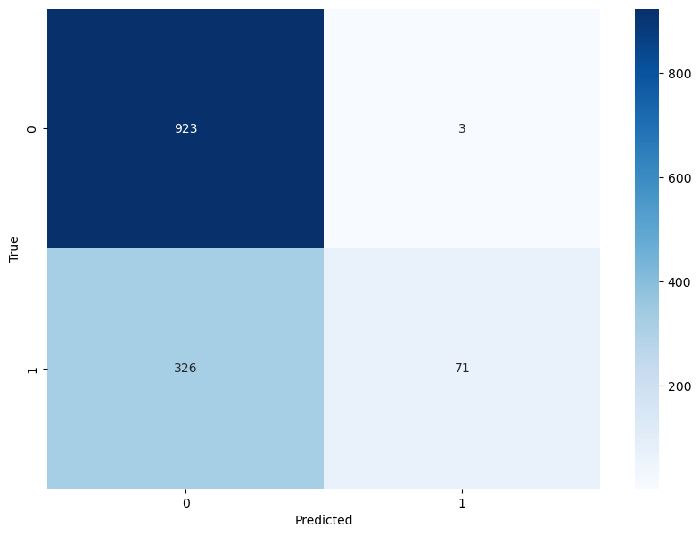
    


    Accuracy: 0.6706948640483383
    Recall: 0.17884130982367757
    Precision: 0.9861111111111112
    F1 Score: 0.302771855010661
    ROC AUC Score: 0.5885817287373422
    


    

    


    Accuracy: 0.5826972010178118
    Recall: 0.17884130982367757
    Precision: 0.9726027397260274
    F1 Score: 0.3021276595744681
    ROC AUC Score: 0.5868499608244352
    


    
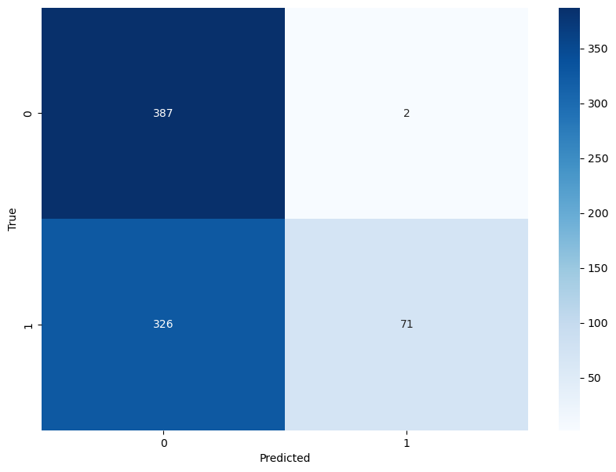
    


```python
#基础模型 logit

#（1）选指标
#（如果要做指标变换，请对训练集和测试集都进行变换！！，并将其新的列名加入positive_features和negative_features）
positive_features = ['GASPRICE',  'RAIL']
negative_features = ['WALK','HHFAMINC_IMP','DRVRCNT','HHVEHCNT','WORKER','TDWKND','DRIVER']

#（2）读训练集
df0 = pd.read_csv('data_train.csv')

#（3）建模（注意类型）
results=build(df0, positive_features, negative_features, 'logit','logit-0')

#（4）获取估计参数
parameters=results.getEstimatedParameters()
beta_values=parameters['Value']
print(parameters)
parameters.to_csv('logit-0-parameters.csv')# 保存估计参数

#（5）评测
df1=pd.read_csv('data_test.csv')# 读测试集
eval(beta_values, positive_features, negative_features, df1)
df1=pd.read_csv('data_test1.csv')# 读测试集
eval(beta_values, positive_features, negative_features, df1)
df1=pd.read_csv('data_test2.csv')# 读测试集
eval(beta_values, positive_features, negative_features, df1)
df1=pd.read_csv('data_test3.csv')# 读测试集
eval(beta_values, positive_features, negative_features, df1)
df1=pd.read_csv('data_test4.csv')# 读测试集
eval(beta_values, positive_features, negative_features, df1)
df1=pd.read_csv('data_test5.csv')# 读测试集
eval(beta_values, positive_features, negative_features, df1)
```

    
    Results for model logit-0
    Output file (HTML):			logit-0.html
    Nbr of parameters:		10
    Sample size:			27448
    Excluded data:			0
    Init log likelihood:		-19025.5
    Final log likelihood:		-1170.65
    Likelihood ratio test (init):		35709.71
    Rho square (init):			0.938
    Rho bar square (init):			0.938
    Akaike Information Criterion:	2361.299
    Bayesian Information Criterion:	2443.5
    Final gradient norm:		0.001319092
    ASC            : -4.38[0.393 -11.1 0][0.345 -12.7 0]
    B_DRIVER       : 1.55[0.154 10 0][0.151 10.3 0]
    B_DRVRCNT      : -0.536[0.0953 -5.63 1.81e-08][0.0946 -5.67 1.42e-08]
    B_GASPRICE     : 0.00483[0.000882 5.47 4.43e-08][0.000799 6.05 1.47e-09]
    B_HHFAMINC_IMP : 0.0979[0.0233 4.2 2.62e-05][0.0243 4.03 5.69e-05]
    B_HHVEHCNT     : 1.62[0.106 15.3 0][0.114 14.2 0]
    B_RAIL         : 1.37[0.13 10.6 0][0.132 10.4 0]
    B_TDWKND       : 1.23[0.172 7.15 8.97e-13][0.183 6.74 1.6e-11]
    B_WALK         : 0.19[0.0128 14.9 0][0.0119 15.9 0]
    B_WORKER       : -0.695[0.134 -5.18 2.2e-07][0.141 -4.94 7.89e-07]
    ('B_DRIVER', 'ASC'):	-0.00204	-0.0336	13.9	0	0.000263	0.00505	15.8	0
    ('B_DRVRCNT', 'ASC'):	0.00569	0.152	9.85	0	0.00297	0.0911	11	0
    ('B_DRVRCNT', 'B_DRIVER'):	-0.00711	-0.484	-9.61	0	-0.00553	-0.387	-10.1	0
    ('B_GASPRICE', 'ASC'):	-0.000317	-0.914	11.1	0	-0.000241	-0.877	12.7	0
    ('B_GASPRICE', 'B_DRIVER'):	1.36e-05	0.1	-10	0	1.3e-05	0.108	-10.2	0
    ('B_GASPRICE', 'B_DRVRCNT'):	-9.34e-06	-0.111	5.67	1.39e-08	-2.21e-06	-0.0292	5.72	1.07e-08
    ('B_HHFAMINC_IMP', 'ASC'):	0.000383	0.0418	11.4	0	0.000689	0.0821	13	0
    ('B_HHFAMINC_IMP', 'B_DRIVER'):	-0.000139	-0.0387	-9.25	0	-1.65e-07	-4.49e-05	-9.49	0
    ('B_HHFAMINC_IMP', 'B_DRVRCNT'):	-0.000257	-0.116	6.3	2.96e-10	-0.000138	-0.0601	6.4	1.53e-10
    ('B_HHFAMINC_IMP', 'B_GASPRICE'):	1.04e-06	0.0506	4	6.28e-05	1.11e-06	0.0573	3.83	0.000127
    ('B_HHVEHCNT', 'ASC'):	-0.00378	-0.0909	14.4	0	-0.00098	-0.0249	16.4	0
    ('B_HHVEHCNT', 'B_DRIVER'):	0.00115	0.0707	0.395	0.693	-5.12e-05	-0.00297	0.377	0.706
    ('B_HHVEHCNT', 'B_DRVRCNT'):	-0.006	-0.596	12	0	-0.00583	-0.54	11.8	0
    ('B_HHVEHCNT', 'B_GASPRICE'):	1.09e-05	0.117	15.3	0	8.94e-06	0.0982	14.2	0
    ('B_HHVEHCNT', 'B_HHFAMINC_IMP'):	-0.000545	-0.221	13.5	0	-0.000628	-0.227	12.5	0
    ('B_RAIL', 'ASC'):	-0.00393	-0.0768	13.6	0	0.0005	0.011	15.6	0
    ('B_RAIL', 'B_DRIVER'):	-0.000491	-0.0245	-0.86	0.39	-0.00118	-0.0591	-0.851	0.395
    ('B_RAIL', 'B_DRVRCNT'):	-0.000663	-0.0535	11.6	0	1.37e-05	0.0011	11.8	0
    ('B_RAIL', 'B_GASPRICE'):	-4.92e-06	-0.0429	10.5	0	-1.41e-05	-0.134	10.4	0
    ('B_RAIL', 'B_HHFAMINC_IMP'):	0.00118	0.391	10.4	0	0.00119	0.372	10.2	0
    ('B_RAIL', 'B_HHVEHCNT'):	-0.00106	-0.0772	-1.42	0.155	-0.000982	-0.0652	-1.37	0.17
    ('B_TDWKND', 'ASC'):	-0.00327	-0.0483	12.8	0	-0.00798	-0.127	13.7	0
    ('B_TDWKND', 'B_DRIVER'):	0.000538	0.0202	-1.39	0.163	0.000482	0.0175	-1.36	0.174
    ('B_TDWKND', 'B_DRVRCNT'):	-0.00107	-0.065	8.74	0	-0.00234	-0.136	8.15	4.44e-16
    ('B_TDWKND', 'B_GASPRICE'):	1.34e-05	0.0882	7.12	1.07e-12	2.3e-05	0.158	6.72	1.85e-11
    ('B_TDWKND', 'B_HHFAMINC_IMP'):	-0.000197	-0.0492	6.48	9.44e-11	0.000148	0.0333	6.18	6.6e-10
    ('B_TDWKND', 'B_HHVEHCNT'):	0.00239	0.131	-2.06	0.0397	0.00324	0.156	-1.96	0.0505
    ('B_TDWKND', 'B_RAIL'):	-0.000271	-0.0121	-0.662	0.508	0.00269	0.111	-0.674	0.501
    ('B_WALK', 'ASC'):	-0.00109	-0.217	11.5	0	-0.000934	-0.227	13.1	0
    ('B_WALK', 'B_DRIVER'):	-0.000226	-0.114	-8.7	0	-0.000465	-0.258	-8.8	0
    ('B_WALK', 'B_DRVRCNT'):	9.98e-05	0.0821	7.64	2.15e-14	0.000199	0.177	7.79	6.66e-15
    ('B_WALK', 'B_GASPRICE'):	4.68e-07	0.0416	14.5	0	2.62e-07	0.0275	15.5	0
    ('B_WALK', 'B_HHFAMINC_IMP'):	3.49e-05	0.117	3.66	0.000255	4.84e-05	0.167	3.65	0.00026
    ('B_WALK', 'B_HHVEHCNT'):	-0.000224	-0.166	-13.2	0	-0.000542	-0.399	-12	0
    ('B_WALK', 'B_RAIL'):	6.5e-05	0.0392	-9.11	0	7.5e-05	0.0476	-8.97	0
    ('B_WALK', 'B_TDWKND'):	1.64e-05	0.00744	-6.03	1.65e-09	-9.56e-05	-0.0439	-5.67	1.43e-08
    ('B_WORKER', 'ASC'):	0.00771	0.146	9.3	0	0.00426	0.0878	10.2	0
    ('B_WORKER', 'B_DRIVER'):	-0.00432	-0.208	-10	0	-0.00661	-0.311	-9.5	0
    ('B_WORKER', 'B_DRVRCNT'):	0.00131	0.102	-1.02	0.31	0.0012	0.0901	-0.979	0.328
    ('B_WORKER', 'B_GASPRICE'):	-3.29e-06	-0.0278	-5.22	1.82e-07	2.07e-06	0.0184	-4.97	6.6e-07
    ('B_WORKER', 'B_HHFAMINC_IMP'):	-0.00091	-0.291	-5.56	2.73e-08	-0.000911	-0.266	-5.32	1.04e-07
    ('B_WORKER', 'B_HHVEHCNT'):	0.000224	0.0158	-13.7	0	-0.000186	-0.0116	-12.7	0
    ('B_WORKER', 'B_RAIL'):	-0.00109	-0.0623	-10.8	0	-0.00108	-0.0582	-10.4	0
    ('B_WORKER', 'B_TDWKND'):	-0.00237	-0.103	-8.41	0	-0.00353	-0.137	-7.85	4.22e-15
    ('B_WORKER', 'B_WALK'):	-5.43e-05	-0.0317	-6.55	5.79e-11	5.49e-05	0.0327	-6.28	3.32e-10
    
                       Value  Rob. Std err  Rob. t-test  Rob. p-value
    ASC            -4.382185      0.344929   -12.704599  0.000000e+00
    B_DRIVER        1.550245      0.151089    10.260452  0.000000e+00
    B_DRVRCNT      -0.536432      0.094601    -5.670494  1.423864e-08
    B_GASPRICE      0.004829      0.000799     6.047361  1.472378e-09
    B_HHFAMINC_IMP  0.097931      0.024330     4.025211  5.692434e-05
    B_HHVEHCNT      1.621649      0.114031    14.221073  0.000000e+00
    B_RAIL          1.374609      0.132077    10.407596  0.000000e+00
    B_TDWKND        1.230995      0.182671     6.738877  1.596145e-11
    B_WALK          0.190136      0.011929    15.938913  0.000000e+00
    B_WORKER       -0.695368      0.140816    -4.938146  7.886893e-07
    Accuracy: 0.9861576570013114
    Recall: 0.16091954022988506
    Precision: 0.3888888888888889
    F1 Score: 0.22764227642276422
    ROC AUC Score: 0.5788363934915659
    


    

    


    Accuracy: 0.9218241042345277
    Recall: 0.181360201511335
    Precision: 0.8674698795180723
    F1 Score: 0.3
    ROC AUC Score: 0.5892702058569235
    


    

    


    Accuracy: 0.8301790281329924
    Recall: 0.17884130982367757
    Precision: 0.922077922077922
    F1 Score: 0.29957805907172996
    ROC AUC Score: 0.5874951093405936
    


    
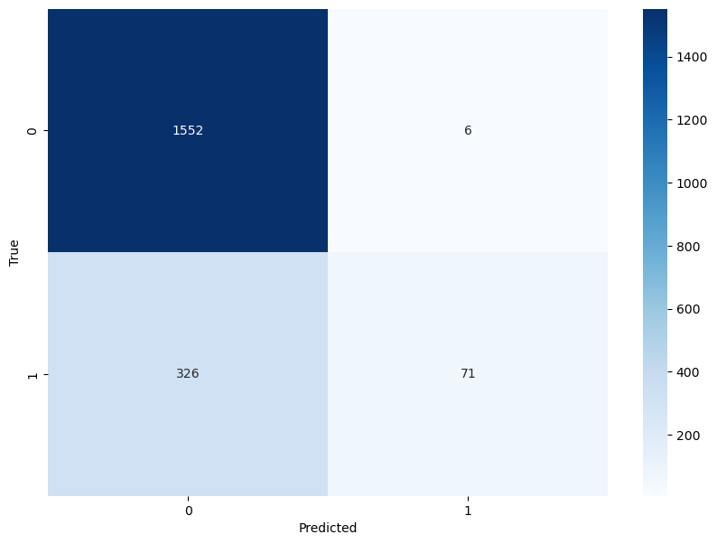
    


    Accuracy: 0.7520786092214664
    Recall: 0.17884130982367757
    Precision: 0.9726027397260274
    F1 Score: 0.3021276595744681
    ROC AUC Score: 0.5883407413049273
    


    
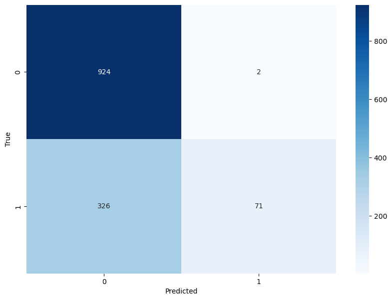
    


    Accuracy: 0.6717019133937563
    Recall: 0.17884130982367757
    Precision: 1.0
    F1 Score: 0.3034188034188034
    ROC AUC Score: 0.5894206549118388
    


    

    


    Accuracy: 0.5826972010178118
    Recall: 0.17884130982367757
    Precision: 0.9726027397260274
    F1 Score: 0.3021276595744681
    ROC AUC Score: 0.5868499608244352
    


    

    


```python
#基础模型 probit

#（1）选指标
#（如果要做指标变换，请对训练集和测试集都进行变换！！，并将其新的列名加入positive_features和negative_features）
positive_features = ['GASPRICE',  'RAIL']
negative_features = ['WALK','HHFAMINC_IMP','DRVRCNT','HHVEHCNT','WORKER','TDWKND','DRIVER']

#（2）读训练集
df0 = pd.read_csv('data_train.csv')

#（3）建模（注意类型）
results=build(df0, positive_features, negative_features, 'probit','probit-0')

#（4）获取估计参数
parameters=results.getEstimatedParameters()
beta_values=parameters['Value']
print(parameters)
parameters.to_csv('probit-0-parameters.csv')# 保存参数

#（5）评测
df1=pd.read_csv('data_test.csv')# 读测试集
eval(beta_values, positive_features, negative_features, df1)
df1=pd.read_csv('data_test1.csv')# 读测试集
eval(beta_values, positive_features, negative_features, df1)
df1=pd.read_csv('data_test2.csv')# 读测试集
eval(beta_values, positive_features, negative_features, df1)
df1=pd.read_csv('data_test3.csv')# 读测试集
eval(beta_values, positive_features, negative_features, df1)
df1=pd.read_csv('data_test4.csv')# 读测试集
eval(beta_values, positive_features, negative_features, df1)
df1=pd.read_csv('data_test5.csv')# 读测试集
eval(beta_values, positive_features, negative_features, df1)
```

    
    Results for model probit-0
    Output file (HTML):			probit-0.html
    Nbr of parameters:		10
    Sample size:			27448
    Excluded data:			0
    Init log likelihood:		-19025.5
    Final log likelihood:		-1163.723
    Likelihood ratio test (init):		35723.56
    Rho square (init):			0.939
    Rho bar square (init):			0.938
    Akaike Information Criterion:	2347.446
    Bayesian Information Criterion:	2429.647
    Final gradient norm:		0.04777368
    ASC            : -2.13[0.186 -11.5 0][0.161 -13.2 0]
    B_DRIVER       : 0.788[0.0734 10.7 0][0.0704 11.2 0]
    B_DRVRCNT      : -0.244[0.044 -5.55 2.85e-08][0.0468 -5.22 1.75e-07]
    B_GASPRICE     : 0.00197[0.000415 4.76 1.93e-06][0.000364 5.42 5.9e-08]
    B_HHFAMINC_IMP : 0.0354[0.0112 3.15 0.00162][0.0113 3.13 0.00177]
    B_HHVEHCNT     : 0.724[0.0481 15 0][0.0545 13.3 0]
    B_RAIL         : 0.6[0.0603 9.95 0][0.0604 9.93 0]
    B_TDWKND       : 0.543[0.0786 6.91 4.8e-12][0.0823 6.6 4.06e-11]
    B_WALK         : 0.097[0.00588 16.5 0][0.00513 18.9 0]
    B_WORKER       : -0.294[0.0627 -4.7 2.65e-06][0.0658 -4.47 7.69e-06]
    ('B_DRIVER', 'ASC'):	7.65e-05	0.00562	14.6	0	0.000375	0.033	16.8	0
    ('B_DRVRCNT', 'ASC'):	0.00138	0.169	10.3	0	0.00076	0.101	11.5	0
    ('B_DRVRCNT', 'B_DRIVER'):	-0.00132	-0.409	-10.3	0	-0.00113	-0.343	-10.6	0
    ('B_GASPRICE', 'ASC'):	-6.99e-05	-0.908	11.5	0	-5.12e-05	-0.872	13.2	0
    ('B_GASPRICE', 'B_DRIVER'):	2.56e-06	0.084	-10.7	0	2.33e-06	0.0908	-11.2	0
    ('B_GASPRICE', 'B_DRVRCNT'):	-2.17e-06	-0.119	5.59	2.29e-08	-5.56e-07	-0.0326	5.27	1.4e-07
    ('B_HHFAMINC_IMP', 'ASC'):	0.000109	0.0522	11.7	0	0.0002	0.11	13.5	0
    ('B_HHFAMINC_IMP', 'B_DRIVER'):	-5.97e-05	-0.0724	-10	0	-4.16e-06	-0.00522	-10.5	0
    ('B_HHFAMINC_IMP', 'B_DRVRCNT'):	-5.87e-05	-0.119	5.99	2.11e-09	-4.16e-05	-0.0785	5.71	1.12e-08
    ('B_HHFAMINC_IMP', 'B_GASPRICE'):	3.3e-07	0.0708	2.98	0.00286	2.93e-07	0.071	2.96	0.00311
    ('B_HHVEHCNT', 'ASC'):	-0.000941	-0.105	14.5	0	-0.000364	-0.0414	16.6	0
    ('B_HHVEHCNT', 'B_DRIVER'):	0.00014	0.0395	-0.748	0.455	-0.000133	-0.0347	-0.712	0.477
    ('B_HHVEHCNT', 'B_DRVRCNT'):	-0.0013	-0.613	11.7	0	-0.00143	-0.561	10.8	0
    ('B_HHVEHCNT', 'B_GASPRICE'):	2.2e-06	0.11	15	0	1.75e-06	0.0882	13.3	0
    ('B_HHVEHCNT', 'B_HHFAMINC_IMP'):	-0.000125	-0.23	13.3	0	-9.73e-05	-0.158	12	0
    ('B_RAIL', 'ASC'):	-0.000717	-0.0641	13.7	0	-0.000161	-0.0165	15.8	0
    ('B_RAIL', 'B_DRIVER'):	-0.000163	-0.0368	-1.95	0.0518	-0.000299	-0.0704	-1.96	0.05
    ('B_RAIL', 'B_DRVRCNT'):	-0.000146	-0.0549	11	0	5.44e-05	0.0193	11.2	0
    ('B_RAIL', 'B_GASPRICE'):	-1.02e-06	-0.0406	9.91	0	-1.57e-06	-0.0712	9.89	0
    ('B_RAIL', 'B_HHFAMINC_IMP'):	0.000248	0.366	9.88	0	0.00025	0.365	9.86	0
    ('B_RAIL', 'B_HHVEHCNT'):	-0.000216	-0.0745	-1.55	0.122	9.58e-05	0.0291	-1.54	0.123
    ('B_TDWKND', 'ASC'):	-0.00024	-0.0164	13.2	0	-0.00129	-0.0973	14.2	0
    ('B_TDWKND', 'B_DRIVER'):	0.000167	0.029	-2.31	0.0207	5.47e-05	0.00945	-2.27	0.023
    ('B_TDWKND', 'B_DRVRCNT'):	-0.000206	-0.0595	8.53	0	-0.000118	-0.0308	8.21	2.22e-16
    ('B_TDWKND', 'B_GASPRICE'):	2.36e-06	0.0724	6.89	5.63e-12	4.77e-06	0.159	6.58	4.63e-11
    ('B_TDWKND', 'B_HHFAMINC_IMP'):	-3.97e-05	-0.045	6.36	2.08e-10	3.93e-05	0.0422	6.15	7.82e-10
    ('B_TDWKND', 'B_HHVEHCNT'):	0.000533	0.141	-2.1	0.0361	0.000552	0.123	-1.94	0.0519
    ('B_TDWKND', 'B_RAIL'):	-5.5e-05	-0.0116	-0.572	0.567	0.000668	0.134	-0.598	0.55
    ('B_WALK', 'ASC'):	-0.000212	-0.195	11.9	0	-0.000176	-0.213	13.7	0
    ('B_WALK', 'B_DRIVER'):	-4.56e-05	-0.106	-9.31	0	-8.79e-05	-0.244	-9.62	0
    ('B_WALK', 'B_DRVRCNT'):	9.23e-06	0.0357	7.72	1.15e-14	3.76e-05	0.157	7.38	1.58e-13
    ('B_WALK', 'B_GASPRICE'):	1.37e-07	0.0561	16.2	0	1.34e-07	0.0718	18.6	0
    ('B_WALK', 'B_HHFAMINC_IMP'):	7.42e-06	0.112	5.09	3.49e-07	7.99e-06	0.137	5.22	1.75e-07
    ('B_WALK', 'B_HHVEHCNT'):	-1.24e-05	-0.0439	-12.9	0	-7.24e-05	-0.259	-11.2	0
    ('B_WALK', 'B_RAIL'):	1.52e-05	0.0428	-8.34	0	8.55e-06	0.0276	-8.31	0
    ('B_WALK', 'B_TDWKND'):	1.06e-05	0.0229	-5.67	1.42e-08	-2.22e-06	-0.00526	-5.41	6.29e-08
    ('B_WORKER', 'ASC'):	0.00183	0.157	9.85	0	0.00116	0.109	11	0
    ('B_WORKER', 'B_DRIVER'):	-0.000938	-0.204	-10.2	0	-0.00132	-0.285	-9.91	0
    ('B_WORKER', 'B_DRVRCNT'):	0.000289	0.105	-0.686	0.493	0.000135	0.0437	-0.631	0.528
    ('B_WORKER', 'B_GASPRICE'):	-1.09e-06	-0.0421	-4.73	2.28e-06	-2.96e-07	-0.0124	-4.5	6.7e-06
    ('B_WORKER', 'B_HHFAMINC_IMP'):	-0.000165	-0.234	-4.98	6.34e-07	-0.000171	-0.229	-4.76	1.93e-06
    ('B_WORKER', 'B_HHVEHCNT'):	-4.06e-05	-0.0134	-12.8	0	-0.000258	-0.072	-11.5	0
    ('B_WORKER', 'B_RAIL'):	-0.000167	-0.0441	-10.1	0	-0.000483	-0.121	-9.46	0
    ('B_WORKER', 'B_TDWKND'):	-0.000429	-0.0872	-8	1.33e-15	-0.000804	-0.149	-7.43	1.09e-13
    ('B_WORKER', 'B_WALK'):	-8.12e-06	-0.0221	-6.2	5.48e-10	1.47e-05	0.0434	-5.95	2.68e-09
    
                       Value  Rob. Std err  Rob. t-test  Rob. p-value
    ASC            -2.127947      0.161170   -13.203085  0.000000e+00
    B_DRIVER        0.788024      0.070389    11.195310  0.000000e+00
    B_DRVRCNT      -0.244436      0.046787    -5.224482  1.746436e-07
    B_GASPRICE      0.001974      0.000364     5.421785  5.900680e-08
    B_HHFAMINC_IMP  0.035436      0.011338     3.125546  1.774752e-03
    B_HHVEHCNT      0.723612      0.054489    13.279995  0.000000e+00
    B_RAIL          0.599969      0.060428     9.928665  0.000000e+00
    B_TDWKND        0.543018      0.082251     6.601947  4.057932e-11
    B_WALK          0.097004      0.005130    18.908240  0.000000e+00
    B_WORKER       -0.294281      0.065783    -4.473518  7.694306e-06
    Accuracy: 0.9870319102433338
    Recall: 0.14942528735632185
    Precision: 0.4642857142857143
    F1 Score: 0.22608695652173913
    ROC AUC Score: 0.5736057959804042
    


    

    


    Accuracy: 0.9192647743136343
    Recall: 0.1486146095717884
    Precision: 0.8676470588235294
    F1 Score: 0.2537634408602151
    ROC AUC Score: 0.5731537544141946
    


    

    


    Accuracy: 0.8245524296675192
    Recall: 0.14609571788413098
    Precision: 0.9354838709677419
    F1 Score: 0.25272331154684097
    ROC AUC Score: 0.5717641618945686
    


    

    


    Accuracy: 0.7430083144368859
    Recall: 0.14609571788413098
    Precision: 0.9830508474576272
    F1 Score: 0.2543859649122807
    ROC AUC Score: 0.5725079021386098
    


    
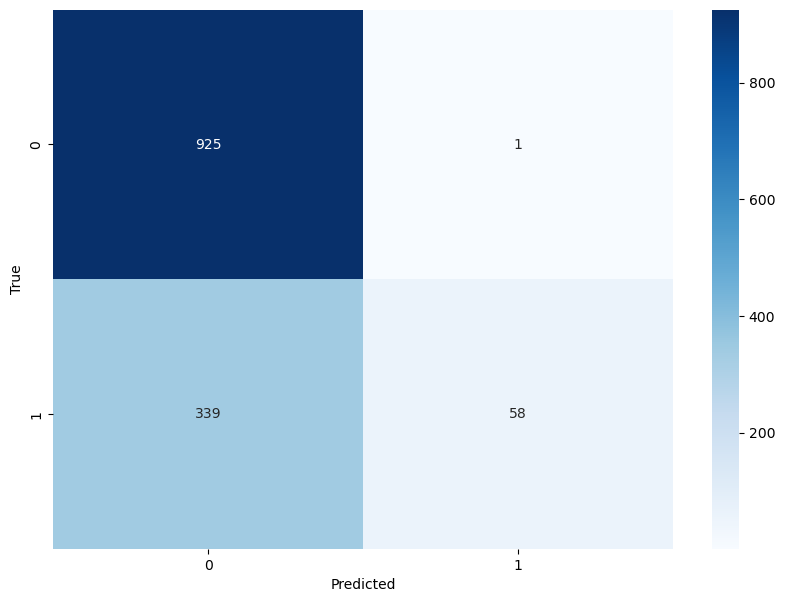
    


    Accuracy: 0.6586102719033232
    Recall: 0.14609571788413098
    Precision: 1.0
    F1 Score: 0.2549450549450549
    ROC AUC Score: 0.5730478589420654
    


    
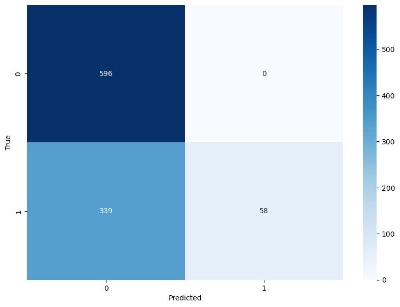
    


    Accuracy: 0.5661577608142494
    Recall: 0.14609571788413098
    Precision: 0.9666666666666667
    F1 Score: 0.2538293216630197
    ROC AUC Score: 0.5704771648546618
    


    
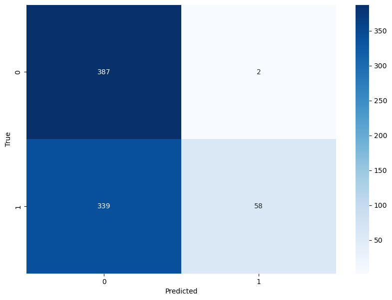
    


### <span style="color:deepskyblue">**2. 进阶模型**


```python
########logit-advance
#（在基础Logit上新增平均收入）
#从第一部分的Logit模型建立情况来看，变量NUMONTRP,HHFAMINC_IMP,URBRUR的关联性并不显著

#（1）选指标
#（如果要做指标变换，请对训练集和测试集都进行变换！！并将其新的列名加入positive_features和negative_features）
positive_features = ['GASPRICE',  'RAIL']
negative_features = ['WALK','AVERAGE_HHFAMINC_IMP','DRVRCNT','HHVEHCNT','WORKER','TDWKND','DRIVER']

#（2）读训练集
df0 = pd.read_csv('data_train.csv')
#对于HHFAMINC_IMP，我们选择以下处理：
df0['AVERAGE_HHFAMINC_IMP']=df0['HHFAMINC_IMP']/df0['HHSIZE']

#（3）建模结果
results=build(df0, positive_features, negative_features, 'logit','logit-advance')

#（4）获取估计参数
parameters=results.getEstimatedParameters()
print(parameters)
beta_values=parameters['Value']
parameters.to_csv('logit-advance-parameters.csv')# 保存参数

#（5）评测
df1=pd.read_csv('data_test.csv')
df1['AVERAGE_HHFAMINC_IMP']=df1['HHFAMINC_IMP']/df1['HHSIZE']
eval(beta_values, positive_features, negative_features, df1)
df1=pd.read_csv('data_test1.csv')
df1['AVERAGE_HHFAMINC_IMP']=df1['HHFAMINC_IMP']/df1['HHSIZE']
eval(beta_values, positive_features, negative_features, df1)
df1=pd.read_csv('data_test2.csv')
df1['AVERAGE_HHFAMINC_IMP']=df1['HHFAMINC_IMP']/df1['HHSIZE']
eval(beta_values, positive_features, negative_features, df1)
df1=pd.read_csv('data_test3.csv')
df1['AVERAGE_HHFAMINC_IMP']=df1['HHFAMINC_IMP']/df1['HHSIZE']
eval(beta_values, positive_features, negative_features, df1)
df1=pd.read_csv('data_test4.csv')
df1['AVERAGE_HHFAMINC_IMP']=df1['HHFAMINC_IMP']/df1['HHSIZE']
eval(beta_values, positive_features, negative_features, df1)
df1=pd.read_csv('data_test5.csv')
df1['AVERAGE_HHFAMINC_IMP']=df1['HHFAMINC_IMP']/df1['HHSIZE']
eval(beta_values, positive_features, negative_features, df1)
```

    
    Results for model logit-advance
    Output file (HTML):			logit-advance.html
    Nbr of parameters:		10
    Sample size:			27448
    Excluded data:			0
    Init log likelihood:		-19025.5
    Final log likelihood:		-1168.625
    Likelihood ratio test (init):		35713.76
    Rho square (init):			0.939
    Rho bar square (init):			0.938
    Akaike Information Criterion:	2357.249
    Bayesian Information Criterion:	2439.45
    Final gradient norm:		0.001179723
    ASC            : -4.33[0.394 -11 0][0.345 -12.5 0]
    B_AVERAGE_HHFAMINC_IMP: 0.137[0.0302 4.54 5.55e-06][0.0329 4.18 2.96e-05]
    B_DRIVER       : 1.36[0.163 8.34 0][0.16 8.51 0]
    B_DRVRCNT      : -0.352[0.101 -3.49 0.000476][0.105 -3.36 0.000792]
    B_GASPRICE     : 0.0048[0.000884 5.43 5.68e-08][0.000805 5.96 2.46e-09]
    B_HHVEHCNT     : 1.66[0.104 15.9 0][0.112 14.8 0]
    B_RAIL         : 1.33[0.125 10.7 0][0.126 10.6 0]
    B_TDWKND       : 1.15[0.173 6.64 3.06e-11][0.181 6.33 2.4e-10]
    B_WALK         : 0.188[0.0128 14.8 0][0.0118 15.9 0]
    B_WORKER       : -0.642[0.131 -4.91 8.94e-07][0.139 -4.62 3.93e-06]
    ('B_AVERAGE_HHFAMINC_IMP', 'ASC'):	0.000732	0.0614	11.4	0	0.000901	0.0793	13	0
    ('B_DRIVER', 'ASC'):	-0.00282	-0.044	13.1	0	-0.000508	-0.00923	14.9	0
    ('B_DRIVER', 'B_AVERAGE_HHFAMINC_IMP'):	-0.00129	-0.262	7.05	1.84e-12	-0.00113	-0.214	7.19	6.41e-13
    ('B_DRVRCNT', 'ASC'):	0.00624	0.157	10.2	0	0.00357	0.0984	11.3	0
    ('B_DRVRCNT', 'B_AVERAGE_HHFAMINC_IMP'):	0.000776	0.254	-5.02	5.27e-07	0.00103	0.297	-4.88	1.04e-06
    ('B_DRVRCNT', 'B_DRIVER'):	-0.0089	-0.542	-7.33	2.36e-13	-0.0078	-0.466	-7.49	6.75e-14
    ('B_GASPRICE', 'ASC'):	-0.000318	-0.913	11	0	-0.000243	-0.875	12.5	0
    ('B_GASPRICE', 'B_AVERAGE_HHFAMINC_IMP'):	1.21e-06	0.0452	-4.39	1.14e-05	2.3e-06	0.087	-4.04	5.39e-05
    ('B_GASPRICE', 'B_DRIVER'):	1.15e-05	0.0798	-8.31	0	9.08e-06	0.0707	-8.48	0
    ('B_GASPRICE', 'B_DRVRCNT'):	-7.07e-06	-0.0793	3.54	0.000402	1.69e-06	0.0199	3.4	0.00067
    ('B_HHVEHCNT', 'ASC'):	-0.00389	-0.0948	14.4	0	-0.000791	-0.0204	16.4	0
    ('B_HHVEHCNT', 'B_AVERAGE_HHFAMINC_IMP'):	-0.000355	-0.113	13.6	0	-0.000376	-0.102	12.7	0
    ('B_HHVEHCNT', 'B_DRIVER'):	0.0017	0.1	1.64	0.101	0.000499	0.0279	1.57	0.117
    ('B_HHVEHCNT', 'B_DRVRCNT'):	-0.0068	-0.648	10.8	0	-0.00675	-0.574	10.4	0
    ('B_HHVEHCNT', 'B_GASPRICE'):	1.17e-05	0.127	15.9	0	9.14e-06	0.101	14.8	0
    ('B_RAIL', 'ASC'):	-0.00387	-0.0787	13.4	0	0.00012	0.00276	15.4	0
    ('B_RAIL', 'B_AVERAGE_HHFAMINC_IMP'):	0.00109	0.288	9.96	0	0.000941	0.228	9.76	0
    ('B_RAIL', 'B_DRIVER'):	-0.00195	-0.096	-0.124	0.902	-0.00256	-0.128	-0.123	0.902
    ('B_RAIL', 'B_DRVRCNT'):	0.00106	0.0843	10.9	0	0.00168	0.127	11	0
    ('B_RAIL', 'B_GASPRICE'):	-5.55e-06	-0.0502	10.6	0	-1.41e-05	-0.139	10.6	0
    ('B_RAIL', 'B_HHVEHCNT'):	-0.000375	-0.0288	-1.99	0.0464	-0.000141	-0.01	-1.94	0.052
    ('B_TDWKND', 'ASC'):	-0.00341	-0.0501	12.5	0	-0.00814	-0.13	13.3	0
    ('B_TDWKND', 'B_AVERAGE_HHFAMINC_IMP'):	-0.000735	-0.141	5.63	1.82e-08	-0.000877	-0.147	5.35	8.84e-08
    ('B_TDWKND', 'B_DRIVER'):	0.00151	0.0537	-0.909	0.363	0.00164	0.0566	-0.895	0.371
    ('B_TDWKND', 'B_DRVRCNT'):	-0.00182	-0.105	7.18	7e-13	-0.00313	-0.165	6.7	2.09e-11
    ('B_TDWKND', 'B_GASPRICE'):	1.25e-05	0.0818	6.62	3.62e-11	2.02e-05	0.138	6.31	2.78e-10
    ('B_TDWKND', 'B_HHVEHCNT'):	0.00241	0.134	-2.7	0.00686	0.0035	0.172	-2.61	0.00897
    ('B_TDWKND', 'B_RAIL'):	-0.000878	-0.0407	-0.844	0.398	0.00113	0.0498	-0.852	0.394
    ('B_WALK', 'ASC'):	-0.00108	-0.215	11.4	0	-0.000888	-0.218	13	0
    ('B_WALK', 'B_AVERAGE_HHFAMINC_IMP'):	2.91e-05	0.0754	1.6	0.111	2.69e-05	0.0693	1.49	0.136
    ('B_WALK', 'B_DRIVER'):	-0.000253	-0.122	-7.09	1.3e-12	-0.00049	-0.26	-7.17	7.38e-13
    ('B_WALK', 'B_DRVRCNT'):	0.000142	0.11	5.39	6.9e-08	0.000252	0.203	5.24	1.64e-07
    ('B_WALK', 'B_GASPRICE'):	4.03e-07	0.0358	14.4	0	4.49e-08	0.00473	15.5	0
    ('B_WALK', 'B_HHVEHCNT'):	-0.000199	-0.15	-13.8	0	-0.000501	-0.379	-12.6	0
    ('B_WALK', 'B_RAIL'):	2.96e-05	0.0186	-9.12	0	1.48e-05	0.01	-9.07	0
    ('B_WALK', 'B_TDWKND'):	-8.8e-06	-0.004	-5.54	3.08e-08	-0.000133	-0.0622	-5.26	1.43e-07
    ('B_WORKER', 'ASC'):	0.00774	0.15	9.31	0	0.00429	0.0892	10.2	0
    ('B_WORKER', 'B_AVERAGE_HHFAMINC_IMP'):	-0.000716	-0.181	-5.59	2.23e-08	-0.000984	-0.215	-5.21	1.92e-07
    ('B_WORKER', 'B_DRIVER'):	-0.00372	-0.175	-8.85	0	-0.00578	-0.26	-8.42	0
    ('B_WORKER', 'B_DRVRCNT'):	0.000357	0.0271	-1.78	0.0751	0.000292	0.02	-1.68	0.0931
    ('B_WORKER', 'B_GASPRICE'):	-2.55e-06	-0.0221	-4.95	7.44e-07	2.45e-06	0.0219	-4.65	3.32e-06
    ('B_WORKER', 'B_HHVEHCNT'):	-0.000454	-0.0334	-13.6	0	-0.000855	-0.0549	-12.6	0
    ('B_WORKER', 'B_RAIL'):	0.000124	0.00759	-11	0	1.52e-05	0.000871	-10.5	0
    ('B_WORKER', 'B_TDWKND'):	-0.00197	-0.0871	-7.94	2e-15	-0.00223	-0.0884	-7.52	5.48e-14
    ('B_WORKER', 'B_WALK'):	-1.95e-05	-0.0117	-6.32	2.66e-10	0.000101	0.0613	-5.98	2.26e-09
    
                               Value  Rob. Std err  Rob. t-test  Rob. p-value
    ASC                    -4.329425      0.345295   -12.538340  0.000000e+00
    B_AVERAGE_HHFAMINC_IMP  0.137402      0.032898     4.176573  2.959340e-05
    B_DRIVER                1.357883      0.159591     8.508525  0.000000e+00
    B_DRVRCNT              -0.352331      0.105004    -3.355401  7.924989e-04
    B_GASPRICE              0.004801      0.000805     5.964163  2.458917e-09
    B_HHVEHCNT              1.659870      0.112025    14.817007  0.000000e+00
    B_RAIL                  1.331328      0.125557    10.603408  0.000000e+00
    B_TDWKND                1.147835      0.181234     6.333447  2.397440e-10
    B_WALK                  0.188352      0.011813    15.944949  0.000000e+00
    B_WORKER               -0.642287      0.139173    -4.615024  3.930493e-06
    Accuracy: 0.986740492495993
    Recall: 0.16091954022988506
    Precision: 0.4375
    F1 Score: 0.23529411764705882
    ROC AUC Score: 0.5791315528776344
    


    
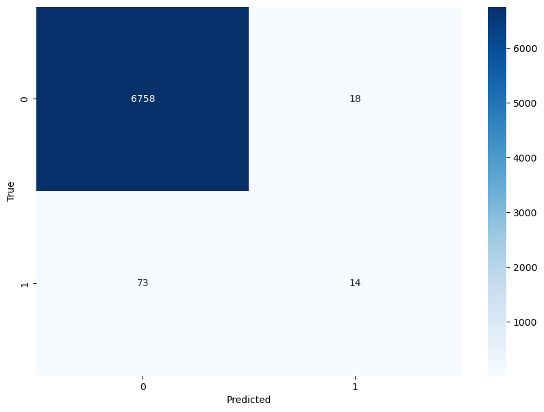
    


    Accuracy: 0.9222894369474174
    Recall: 0.181360201511335
    Precision: 0.8888888888888888
    F1 Score: 0.301255230125523
    ROC AUC Score: 0.589526550383968
    


    

    


    Accuracy: 0.8317135549872122
    Recall: 0.17884130982367757
    Precision: 0.9594594594594594
    F1 Score: 0.30148619957537154
    ROC AUC Score: 0.5884578821262162
    


    

    


    Accuracy: 0.7528344671201814
    Recall: 0.17884130982367757
    Precision: 0.9861111111111112
    F1 Score: 0.302771855010661
    ROC AUC Score: 0.5888806981083831
    


    

    


    Accuracy: 0.6717019133937563
    Recall: 0.17884130982367757
    Precision: 1.0
    F1 Score: 0.3034188034188034
    ROC AUC Score: 0.5894206549118388
    


    

    


    Accuracy: 0.5826972010178118
    Recall: 0.17884130982367757
    Precision: 0.9726027397260274
    F1 Score: 0.3021276595744681
    ROC AUC Score: 0.5868499608244352
    


    

    


```python
########probit-advance

#（1）选指标
#（如果要做指标变换，请对训练集和测试集都进行变换！！并将其新的列名加入positive_features和negative_features）
positive_features = ['GASPRICE',  'RAIL']
negative_features = ['WALK','AVERAGE_HHFAMINC_IMP','DRVRCNT','HHVEHCNT','WORKER','TDWKND','DRIVER']

#（2）读训练集
df0 = pd.read_csv('data_train.csv')
#对于HHFAMINC_IMP，我们选择以下处理：
df0['AVERAGE_HHFAMINC_IMP']=df0['HHFAMINC_IMP']/df0['HHSIZE']

#（3）建模结果
results=build(df0, positive_features, negative_features, 'probit','probit-1')

#（4）获取估计参数
parameters=results.getEstimatedParameters()
print(parameters)
beta_values=parameters['Value']
parameters.to_csv('probit-1-parameters.csv')# 保存参数

#（5）评测
df1=pd.read_csv('data_test.csv')
df1['AVERAGE_HHFAMINC_IMP']=df1['HHFAMINC_IMP']/df1['HHSIZE']
eval(beta_values, positive_features, negative_features, df1)
df1=pd.read_csv('data_test1.csv')
df1['AVERAGE_HHFAMINC_IMP']=df1['HHFAMINC_IMP']/df1['HHSIZE']
eval(beta_values, positive_features, negative_features, df1)
df1=pd.read_csv('data_test2.csv')
df1['AVERAGE_HHFAMINC_IMP']=df1['HHFAMINC_IMP']/df1['HHSIZE']
eval(beta_values, positive_features, negative_features, df1)
df1=pd.read_csv('data_test3.csv')
df1['AVERAGE_HHFAMINC_IMP']=df1['HHFAMINC_IMP']/df1['HHSIZE']
eval(beta_values, positive_features, negative_features, df1)
df1=pd.read_csv('data_test4.csv')
df1['AVERAGE_HHFAMINC_IMP']=df1['HHFAMINC_IMP']/df1['HHSIZE']
eval(beta_values, positive_features, negative_features, df1)
df1=pd.read_csv('data_test5.csv')
df1['AVERAGE_HHFAMINC_IMP']=df1['HHFAMINC_IMP']/df1['HHSIZE']
eval(beta_values, positive_features, negative_features, df1)
```

    
    Results for model probit-1
    Output file (HTML):			probit-1.html
    Nbr of parameters:		10
    Sample size:			27448
    Excluded data:			0
    Init log likelihood:		-19025.5
    Final log likelihood:		-1161.982
    Likelihood ratio test (init):		35727.04
    Rho square (init):			0.939
    Rho bar square (init):			0.938
    Akaike Information Criterion:	2343.964
    Bayesian Information Criterion:	2426.165
    Final gradient norm:		0.04058286
    ASC            : -2.08[0.186 -11.2 0][0.162 -12.8 0]
    B_AVERAGE_HHFAMINC_IMP: 0.0526[0.0145 3.62 0.000299][0.0149 3.52 0.00043]
    B_DRIVER       : 0.71[0.0779 9.11 0][0.0752 9.44 0]
    B_DRVRCNT      : -0.174[0.0466 -3.73 0.000191][0.0514 -3.38 0.00072]
    B_GASPRICE     : 0.00192[0.000414 4.64 3.5e-06][0.000364 5.27 1.33e-07]
    B_HHVEHCNT     : 0.737[0.0472 15.6 0][0.054 13.6 0]
    B_RAIL         : 0.589[0.0583 10.1 0][0.058 10.2 0]
    B_TDWKND       : 0.521[0.0788 6.61 3.91e-11][0.0815 6.38 1.72e-10]
    B_WALK         : 0.0962[0.00586 16.4 0][0.0051 18.9 0]
    B_WORKER       : -0.276[0.0614 -4.49 7.07e-06][0.0653 -4.22 2.41e-05]
    ('B_AVERAGE_HHFAMINC_IMP', 'ASC'):	0.000288	0.106	11.5	0	0.000332	0.137	13.3	0
    ('B_DRIVER', 'ASC'):	-0.000361	-0.0248	13.7	0	-3.19e-05	-0.00262	15.6	0
    ('B_DRIVER', 'B_AVERAGE_HHFAMINC_IMP'):	-0.000358	-0.316	7.86	3.77e-15	-0.0003	-0.268	8.17	2.22e-16
    ('B_DRVRCNT', 'ASC'):	0.00169	0.195	10.4	0	0.00114	0.136	11.7	0
    ('B_DRVRCNT', 'B_AVERAGE_HHFAMINC_IMP'):	0.0002	0.296	-5.09	3.65e-07	0.000246	0.321	-4.65	3.35e-06
    ('B_DRVRCNT', 'B_DRIVER'):	-0.00177	-0.487	-8.15	4.44e-16	-0.00168	-0.435	-8.19	2.22e-16
    ('B_GASPRICE', 'ASC'):	-7e-05	-0.906	11.2	0	-5.14e-05	-0.87	12.8	0
    ('B_GASPRICE', 'B_AVERAGE_HHFAMINC_IMP'):	1.82e-07	0.0302	-3.49	0.000492	3.16e-07	0.058	-3.4	0.000684
    ('B_GASPRICE', 'B_DRIVER'):	2.34e-06	0.0723	-9.09	0	1.6e-06	0.0584	-9.42	0
    ('B_GASPRICE', 'B_DRVRCNT'):	-1.75e-06	-0.0909	3.77	0.000164	1.8e-07	0.00962	3.42	0.000627
    ('B_HHVEHCNT', 'ASC'):	-0.000954	-0.108	14.3	0	-0.000237	-0.027	16.4	0
    ('B_HHVEHCNT', 'B_AVERAGE_HHFAMINC_IMP'):	-8.05e-05	-0.117	13.4	0	-4.37e-05	-0.0542	12	0
    ('B_HHVEHCNT', 'B_DRIVER'):	0.000236	0.064	0.302	0.763	-7.15e-05	-0.0176	0.286	0.775
    ('B_HHVEHCNT', 'B_DRVRCNT'):	-0.00146	-0.663	10.6	0	-0.00156	-0.564	9.77	0
    ('B_HHVEHCNT', 'B_GASPRICE'):	2.44e-06	0.125	15.6	0	1.7e-06	0.0862	13.6	0
    ('B_RAIL', 'ASC'):	-0.00062	-0.057	13.5	0	-0.000265	-0.0282	15.4	0
    ('B_RAIL', 'B_AVERAGE_HHFAMINC_IMP'):	0.000231	0.272	9.56	0	0.00021	0.242	9.53	0
    ('B_RAIL', 'B_DRIVER'):	-0.000456	-0.1	-1.19	0.234	-0.000639	-0.147	-1.19	0.232
    ('B_RAIL', 'B_DRVRCNT'):	0.000208	0.0766	10.6	0	0.000442	0.148	10.7	0
    ('B_RAIL', 'B_GASPRICE'):	-1.44e-06	-0.0597	10.1	0	-1.68e-06	-0.0795	10.1	0
    ('B_RAIL', 'B_HHVEHCNT'):	-6.3e-05	-0.0228	-1.95	0.0513	0.000238	0.0761	-1.94	0.0522
    ('B_TDWKND', 'ASC'):	-0.000359	-0.0244	12.8	0	-0.00138	-0.104	13.8	0
    ('B_TDWKND', 'B_AVERAGE_HHFAMINC_IMP'):	-0.00013	-0.113	5.73	1.02e-08	-8.97e-05	-0.0737	5.57	2.49e-08
    ('B_TDWKND', 'B_DRIVER'):	0.000363	0.0591	-1.76	0.0776	0.000198	0.0323	-1.74	0.0821
    ('B_TDWKND', 'B_DRVRCNT'):	-0.000349	-0.0951	7.29	3.12e-13	-0.000171	-0.0407	7.08	1.49e-12
    ('B_TDWKND', 'B_GASPRICE'):	2.34e-06	0.0716	6.59	4.54e-11	4.43e-06	0.149	6.36	1.95e-10
    ('B_TDWKND', 'B_HHVEHCNT'):	0.000531	0.143	-2.52	0.0117	0.000555	0.126	-2.35	0.0186
    ('B_TDWKND', 'B_RAIL'):	-0.000138	-0.0301	-0.689	0.491	0.00047	0.0994	-0.719	0.472
    ('B_WALK', 'ASC'):	-0.000213	-0.195	11.6	0	-0.000178	-0.215	13.3	0
    ('B_WALK', 'B_AVERAGE_HHFAMINC_IMP'):	5.61e-06	0.0658	2.85	0.00433	5.14e-06	0.0674	2.83	0.00468
    ('B_WALK', 'B_DRIVER'):	-5.01e-05	-0.11	-7.79	6.66e-15	-9.42e-05	-0.246	-8.01	1.11e-15
    ('B_WALK', 'B_DRVRCNT'):	1.75e-05	0.0643	5.8	6.68e-09	4.78e-05	0.182	5.33	1e-07
    ('B_WALK', 'B_GASPRICE'):	1.24e-07	0.051	16.1	0	1.16e-07	0.0622	18.5	0
    ('B_WALK', 'B_HHVEHCNT'):	-7.75e-06	-0.028	-13.4	0	-6.88e-05	-0.25	-11.5	0
    ('B_WALK', 'B_RAIL'):	7.43e-06	0.0217	-8.42	0	4.34e-08	0.000147	-8.46	0
    ('B_WALK', 'B_TDWKND'):	7.11e-06	0.0154	-5.38	7.56e-08	-8.26e-06	-0.0199	-5.19	2.13e-07
    ('B_WORKER', 'ASC'):	0.00182	0.159	9.68	0	0.00116	0.109	10.8	0
    ('B_WORKER', 'B_AVERAGE_HHFAMINC_IMP'):	-0.00011	-0.124	-5.07	4.08e-07	-0.000188	-0.193	-4.71	2.5e-06
    ('B_WORKER', 'B_DRIVER'):	-0.000852	-0.178	-9.18	0	-0.00111	-0.225	-8.95	0
    ('B_WORKER', 'B_DRVRCNT'):	0.000124	0.0432	-1.35	0.176	-7.75e-05	-0.0231	-1.22	0.224
    ('B_WORKER', 'B_GASPRICE'):	-7.78e-07	-0.0306	-4.52	6.13e-06	-9.43e-08	-0.00396	-4.25	2.12e-05
    ('B_WORKER', 'B_HHVEHCNT'):	-0.000172	-0.0594	-12.7	0	-0.000352	-0.0998	-11.4	0
    ('B_WORKER', 'B_RAIL'):	4.22e-05	0.0118	-10.3	0	-0.000326	-0.086	-9.5	0
    ('B_WORKER', 'B_TDWKND'):	-0.000395	-0.0816	-7.67	1.67e-14	-0.00066	-0.124	-7.2	6.03e-13
    ('B_WORKER', 'B_WALK'):	-1.25e-06	-0.00348	-6.03	1.65e-09	2.12e-05	0.0635	-5.71	1.15e-08
    
                               Value  Rob. Std err  Rob. t-test  Rob. p-value
    ASC                    -2.083226      0.162199   -12.843647  0.000000e+00
    B_AVERAGE_HHFAMINC_IMP  0.052551      0.014925     3.521051  4.298397e-04
    B_DRIVER                0.710254      0.075203     9.444537  0.000000e+00
    B_DRVRCNT              -0.173726      0.051369    -3.381936  7.197684e-04
    B_GASPRICE              0.001922      0.000364     5.274059  1.334391e-07
    B_HHVEHCNT              0.736994      0.054004    13.647136  0.000000e+00
    B_RAIL                  0.589076      0.058005    10.155702  0.000000e+00
    B_TDWKND                0.520549      0.081535     6.384344  1.721332e-10
    B_WALK                  0.096229      0.005103    18.856777  0.000000e+00
    B_WORKER               -0.275877      0.065331    -4.222763  2.413251e-05
    Accuracy: 0.9871776191170042
    Recall: 0.14942528735632185
    Precision: 0.48148148148148145
    F1 Score: 0.22807017543859648
    ROC AUC Score: 0.5736795858269211
    


    

    


    Accuracy: 0.9194974406700791
    Recall: 0.1486146095717884
    Precision: 0.8805970149253731
    F1 Score: 0.2543103448275862
    ROC AUC Score: 0.5732819266777168
    


    
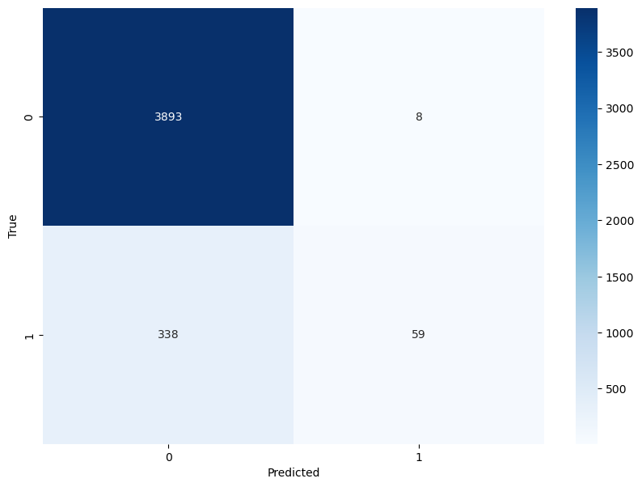
    


    Accuracy: 0.8250639386189258
    Recall: 0.14609571788413098
    Precision: 0.9508196721311475
    F1 Score: 0.25327510917030566
    ROC AUC Score: 0.5720850861564429
    


    
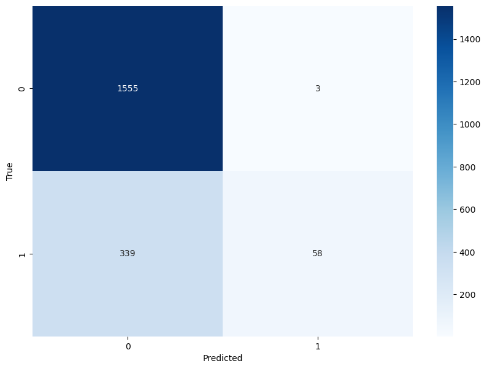
    


    Accuracy: 0.7430083144368859
    Recall: 0.14609571788413098
    Precision: 0.9830508474576272
    F1 Score: 0.2543859649122807
    ROC AUC Score: 0.5725079021386098
    


    

    


    Accuracy: 0.6586102719033232
    Recall: 0.14609571788413098
    Precision: 1.0
    F1 Score: 0.2549450549450549
    ROC AUC Score: 0.5730478589420654
    


    

    


    Accuracy: 0.5661577608142494
    Recall: 0.14609571788413098
    Precision: 0.9666666666666667
    F1 Score: 0.2538293216630197
    ROC AUC Score: 0.5704771648546618
    


    

    


## **STEP3 机器学习模型——XGBoost**

### <span style="color:deepskyblue">**1. XGBoost建模**


```python
import shap
import xgboost as xgb
from xgboost import plot_importance, XGBClassifier  
import pandas as pd
import matplotlib.pyplot as plt
import numpy as np
import seaborn as sns
from sklearn.model_selection import GridSearchCV, train_test_split, cross_val_score
from sklearn.metrics import accuracy_score, recall_score, precision_score, f1_score, roc_auc_score, confusion_matrix

from sklearn.preprocessing import OneHotEncoder, StandardScaler
from sklearn.compose import ColumnTransformer
from sklearn.pipeline import Pipeline
```


```python
def calculate_metrics(y_test, y_pred):
    accuracy = accuracy_score(y_test, y_pred)
    recall = recall_score(y_test, y_pred)
    precision = precision_score(y_test, y_pred)
    f1 = f1_score(y_test, y_pred)
    roc_auc = roc_auc_score(y_test, y_pred)
    cm = confusion_matrix(y_test, y_pred)

    print(f"Accuracy: {accuracy}")
    print(f"Recall: {recall}")
    print(f"Precision: {precision}")
    print(f"F1 Score: {f1}")
    print(f"ROC AUC Score: {roc_auc}")
    
    # 绘制混淆矩阵的热力图
    plt.figure(figsize=(10, 7))
    sns.heatmap(cm, annot=True, fmt='d', cmap='Blues')
    plt.xlabel('Predicted')
    plt.ylabel('True')
    plt.show()
```


```python
# 分类变量和连续变量
categorical_features = ['WORKER', 'URBRUR', 'TRIPPURP', 'TDWKND', 'DRIVER', 'RAIL']
numeric_features = ['WALK', 'TRPMILES', 'HHFAMINC_IMP', 'NUMONTRP', 'GASPRICE', 'DRVRCNT', 'HHVEHCNT', 'HHSIZE','R_AGE']

# 导入扩样后数据
df_rep0=pd.read_csv('data_whole.csv')

# (1)如果要每次重新shuffle训练集、测试集：
#X_train, X_test, y_train, y_test = train_test_split(df_rep0[categorical_features + numeric_features], df_rep0['PUBTRANS'].values, test_size=0.2, random_state=42, shuffle=True)

# (2)如果每次用一样的
X_train=pd.read_csv('data_train.csv')
y_train = X_train['PUBTRANS'].values
X_train = X_train.drop('PUBTRANS', axis=1)
```


```python

# 创建预处理器
preprocessor = ColumnTransformer(
    transformers=[
        ('num', StandardScaler(), numeric_features),
        ('cat', OneHotEncoder(), categorical_features)])

# 创建分类器
clf = XGBClassifier(
    booster='gbtree',
    n_estimators=100,
    learning_rate=0.1,
    reg_alpha=0,
    reg_lambda=1,
    subsample=1,
    colsample_bytree=1,
    colsample_bynode=1,
    min_child_weight=0,
    max_depth=10,
    random_state=42
)

# 创建管道
pipe = Pipeline(steps=[('preprocessor', preprocessor),
                       ('classifier', clf)])
```

#### (1) 使用网格搜索优化超参数


```python
# 定义参数网格
param_grid = {
    'classifier__n_estimators': [50, 100, 150, 200, 250],
    'classifier__learning_rate': [0.01, 0.05, 0.1, 0.2, 0.3],
    'classifier__max_depth': [4, 6, 8, 10, 12]
}
# 创建网格搜索对象，使用交叉验证
grid_search = GridSearchCV(pipe, param_grid, cv=5, verbose=3)

# 执行网格搜索
grid_search.fit(df_rep0[categorical_features + numeric_features], df_rep0['PUBTRANS'].values)

# 输出最佳参数和对应的评分
print(f"Best parameters: {grid_search.best_params_}")
print(f"Best cross-validation score: {grid_search.best_score_}")

# 使用最佳参数创建新的管道
best_clf = grid_search.best_estimator_

# 训练模型
best_clf.fit(X_train, y_train)

# 预测

X_test=pd.read_csv('data_test.csv')
y_test = X_test['PUBTRANS'].values
X_test = X_test.drop('PUBTRANS', axis=1)
y_pred = best_clf.predict(X_test)
calculate_metrics(y_test, y_pred)

X_test=pd.read_csv('data_test2.csv')
y_test = X_test['PUBTRANS'].values
X_test = X_test.drop('PUBTRANS', axis=1)
y_pred = best_clf.predict(X_test)
calculate_metrics(y_test, y_pred)


```

#### (2) 使用交叉验证


```python

# 使用交叉验证评估模型
scores = cross_val_score(pipe, df_rep0[categorical_features + numeric_features], df_rep0['PUBTRANS'].values, cv=5)

print(f"Cross-validation scores: {scores}")
print(f"Average cross-validation score: {scores.mean()}")

from sklearn.model_selection import train_test_split
from sklearn.metrics import accuracy_score, recall_score, precision_score, f1_score, roc_auc_score, confusion_matrix
import seaborn as sns
import matplotlib.pyplot as plt

# 训练模型
pipe.fit(X_train, y_train)

# 预测
X_test=pd.read_csv('data_test.csv')
y_test = X_test['PUBTRANS'].values
X_test = X_test.drop('PUBTRANS', axis=1)
y_pred = pipe.predict(X_test)
calculate_metrics(y_test, y_pred)

X_test=pd.read_csv('data_test1.csv')
y_test = X_test['PUBTRANS'].values
X_test = X_test.drop('PUBTRANS', axis=1)
y_pred = pipe.predict(X_test)
calculate_metrics(y_test, y_pred)

X_test=pd.read_csv('data_test2.csv')
y_test = X_test['PUBTRANS'].values
X_test = X_test.drop('PUBTRANS', axis=1)
y_pred = pipe.predict(X_test)
calculate_metrics(y_test, y_pred)

X_test=pd.read_csv('data_test3.csv')
y_test = X_test['PUBTRANS'].values
X_test = X_test.drop('PUBTRANS', axis=1)
y_pred = pipe.predict(X_test)
calculate_metrics(y_test, y_pred)

X_test=pd.read_csv('data_test4.csv')
y_test = X_test['PUBTRANS'].values
X_test = X_test.drop('PUBTRANS', axis=1)
y_pred = pipe.predict(X_test)
calculate_metrics(y_test, y_pred)

X_test=pd.read_csv('data_test5.csv')
y_test = X_test['PUBTRANS'].values
X_test = X_test.drop('PUBTRANS', axis=1)
y_pred = pipe.predict(X_test)
calculate_metrics(y_test, y_pred)
```

    Cross-validation scores: [0.98936325 0.9864471  0.99023608 0.98571845 0.99009035]
    Average cross-validation score: 0.9883710474132258
    Accuracy: 0.9957744426635582
    Recall: 0.8045977011494253
    Precision: 0.8536585365853658
    F1 Score: 0.8284023668639053
    ROC AUC Score: 0.9014133724165072
    


    

    


    Accuracy: 0.9946486738017682
    Recall: 0.9622166246851386
    Precision: 0.9794871794871794
    F1 Score: 0.9707750952986023
    ROC AUC Score: 0.9800829342343919
    


    
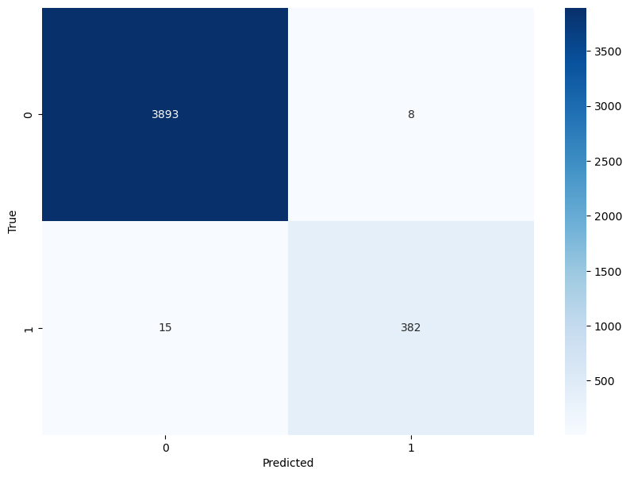
    


    Accuracy: 0.9892583120204603
    Recall: 0.9521410579345088
    Precision: 0.9947368421052631
    F1 Score: 0.972972972972973
    ROC AUC Score: 0.9754286804435061
    


    
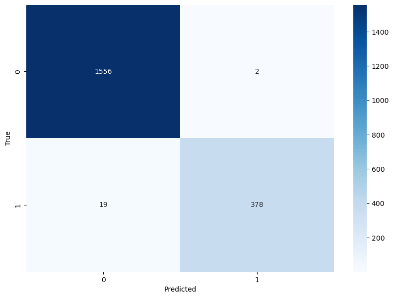
    


    Accuracy: 0.9848828420256992
    Recall: 0.9521410579345088
    Precision: 0.9973614775725593
    F1 Score: 0.9742268041237113
    ROC AUC Score: 0.9755305721637988
    


    
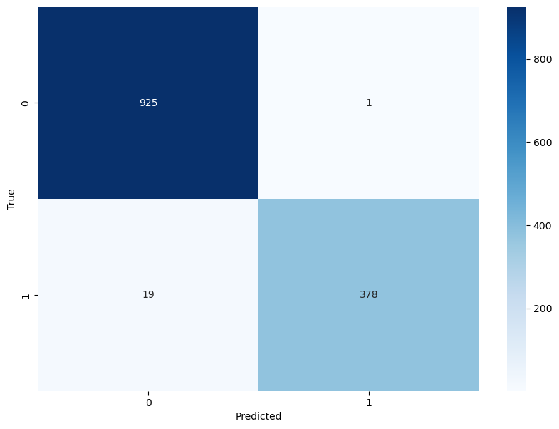
    


    Accuracy: 0.9798590130916415
    Recall: 0.9521410579345088
    Precision: 0.9973614775725593
    F1 Score: 0.9742268041237113
    ROC AUC Score: 0.9752316027927578
    


    
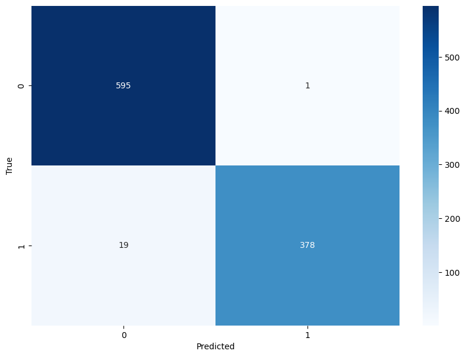
    


    Accuracy: 0.9707379134860051
    Recall: 0.9521410579345088
    Precision: 0.9895287958115183
    F1 Score: 0.9704749679075738
    ROC AUC Score: 0.9709291407924473
    


    
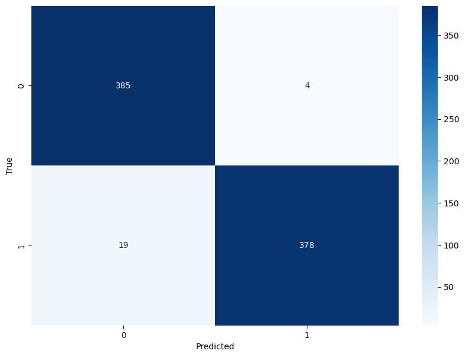
    


```python
# 获取特征重要性
feature_importances = pipe.named_steps['classifier'].feature_importances_

print(feature_importances)
# 获取特征名称
feature_names = pipe.named_steps['preprocessor'].get_feature_names_out()

plt.figure(figsize=(10, 15))
bars = plt.barh(feature_names, feature_importances)

# 在条形图上添加贡献度数值
for bar in bars:
    width = bar.get_width()
    plt.text(width, bar.get_y() + bar.get_height()/2, f'{width:.2f}', ha='left', va='center')

plt.yticks(rotation=0, fontsize=14)
plt.title('Feature importance', fontsize=14)
plt.show()
```

    [0.24211243 0.04533319 0.01520913 0.03047476 0.02584477 0.01798545
     0.32125056 0.02199318 0.02361082 0.01493117 0.         0.02847592
     0.         0.017366   0.01342116 0.03188443 0.02479946 0.01728985
     0.0137465  0.         0.03046666 0.         0.06380459 0.        ]
    


    
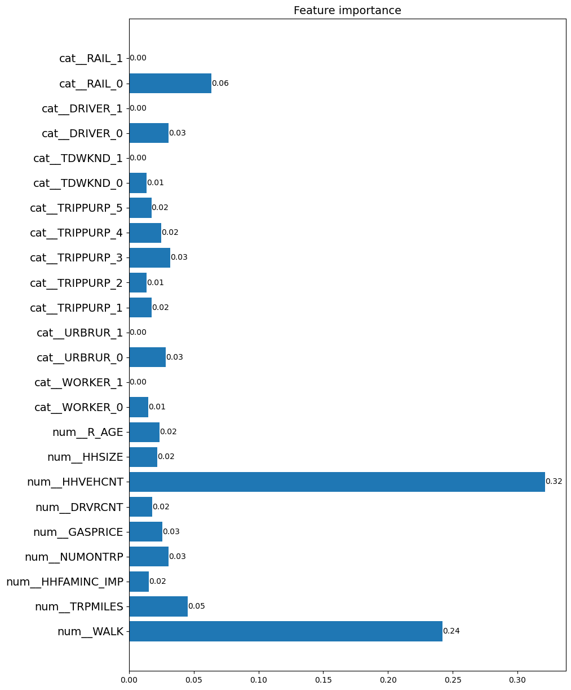
    


### <span style="color:deepskyblue">**2. SHAP解释**


```python
import shap

# 获取分类器
clf = pipe.named_steps['classifier']

# 获取预处理后的特征
X_preprocessed = pipe.named_steps['preprocessor'].transform(X_train)

# 利用SHAP解释XGBoost模型
explainer = shap.TreeExplainer(clf)
shap_values = explainer.shap_values(X_preprocessed)

```


```python

# 对于其中的某一行进行分析
shap.initjs()
shap.force_plot(explainer.expected_value, shap_values[2], X_preprocessed[2],feature_names=feature_names)

```


```python
#对于特征的总体分析
shap.summary_plot(shap_values, X_preprocessed,feature_names=feature_names)
# shap.summary_plot(shap_values, X_preprocessed, plot_type="bar")
#将上面画的图表纵轴中的数值换成对应的变量名
shap.summary_plot(shap_values, X_preprocessed, plot_type="bar", feature_names=feature_names)
```


```python

# 部分依赖图
shap.dependence_plot(3, shap_values, X_preprocessed, interaction_index=None, show=False)

# 对多个变量的交互进行分析
# shap_interaction_values = shap.TreeExplainer(clf).shap_interaction_values(X_preprocessed)
# shap.summary_plot(shap_interaction_values, X_preprocessed, max_display=6)

# shap.dependence_plot(1, shap_values, X_preprocessed, interaction_index=1, show=False)
```
