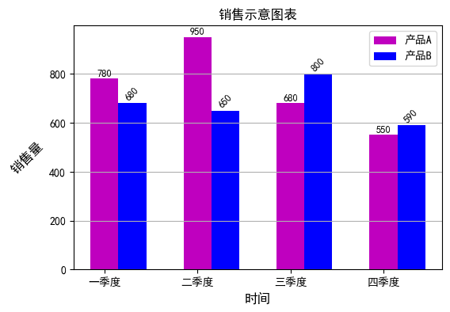
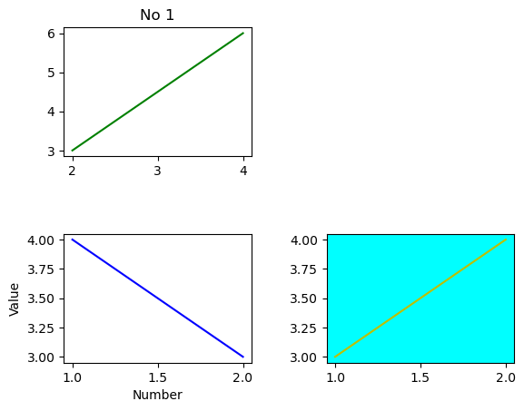
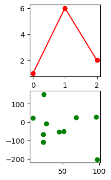
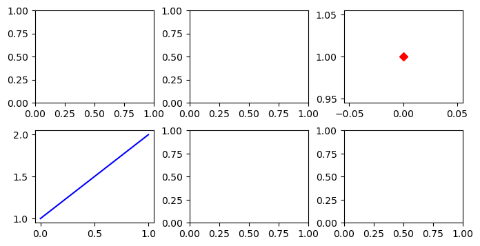

# Python 程序设计 课堂笔记
- 说明： 该笔记基于同济大学大类基础课程 Python程序设计，仅仅是入门，附有相关例题和习题的代码，多加练习，可以较短时间拿下期末考试  

- 相关文件获取：https://github.com/ryan11njr 


# 1. python语言概述

## 1.1 程序设计语言
- 程序运算模式：IPO  输入、处理、输出
- 程序设计语言
    - 低级语言
        - 机器语言：是由 0 和 1 二进制代码按一定规则组成的、能被机器直接理解和执行的指令集合
        - 汇编语言：用英文助记符来表示机器指令，不能直接在计算机上运行，需要翻译成为机器语言程序
    - 高级语言：更接近于自然语言并力求使语言脱离具体机器，达到程序可移植的目的
        - 解释：对源程序进行逐句解释执行，即翻译一句立即执行一句。
            - Python、Visual Basic
        - 编译：编译方式是将整个程序翻译成目标程序。编译方式执行速度快，但每次修改源程序，都必须重新编译
            - C/C++、Java
        - 面向过程：以“数据结构+算法”程序设计范式构成 
            -  BASIC、C
        - 面向对象：以对象作为基本程序结构单位的程序设计语言，设计的程序是以对象为核心，在程序运行时对象是基本成分
            - Python、C++、Visual Basic、Java
## 1.2 python简介
- Python 是自由∕开源软件 FLOSS
- Cpython是官方默认的编译器，自带
- IPython是基于Cpython的一个交互解释器，用IN[序号]作为提示符
    - 交互模式：命令行敲击Python进入，提示符是>>> 。 exit() 退出交互模式
- Python 的常用开发环境
    - IDLE，Python内置的
        - shell交互方式
        - 文件交互方式Run Module（类似于编译了）
    - Anaconda Sypder
- 第三方库
    - 安装
        - pip命令 pip install , pip list 
        - conda命令
        - whl文件 
## 1.3 程序调试
- 错误类型
    - 语法错误：解释器可以发现，可以根据提示信息修改
    - 逻辑错误：解释器发现不了，往往需要通过设置断点，跟踪程序的运行过程
        - print（）
        - 设置断点
        - 单步运行
- 获取帮助
    - help（）以获对象的信息
    - dir（）查看对象的所有属性及方法
    - __ doc__ 文档字符串（DocStrings），是指模块、类、函数中等添加的说明性文字
        - 当不是函数、方法、模块等调用 doc 时，而是具体对象调用时，会显示此对象从属的类型的构造函数的文档字符串
## 1.4 课后题
- 安装时应选定“Add Python 3.7 to PATH”复选框，将 Python 的安装目录路径添加到环境变量 **PATH **中
- input() 类型是string

# 2. 语言基础

## 2.1 数据类型
### 2.1.1 数
- 基本数据类型
    - int、float、complex、bool
- 组合数据类型
    - 有序
        - str
        - list
        - tuple
    - 无序
        - dictionary
        - 集合set
### 2.1.2 数据常量
- 整数有四种表示形式，分别为：十进制、二进制整数、八进制整数和十六进制整数
- 浮点数又称实数，有两种表示形式，分别为：小数形式和指数形式
    - 123.0、0.123e3、1.23E2、123e0 等都是合法的浮点数
- complex(x1[,x2])可以将1个或者2个数值转换成复数
### 2.1.3 算数表达式
- 简单赋值、复合赋值（+=...）、链式赋值、序列解包赋值（x,y=y,x）
### 2.1.4 类型转换
- 隐式转换  （3+4.0=7.0）
- 显式转换  （int（7.0））
### 2.1.5 常用数值类函数
- python中有4类函数：内置函数(直接用)、标准库函数(先导入)、第三方库(先安装再导入)、用户自定义函数
- eval(str)  ：将字符串 str 当成有效表达式来求值，并返回计算结果 ----evaluate
    -  x,y,z=eval(input("输入 x,y,z："))
- math库
    - 注意三角函数都是弧度
- random库
    - random() ：随机[0,1)区间内的一个浮点数]
    - randint(a,b)   ：[a,b]
    - randrange(m,n[,k]) :[m, n)之间以 k 为步长的随机整数，缺省k为 1
    - sample(seq,k) : 从序列 seq 中随机抽取 k个 元 素 组 成 列 表 , k≤len(seq)


```python
from random import *
print(randint(1,2))
sample(range(1,10),5)
```

## 2.2 字符串类型和处理
### 2.2.1 转义字符
- \\  反斜杠  \'  单引号  \'' 双引号 \n 换行 \t 制表符table \r 回车
- 对于“\t”横向制表符所占的列数与开发环境有关。例如 IDLE 环境占 8 列、Spyder占 4 列；所以同样的代码在不同的开发环境输出的效果将不同。
- raw：在字符串前加 r，即：r"内容"或 r'内容'，表示字符串内的内容不转义。
### 2.2.2 字符串基本操作
- 连接、重复、子串、索引、切片
- 字符串方法
    - upper(),lower(),isnumeric(),isalpha()....[并不保存！要自己赋值]
    - index(s)在字符串中找第一个出现 s子串的位置，找不到抛出异常
    - find(s)在字符串中找第一个出现 s子串的位置，找不到返回-1
    - startswith(s[,start[,end]])
    - split([s]),将字符串按照 s 分隔符分离，返回结果是列表。缺省 s 按空格、制表符或换行符分隔
        - 对于 split()函数，若以 split(" ")单空格分离，当字符串中连续出现多个空格时，分离的效果比较差。改进的方法为缺省参数，系统就会优化处理，即当连续出现多个空格作为一个空格分离，效果比较好。
    - strip(s)，去掉字符串两旁的 s 子串，一般用于去掉空格


```python
print(25*"-") #“*”为对字符串复制，即显示 25 个下划线字符
print("|学号\t|姓名\t|计算机\t| ") #“\t”跳到下一个制表位（默认一个制表位占 8 列）
print(25*"-") 
print("|1800019999 \t|张三\t|优秀\t|")
print(25*"-")
print("|180002\t|李小明\t|良\t|")
print(25*"-")
print("|180003\t|王平平\t|不及格\t|\r")
print(25*"-","\n") # 本身 print 结束要换行，加了“\n”实质是空一行
print(r"|180003\t|王平平\t|不及格\t|\r") #r"字符串"内容不转义，照样输出
```


```python
s2="a 12 34"
print(s2.split())
print(s2.split(" "))
"   123 ".strip() 
print(s2[0])

```

    ['a', '12', '34']
    ['a', '12', '34']
    a
    


```python
s=input("输入时间：小时：分：秒 ")
hour,minute,second=s.split(":")
print(hour,"小时，",minute,"分，",second,"秒")
```

## 2.3 bool类型和处理
- 除 not 是单目运算符外（即仅右边有操作数），其余是双目运算符
- 对数学上常用于表示值域范围的表达式，在 Python 的逻辑运算中，则可采用与数学上相同书写的逻辑表达式。
    - 要表示 x 的值域范围 0≤x<10，则简化的逻辑表达式为：0<=x<10，这在其他程序设计语言中是不支持的，必须写成：0<=x and x<10。


## 2.4 组合数据类型简介
  列表和元组在很多操作上是一样的，如索引、切片、各种数据的统计等，不同的是表示形式不同，前者是方括号“[]”，后者是圆括号“()”，更大区别是列表是可修改的，元组是不可修改的，元组可以看成是只读的列表。
### 2.4.1 列表和元组
- 注意：当建立的元组仅有一个元素时，要在后面加逗号，不然建立的就不是元组 tuple


```python
fibs=[0,1,1,2,3,5,8,13] # 建立了一个斐波那契数列列表
stud=[["黄小明",87],["李平",79],["章一",99]] # 建立由 3 名学生的姓名成绩构成的嵌套列表
num1=["一二三四五六"] # 建立了仅有一个元素的列表["一二三四五六"]
nl=[] # 建立空列表

#列表操作
>>> fibs=[0,1,1,2,3,5,8,13] # 建立 fibs 列表：[0,1,1,2,3,5,8,13]
>>> fibs[4] # 通过索引访问列表中元素值：3
>>> fibs+[21] # 两个列表加操作结果：[0, 1, 1, 2, 3, 5, 8, 13, 21]
>>> fibs*2 # 将列表复制 2 次：[0, 1, 1, 2, 3, 5, 8, 13, 0, 1, 1, 2, 3, 5, 8, 13]
>>> fibs[3:5] # 通过切片访问列表中元素：[2, 3]
```


```python
tfibs=(0,1,1,2,3,5,8,13) # 建立元组：(0,1,1,2,3,5,8,13)
tfibs=0,1,1,2,3,5,8,13 # 与上式等价，建立元组：(0,1,1,2,3,5,8,13)
tstud=(("黄小明",87),("李平",79),("章一",99))# 建立由 3 名学生的姓名成绩构成的嵌套元组
tnl=() # 建立空元组

# 元组操作
>>>x,y,z=(10,20,30) # 元组序列赋值给多个变量，括号可省
>>>x,y=y,x # 元组(y,x)的元素依次赋值给 x,y 变量，实现两数交换
>>>print("x=%d,y=%d"%(x,y)) # 格式输出中的输出元素是元组
>>>def f(x):
return x**2,x**(1/2) # 函数返回两个值，默认是元组类型
```

### 2.4.2 字典和集合
字典和集合都属于无序的数据类型，因此不能像列表和元组通过位置索引来访问数据元素。
- Python 中字典是内置的映射类型，即通过键获得对应的值。可以方便地进行字典中元素的检索、插入、删除和统计等操作。
- 集合类型与数学中的集合概念是一致的，其主要作用是消除重复元素、进行集合运算
- 注意：字典和集合表示形式都是一对 “{}”括起，若要创建空集合，必须通过 set()函数


```python
sfibs={0,1,1,2,3,5,8,13} # 建立 sfibs 集合{0, 1, 2, 3, 5, 8, 13}
sh={"hello!"} # 直接建立 sh 集合{"hello!"}
sh2=set("hello!") # 利用函数建立 sh2 集合{'!', 'h', 'l', 'e', 'o'}
s=set()
type(s)
```


```python
subject = ['计算机','物理','物理','物理','数学']
subject = set(subject)
subject
```


    {'数学', '物理', '计算机'}


## 2.5 输入输出
### 2.5.1 输入
- input("提示")
- a,b,c= eval(input("输入a,b,c:"))
    -  eval()可以输入多个值，也可以根据输入的值自动转换成相应的类型！


```python
for i in range(5):
    print(i,i**2,sep='和',end=' # ' )
```

### 2.5.2 输出
- IDLE 交互状态下直接输出
- print([输出项列表][, sep=分隔符][, end=结束符])
    - print()函数参数全部可以缺省，若没有参数，则输出一个空行
- 格式化输出
    - % 方式【和c语言一样】
        - 格式控制字符串 %（输出项列表）
        - % [m][.n]类型符
        - 类型：%d , %c , %s , %f(%F), %e(%E) 
        ---
        - （1）当输出值整数位数多于最小宽度，按实际值输出；输出值小数位数多于精度位数则四舍五入按精度位数输出；输出小数位数少于精度位数，右补 0；输出值位数少于最小宽度，则右对齐左补空格。
        - （2）当输出项的数据类型与格式符不一致时，若格式符是%s，输出项是非字符串类型，自动转换为字符串再输出；反之若输出项是字符串，而格式符是非%s，则会产生错误信息。
    - format() 方法
        - 格式模板.format（输出项列表）
        - “{}”的形式：{[序号:[m.n]类型符]}
---
以下不考：
- 字符串插值（f-strings）： 这是 Python 3.6+ 引入的一种非常方便的字符串格式化方法。在字符串前加上 'f' 或 'F'，然后在字符串中使用大括号 {} 来引用变量或表达式
 - 使用格式化字符串（str.format_map 和 str.format）： 这种方式可以使用字典或关键字参数来格式化字符串。
- 模板字符串： Python 提供了 string.Template 类，可以用于创建模板字符串，然后使用 substitute() 方法进行替换。


```python
kg=" "
ss="★"
name=input("输入好友的姓名：")
n=len(name)
print("{}好友{}：生日快乐！".format(5*kg,name)) 
print("{}{}{}{}{}".format(9*kg,2*ss,kg,2*ss,9*kg))
print("{}{}{}".format(8*kg,7*ss,8*kg))
for i in range(1,5): # 循环语句执行 print 函数 4 次输出图案下部
    print("{}{}{}".format((7+i)*kg,(9-2*i)*ss,(7+i)*kg))
```

## 2.6 课后题
- 执行语句：x,y=eval(input( ))时，从键盘上输入数据格式错误的是 A.10 20
- 若 string='Hello_World'，则 string[:-6]*2 的值是
- 下面    complex  不是Python的组合数据类型。 str是！
- 表达式 'ab' + '''甲乙\new''' * 2 的结果字符串长度是[12]!  \n是换行，即使在三撇内
- 数学表达式
- 数据拆分
- 字符串拆分、字符串拷贝


```python
x,y = eval(input())
print("x = {0} , y = {1}".format(x,y))
```


```python
string='Hello_World'
string[:-6]*2 
```


    'HelloHello'


```python
from math import *
x=1;y=1;
sin(pi/4)+(e+log(10))/sqrt(x+y+1)
```


```python
n = int(input("输入一个 6 位的正整数 n: "))
n3 = n % 100
n2 = (n // 100) % 100
n1 = n // 10000
print(n1, n2, n3)
```


```python
lst1=[1,3,5,7]
lst2= lst1 
lst3 = lst1.copy() # 看出来区别了吗？
lst1[2]=6
print(lst2)
print(lst3)
```


```python
s="hello"
s[3]
```


```python
s='ab' + '''甲乙\new''' * 2
print("length: ",len(s))
print(s)
```


```python
print("x/y={0:8.2f}x % y={1:3d}".format(100/15,100 % 15))
```

(1)  $$\frac{\sqrt{\frac{3x + y}{z}}}{(xy)^4}$$
(2)  $$\sin{\left(\frac{\pi}{4}\right)} + \frac{e^{10} + \ln{10}}{\sqrt{x + y + 1}}$$


```python
# P2-1.PY
from math import *
x=5
y=6
z=7
ans1=sqrt((3*x+y)/z)/(x*y)**4
ans2=sin(45*(pi/180))+(e**10+log(10))/sqrt(x+y+1)
print("(1)  ",ans1)
print("(2)  ",ans2)
```


```python
# P2-2.PY
s = " Python Programming Language "
# (1) 利用lower()函数将s字符串全部转换成小写字母并显示。
lower_s = s.lower()
print("(1) 转换为小写字母:", lower_s)
# (2) 利用upper()函数将s字符串全部转换成大写字母并显示。
upper_s = s.upper()
print("(2) 转换为大写字母:", upper_s)
# (3) 利用count()函数统计s字符串中出现字母"n"的个数。
count_n = s.count("n")
print("(3) 出现字母'n'的个数:", count_n)
# (4) 利用split()函数将s字符串按单词分离到列表中。
word_list = s.split()
print("(4) 单词列表:", word_list)
# (5) 利用replace()函数将s字符串中出现的空格由","替换。
replace_s = s.replace(" ", ",")
print("(5) 替换空格为逗号:", replace_s)
```


```python
# P2-3.PY
# 输入年份
year = int(input("请输入一个年份："))
# 判断是否为闰年
if (year % 4 == 0 and year % 100 != 0) or (year % 400 == 0):
    print(f"{year} 年是闰年")
else:
    print(f"{year} 年不是闰年")
```


```python
# P2-4.PY
x=int(input("输入三位正整数："))
x_reverse=x//100+(x//10%10)*10+(x%10)*100
print(f"反转了：{x_reverse} ")
```


```python
# P2-5.PY
s = input("输入18位身份证号：")
year = s[6:10]
month = s[10:12]
day = s[12:14]
birth = year+"年"+month+"月"+day+"日"
print("出生年月日为\n",birth)
```

# 3. 基本控制结构
- 类型：顺序、选择、循环
- 特点：“单入口和单出口”，即每种控制结构可用一个入口和一个出口的流程图表示

## 3.1 顺序结构
“单入口和单出口”，即每种控制结构可用一个入口和一个出口的流程图表示
## 3.2 选择结构
- if，elif,else
    - （1）不管有几个分支，程序执行了一个分支后，其余分支不再执行。
    - （2）当多分支中有多个表达式同时满足，则只执行第一个与之匹配的语句块。因此，要注意多分支中表达式的书写次序，防止某些值的过滤。
## 3.3 循环结构
### 3.3.1 for 常称为计数型循环语句，是一个通用的序列迭代器
- （1）序列可以是：常用的 range()函数；组合数据类型，包括字符串、列表、元组、集合和字典等。
- （2）循环的次数由序列中的成员个数决定。


```python
n=0
for asc in range(32,127):
 print('%s=%d'%(chr(asc),asc),end='\t')
 n=n+1
 if n %7==0:print()
```


```python
# 遍历法
str=input("输入字符串:")
isnumeric=True
for c in str:
 if c not in "0123456789":
 isnumeric=False
if isnumeric:
 print(str,"是数字字符串")
else:
 print(str,"含有非数字字符")
# 索引法
for i in range(len(str)): #len()字符
串长度
if str[i] not in "0123456789": 
 isnumeric=False
if isnumeric:
 print(str,"是数字字符串")
else:
 print(str,"含有非数字字符")
```

### 3.3.2 while 


```python
# gcd：枚举法
m,n=eval(input("输入 m,n"))
min_mn = min(m,n) 
while not(m % min_mn == 0 and n % min_mn== 0): # gcd 不是 m、n 的公因子则循环
 min_mn = min_mn - 1
print("最大公约数是：",min_mn)

# gcd： 辗转相除
m,n=eval(input("输入 m,n"))
if m<n: # 若 m<n，则交换，使得 m>=n
 m,n=n,m
r=m % n
while r!=0:
 m=n
 n=r
 r=m % n
print("最大公约数是：",n)
```

### 3.3.3 其他子句
- break
- continue
- pass
- else
    - 当在循环体中有 break 语句时，else 子句的作用就显现，尤其在循环的嵌套的场合使得代码更精炼


```python
# 例子：求 2～100 之间的素数，并且每行显示 8 个素数。
# 法1 不用else
countm=0
for m in range(2,101):
     tag=True # 假定m为素数 
     for j in range(2,m): 
         if m % j ==0:
             tag=False # m能被j整除不是素数
             break # 退出本次循环，处理下一个m
         if tag: # 若tag为True则m是素数显示
             print(m,end="\t")
         countm+=1
             if countm % 8 ==0:
             print()

# 法2 用 else
countm=0
for m in range(2,101):
 for j in range(2,m): 
     if m % j ==0:
         break
 else:
    print(m,end="\t")
    countm+=1
    if countm % 8 ==0:
        print()
```

## 3.4 综合应用与课后题


```python
# 例1利用循环结构显示有规律的数字字符图
t=0
for i in range(1,10):
 t=t*10+i
 print("{}{}×8＋{}＝{}".format((11-i)*" ",t,i,t*8+i))

```


```python
# 下面 for 语句中不能输出 10 和 20 的序列是
for i in range(10,20):
    print(i,end=" ")
print()
for i in (10,20):
    print(i,end=" ")
print()
for i in {20,10}:
    print(i,end=" ")
print()
for i in [20,10]:
    print(i,end=" ")
```

    10 11 12 13 14 15 16 17 18 19 
    10 20 
    10 20 
    20 10 


```python
i = 1
while(i<10):
    pass
    i=i+1
    print(i)
```


```python
#P3-1
import math
a,b,c=eval(input("请输入三个系数:"))
d=b**2-4*a*c
if d<0:
    print("无实根")
elif d==0:
    print("重根x1=x2={0:.3f}".format(-b/(2*a)))
else:
    x1=(-b+math.sqrt(d))/(2*a)
    x2=(-b-math.sqrt(d))/(2*a)
    print("x1={0:.3f} , x2={1:.3f}".format(x1,x2))
```


```python
#P3-2
x = float(input("请输入花的钱x"))
if x<1000:
    y=x
elif 1000<=x<2000:
    y=0.9*x
elif 2000<=x<3000:
    y=0.8*x
else :
    y=0.7*x
print("y={0:0.3f}".format(y))
```


```python
#P3-3
x = float(input("请输入上网时间x"))
if x<10:
    y=30
elif 10<=x<50:
    y=30+2.5*(x-10)
else :
    y=30+2.5*40+2*(x-50)
if y>150:
    y=150
print("y={0:0.2f}".format(y))
```


```python
import matplotlib.pyplot as plt

def cal(x):
    if x < 10:
        y = 30
    elif 10 <= x < 50:
        y = 30 + 2.5 * (x - 10)
    else:
        y = 30 + 2.5 * 40 + 2 * (x - 50)
    if y > 150:
        y = 150
    return y

l = list()
for i in range(1, 100):
    l.append(cal(i))

# 绘制图表
plt.plot(range(1, 100), l, label='Calculated Values')
plt.xlabel('x')
plt.ylabel('y')
plt.title('Calculated Values for Different x')
plt.grid(True)
plt.legend()
plt.show()
```


```python
#P3-4
x,y,z=eval(input("请输入x,y,z:"))
if x > y:
    x, y = y, x
if x > z:
    x, z = z, x
if y > z:
    y, z = z, y
print("从小到大排序后的结果为:{}<{}<{}".format(x, y, z))
```


```python
#P3-5
m,n=eval(input("输入M，N"))
if n%2!=0:
    print("错误！输入的总脚数N必须是偶数！")
else :
    y=n/2-m
    x=m-y
    if x<0 or y<0:
        print("错误！数据无解，鸡和兔的数量必须是非负数")
    else:
        print("鸡有%d只，兔有%d只"%(x,y))
    
```


```python
#P3-6
#import sys
x = float(input("请输入成绩x"))
if x<60:
    y=0
elif 60<=x<=69:
    y=2
elif 70<=x<=79:
    y=3
elif 80<=x<=89:
    y=4
elif 90<=x<=100:
    y=5
else :
    print("wrong number!")
    #sys.exit(1)
print("成绩：{},绩点：{}".format(x,y))
```


```python
#P3.2-1
import random as rd
n=rd.randint(5,10)
for i in range(1,n+1):
    t=ord('a')+i-1
    space = 11-i
    print("{}{}".format(space*" ",chr(t)*(i*2-1)))
```


```python
#P3.2-2
import random as rd
n = rd.randint(5, 10)
if n % 2 == 0:
    for i in range(1, n // 2 + 1):
        t = ord('A') + i - 1
        space = n // 2 - i
        print("{}{}".format(space * " ", chr(t) * (i * 2 - 1)))
    for i in range(n // 2 + 1, n + 1):
        t = ord('A') + i - 1
        space = i - (n // 2)-1
        print("{}{}".format(space * " ", chr(t) * ((n-i+1)*2-1)))
else:
    for i in range(1, (n + 1) // 2 + 1):
        t = ord('A') + i - 1
        space = (n + 1) // 2 - i
        print("{}{}".format(space * " ", chr(t) * (i * 2 - 1)))
    for i in range((n + 1) // 2 + 1, n + 1):
        t = ord('A') + i - 1
        space = i - ((n + 1) // 2)
        print("{}{}".format(space * " ", chr(t) * ((n-i)*2+1)))

```


```python
#P3.2-3
s=str(input("输入表达式："))
#left = s.count("(")
#right = s.count(")")
left = 0
right = 0
for i in s:
    if i == '(':
        left+=1
    if i ==')':
        right+=1
if left == right:
    print("左括号等于右括号")
elif left<right:
    print("左括号小于右括号")
else :
    print("左括号大于右括号")
```


```python
#P3.2-4
s=str(input("输入表达式："))
words=s.split()
longest = ' '
length = 0
for i in words:
    if len(i)>length:
        length = len(i)
        longest = i
print("最长的单词：",longest)
```


```python
#P3.2-5
x=int(input("输入正整数x："))
y=0
while x!=0:
    tmp = x%10
    y=y*10+tmp
    x//=10
print(y)   
```


```python
#P3.2-6
s = 0  
ti = 1  
i = 1  
while 1 / ti >= 1e-4:
    s += 1 / ti
    i += 1
    ti = ti + i

print("级数的值:", s)
print("计算到第", i, "项")
```


```python
#P3.2-7

import math
pi = 2
for i in range(1,1001):
    pi*=(2*i)**2/((2*i-1)*(2*i+1))
print("PI近似值=",pi)
print("PI真实值=",math.pi)
print("n=1000时，PI近似值与真实值差绝对值=",abs(math.pi-pi))
```


```python
#P3.2-8
for i in range(100,1000):
    x1=i%10
    x1=x1**3
    x2=(i//10)%10
    x2=x2**3
    x3=i//100
    x3=x3**3
    if(i==x1+x2+x3):
        print(i,"是水仙数")
```


```python
#P3.2-9
a,n=eval(input("请输入a,n:"))
output = 's='
s=0
if not (1<=a<=9 and 5<=n<=10):
    print("输入数据范围有错误")
else :
        temp=0
        for i in range(1,n):
            temp=temp*10+a
            s+=temp
            output+=str(temp)+'+'
        temp=temp*10+a
        s+=temp
        output+=str(temp)+'='+str(s)
        print(output)
```


```python
#P3.2-10
# 定义课程列表
courses = ['x', 'y', 'z']

# 三重循环枚举所有可能的安排
for day1 in range(1, 7):  # 周一到周六
    for day2 in range(day1 + 1, 7):  # 确保y在x之后
        if day2>5:
            continue
        else:
            for day3 in range(start, 7):  # 确保z在y之后
                print(f"周{day1}: {courses[0]}, 周{day2}: {courses[1]}, 周{day3}: {courses[2]}")

```


```python
#P3.2-11
import random
n=random.randint(1,100)
flag=1
times=0
while (flag):
    x= int(input("输入猜测的数："))
    times+=1
    if x==n:
        print(x," 恭喜你猜对了!你猜了%d次"%times)
        flag=0
    elif x<n:
        print(x," 小了")
    else :
        print(x," 大了")
```


```python
# 增补例题1
string= "My moral standing is:.98765"
a=string.find(":")
b=float(string[a+1:])
#或者 ans=string.split(":")[-1] 
#将字符串 string 按照冒号分割，并取得分割后的列表中的第二个元素，也就是冒号后面的部分。
print(b)
```


```python
# 增补例题2
a=input()
b=a.split(",")#使用 split() 函数将字符串 a 按照空格（缺省）进行分割
c=b[::-1] #使用切片操作 b[::-1] 将列表 b 反转
#或者直接
#b.reverse()
#d=' '.join(b)
d=' '.join(c)
print(d)
```


```python
# 增补例题3
def ld(n):
    for i in range(0,n):
        print(" "*i,chr(65+i)*(2*n-2*i),sep='')
    for i in range(0,n):
        print(" "*(n-i-1),chr(64+n-i)*(2*i+2),sep='')
    
def lx(n):
    for i in range(0,n):
        print(" "*(n-i-1),chr(64+n-i)*(2*i+2),sep='')
    for i in range(0,n):
        print(" "*i,chr(65+i)*(2*n-2*i),sep='')

def hd(n):
    for i in range(0,n):
        print(chr(64+n-i)*(i+1),' '*(2*(n-i)-1),chr(64+n-i)*(i+1),sep='')
    for i in range(0,n):
        print(chr(65+i)*(n-i),' '*(2*i+1),chr(65+i)*(n-i),sep='')

def mk(n):
    for i in range(0,n):
        print(chr(65+i)*(n-i),' '*(2*i+1),chr(65+i)*(n-i),sep='')
    for i in range(0,n):
        print(chr(64+n-i)*(i+1),' '*(2*(n-i)-1),chr(64+n-i)*(i+1),sep='')
ld(10)
lx(10)
hd(10)
mk(10)
```


```python
#增补例题4 进制转换
def decimal_to_base(num, base):
    """
    转换成任意进制
    """
    if base < 2 or base > 36:
        raise ValueError(" base错误")
    if num == 0:
        return "0"
    digits = []
    while num > 0:
        remainder = num % base
        if remainder < 10:
            digits.append(str(remainder))
        else:
            digits.append(chr(ord('A') + remainder - 10))
        num //= base
    digits.reverse()
    return "".join(digits)

num,base=eval(input("输入数字和进制："))
print(decimal_to_base(num,base))
```

# 4. 自定义函数与递归

## 4.1函数的定义
编写函数实现对任意给定的实数列表，将其偶数项元素加 1,奇数项元素减 1。  
  由于列表是一种带分量的复合数据类型，函数中只要不对列表本身赋值，则列表可以将数值的改变带回实参，所以函数无需返回值，故定义函数如下：  


```python
def handleList (x): # x 是一个列表
     for i in range(len(x)):
            if i% 2==0:
                x[i] +=1
            else:
                x[i] -=1
li=[1,2,3,4,5]
handleList(li) #函数无返回值，直接写函数名
print(li)
```


  代码中，因为 python 变量与值采用绑定方式，函数体内只要不对列表变量 x 赋值（变量没有重新绑定），列表有能力将其含有的值返回给调用函数，所以不需要 return 语句。

## 4.2 参数及传递
- 实在参数简称实参，可以是常量、表达式、变量
- Python 的形参分为三种类型：位置参数、默认值参数、可变长度参数
### 4.2.1 位置参数及默认值参数
- 位置参数：形参定义时标识符前后无任何修饰的参数，也称必选参数。在函数调用时，必须有对应的实参。
- 可选参数：直接被赋值的参数称为默认值参数。调用函数时，对应默认值形参的实参，可有可无。无对应实参时，取其默认值；有对应实参时，则取实参值。语法规定，默认值参数必须放在位置参数的后面。
- 调用：函数参数较多时，按位置一一对应方式易导致程序可阅读性差，调用容易出错。此时可在调用函数时直接指定形参的值，形式为：形式参数名=表达式，这种调用方式叫做形参名称对应调用，它不必考虑形参定义时的先后次序。
    - 请特别注意，这种调用方式中，一旦一个参数开始使用了形参名字调用，后续的所有参数都必须使用该方式。
### 4.2.2 可变长参数
某些情形下，需要处理的数据的个数是不定的，如求两组数的最大值max(1,2,3),max(1,2,3,4,5)
- (1) 定义&规则:
    - 形式参数的前面带*，它将对应的一组实参转化为一个元组。
    - 参数的前面带**，对应的实参以“标识符=值”的方式传递。该类可变长参数将对应的实参，以“标识符”为键，以“值”为值，转化为字典， ** 参数也被称为关键字参数。
    --------
- 定义顺序：可变长参数必须在形参表的最后出现。所以 python 函数形参表中各种类型参数出现的次序依次为：位置参数、默认值参数、可变长度参数。
- 调用顺序：要注意的一点是，在位置形参、默认值形参与可变长关键字都存在的函数中，其调用规则不符合指定形参名字方式。因为一旦一个参数使用形参名字调用，后续参数也必须用这种模式，但可变长度形参，对应着一组实参。如例3，如果将调用语句改写为res=calcu(cmd='求和',3,3,100)，则语法要求后续的三个实参（3，3，100）也必须按形参名字传递，这与函数形参*data 的定义是不符的。


```python
# 例1
def test(*arg):
    print(arg)
test(1,10.5,4)
# 例2
def test(**arg):
    print(arg)
test(a=1,b=10.5,c=4)
```


```python
#  例3 定义函数，给定一个字符串指令（求和、求平均、累乘），用可变长参数对
#  后续的任意个实数进行相应的处理。
def calcu(cmd='求平均',*data): # data 收集多个实参形成是一个元组
    print(data)
    if cmd=='求平均':
        s=sum(data)/len(data)
        return s
    elif cmd=='求和':
         return sum(data)
    else:
        s=1
        for i in data:
             s *=i
        return s
print(calcu('求和',1,2,100))
print(calcu('求平均',1,2,3))
print(calcu('累乘',1,2,3))
```


```python
#例4 定义函数，收集实参形成字典，并输出实参的名字和值。
def keyArgFunc(**keyarg): # keyarg 是一个字典
    for x in keyarg: # 取字典中的每个键
        print( x + ": " + str(keyarg[x])) # keyarg[x]取键对应的值
keyArgFunc(no=10,name='李彤',spec='学生',age='20')
```

-----
- (2) 实参的序列解包:
    - 对序列类型的实参，在其前加*，称为实参解包，可以配合可变长形参使用。
    - 运行机制为，实参*L 解包后去掉列表的方括号，形成对应于形参 a,b,c 的三个实参。


例5：对二维列表而言，如 X=[[1,2,3],[4,5,6],[7,8,9]],其解包的结果是三个列表：[1,2,3]、[4,5,6]、[7,8,9]，利用 zip 函数，将三个列表的对应元素组合在一起形成元组，这就实现了将矩阵的列转为对应的行，再将元组转换为列表即可实现函数功能。


```python
# 例5 利用实参解包实现矩阵转置
X=[[1,2,3],[4,5,6],[7,8,9]]
Xt=list(map(list,zip(*X))) # list、map、zip 函数请参见第五章
print(Xt)
```

### 4.2.3 形参对实参的影响
Python 中实参和形参间传递，全部采用引用的方式[和C不一样]，即给对象绑定标签的方式。按数据类型，可以分成简单类型和复杂类型形参进行讨论。
- (1) 简单类型形参
    - 简单类型的形式参数，要对其值进行变更，必须对其进行赋值，导致形参重新绑定到其它数值上，所以不会影响实参的值。  例1
- (2) 复杂类型形参
    - 复杂类型是指变量本身含有分量，如序列及后续课程内容中的面向对象编程中的对象。这类形参值的改变又可分为两种情况，形参本身值和形参分量值的改变。
    - [1] 形参本身值改变：使得形参变量标签被重新绑定，所以会影响实参的值。例2
    - [2] 形参分量值改变：不会导致形参本身的重新绑定，所以会导致实参的变更。例3
    


```python
#例1
def getmax(x,y,z,maxx):
    if x<y:
        x,y=y,x
    if x<z:
        x,z=z,x
    maxx=x
    print("max=",maxx)
x,y,z=10,47,-1
Max=x
getmax(x,y,z,Max)
print('主函数中 Max=',Max)
print('x={},y={},z={}'.format(x,y,z))
      
'''
从程序运行的结果看，函数中实现了寻找最大值，但最大值没有通过形参 Max 返回给
调用函数，同时，函数中对 x, y, z 的值进行了变更，但主函数中它们的值并没有改变。
'''
```


```python
li=list()
help(li.append)
```


```python
# 例2
def fibs(ans,n):
    for i in range(n-2):
       # ans =ans+[ ans[-1]+ans[-2] ]   #不会修改
        ans.append(ans[-1]+ans[-2])# 会修改
    print(ans)
start=[0,1]
fibs(start,5)
print(start)

'''
可以发现，函数中实现了求取斐波那契数列，但主函数的中的 start 值并没有改变。其
原因在于函数中对形参 ans 进行了重新赋值。'''

'''
然而用第二种方法就会改变，由于函数中只是对形参的分量进行赋值，不响应形参本身的绑定'''
```


```python
# 例3
def power2(li):
    for i in range(len(li)):
        li[i]=li[i]**2
    print('函数内：',li) # 验证函数内部形参值的变化
start=[1,2,3,4,5]
power2(start)
print('主程序：',start)
'''
可以发现，由于函数中只是对形参的分量进行赋值，不响应形参本身的绑定，所以形参
导致了实参值的变更。
'''
```

总结而言，形参对实参值的改变遵循以下原则：$[牢牢记住python的标签和地址的关系]$
- ①函数体的实现语句中，如果形参出现在“=”的左侧，导致其地址变更（标签再挂），则后续操作中，形参值的改变不影响实参的值。
- ②形参是列表、对象等复杂类型，形参分量值的变更，将导致对应实参的变更。因为这种操作不会影响形式参数的绑定

### 4.2.4 变量的作用域
- (1) 全局变量
    - 隐式使用:如果在函数中使用了一个变量的值，而该变量在函数中并未定义，但调用函数前，有同名的全局变量存在，则函数中使用的是全局变量。
    - 显式声明:为避免全局变量在函数中未定义就使用而引起的不确定性，可通过 global 关键字强调使用全局变量。
- (2) 局部变量


```python
# 隐式使用全局变量
'''
请特别注意，在函数内，变量处于赋值符的左边，则是函数内定义的局部变量，出现在
赋值符“=”的右侧，则是引用全局变量。
'''
def fx(n):
    z=100*x # 函数内未定义 x，但调用函数前，定义了全局的 x
    print("z=",z,'x=',x)
x=1 #全局变量 x
fx(3)
print ("全局的 x=", x)
```


```python
# 显式使用全局变量
'''
此时，即使函数中将变量 x 处于赋值符的左边，x 仍是全局变量，
会影响其在主程序中的取值。
'''
def fx(n):
    global x # 明确使用全局变量 x
    z=100*x 
    print("z=",z,'x=',x)
    x=1000 # x 是全局的
    print('x=',x)
x=1
fx(3)
print ("全局的 x=", x)
```


```python
# 局部变量
def fx(n):
    x=1000*n # 函数内，局部的 x 
    print("局部的 x=",x)
    xxxxx=10
    x=1 # 全局 x
fx(3)
x+=1
print ("全局的 x=", x) # 主程序，使用全局的 x
try: 
    print("访问局部变量 xxxxx=",xxxxx)
except NameError:
     print('A')
```

## 4.3 Lambda函数
- 通过 lambda 表达式定义的函数，是对逻辑特别简单的函数的快速实现。
- lambda 表达式是一个匿名函数，即没有函数名的函数，可以在某些场合直接使用
- 如果给 lambda 表达式赋予名称，它就是 lambda 函数


```python
import math
# 用 lambda 函数计算给定列表的平均值和标准偏差
aver=lambda L: sum(L)/len(L)
sigma=lambda L,aver:math.sqrt(sum([(i-aver)**2 for i in L])/(len(L)-1))
Li=[1,2,100,45]
average=aver(Li)
print(sigma(Li,average))

aver([1,2,3,4,5])
```

## 4.4 递归函数


```python
# 1.递归求gcd
def gcd(m,n):
    if (m % n==0): # 递归结束条件
        return n
    else:
        return gcd(n,m % n) # 递归调用
m,n=eval(input())
print(gcd(m,n))
```


```python
# 2.hannoi
def Hanoi(n, A, B , C): 
    if n == 1:
        print(A+"→"+C)
        return 1
    else:
        t1=Hanoi(n - 1, A, C, B) #n-1 盘子，借助于 C，从 A 移到 B 
        print(A + "→" + C) # 最后一个盘子，从 A 移动到 C
        t2=Hanoi(n - 1, B, A ,C) # n-1 个盘子，借助于 A，从 B 移到 C ， 
        return t1+t2+1
times=Hanoi(3,"A","B","C") # 借助列表的值，函数中改变可传递回来
print('移动次数=',times) 
```


```python
# 3.二分法求高次方程根
import math
def fx(x):
    global c # 使用全局变量
    ka=10**(-4.56) #醋酸的 ka
    kw=1e-14
    kakw=ka*kw
    f=x**3 + ka * x**2 -(ka * c + kw)*x-kakw
    return f
def biAlgorithm(a,b,func): # func 对应高次方程函数，作为二分法的参数
    fa=func(a) # func 对应 fx，fx 中使用了全局的 c，简化处理
    while (abs(a-b)>1e-10):
        m=(a+b)/2
        fm=func(m)
        if (fa*fm>0):
            a=m
        else:
            b=m
        return a
fa=1
fb=1 # fa 和 fb 可以随意取值，保证进入下面的 while 循环即可
c=float(input('请输入醋酸浓度:'))
while(fa*fb>0): # while 循环寻找合理区间
 a=float(input('请输入左区间：'))
 b=float(input('请输入右区间'))
 fa=fx(a)
 fb=fx(b)
answer=biAlgorithm(a,b,fx)
import math
pH=-math.log10(answer)
print(pH)
```


```python
# 4.递归制作树形分型图 
import turtle
def draw_brach(brach_length):
    if brach_length>20:
        #画树主干
        turtle.forward(brach_length)
        turtle.backward(brach_length) #返回底部
        #画低位树枝
        turtle.forward(brach_length/3)
        turtle.left(30)
        draw_brach(brach_length*0.5)
        turtle.right(30)
        turtle.backward(brach_length/3) #回树枝最底部
        # 绘中枝
        turtle.forward(brach_length*0.5)
        turtle.right(30)
        draw_brach(brach_length*0.5)
        turtle.left(30) # 返回
        turtle.backward(brach_length*0.5) #回树枝最底部
        # 绘上枝
        turtle.forward(brach_length*2/3)
        turtle.left(30)
        draw_brach(brach_length*0.5)
        turtle.right(30)
        turtle.backward(brach_length*2/3) #回树枝最底部
turtle.left(90) # 本来向右，改为向上，位置屏幕中央
turtle.penup() #提笔
turtle.backward(150) #向下退 150 像素
turtle.pendown() #落笔
turtle.color('green')
draw_brach(400) # 主树干 400 像素
turtle.exitonclick() # 点击鼠标退出制图界面
```

## 4.5 课后题
### 4.5.1 选择、填空
- null
### 4.5.2 程序题

这个级数的通项公式为：

$$\sum_{n=0}^{\infty}\frac{(-1)^n x^{2n+1}}{(2n+1)!}$$

其中 $x$ 为级数的参数。


```python
def sum_series(x):
    s = 0
    n = 1
    div = 1
    term = x
    while term > 1e-6:
        if(n%2==1):
            term*=x**2/div
        else:
            term*=-x**2/div
        s += term
        n += 1
        div*=n
        n += 1
        div*=n
    return s
x= float(input("输入x："))
result = sum_series(x)
print(f"级数和为：{result}")
```


```python
def reverse_list(lst):
    if len(lst) == 0 or len(lst) == 1:
        return lst
    else:
        return reverse_list(lst[1:]) + [lst[0]]

L = [1, 2, 3]
print(f"原列表：{L}")
L = reverse_list(L)
print(f"逆转后的列表：{L}")
```


```python
def Trans(d, r):
    if d < r:
        return str(d)
    else:
        return Trans(d // r, r) + str(d % r)

d = int(input("请输入一个十进制正整数："))
r = int(input("请输入一个2~9之间的整数："))
result = Trans(d, r)
print(f"{d}的{r}进制表示为：{result}")
```


```python
def f(n):
    if n == 0:
        return 0
    elif n == 1:
        return 1
    else:
        return f(n-1) + f(n-2)

n = int(input("请输入一个正整数："))
result = f(n)
print(f"斐波那契数列的第{n}项为：{result}")
```


```python
def narcissistic_number():
    result = []
    for i in range(100, 1000):
        a = i // 100
        b = (i // 10) % 10
        c = i % 10
        if a ** 3 + b ** 3 + c ** 3 == i:
            result.append(i)
    return result

result = narcissistic_number()
print(f"100~999之间的所有水仙花数为：{result}")
```


```python
def f(x):
    return 2 * x ** 3 - 4 * x ** 2 + 3 * x - 6

def bisection_method(a, b, eps):
    if f(a) * f(b) > 0:
        return None
    while abs(b - a) > eps:
        c = (a + b) / 2
        if f(c) == 0:
            return c
        elif f(a) * f(c) < 0:
            b = c
        else:
            a = c
    return (a + b) / 2

a, b = -10, 10
eps = 1e-6
result = bisection_method(a, b, eps)
if result is None:
    print("在给定区间内没有找到根")
else:
    print(f"方程的一个根为：{result}")
```


```python
import numpy as np

# Define the data
x = np.array([89, 91, 93, 95, 97])
y = np.array([87, 89, 89, 92, 93])

# Calculate the correlation coefficient using a for loop
n = len(x)
x_mean = sum(x) / n
y_mean = sum(y) / n
print(n,' ',x_mean,' ', y_mean)
cov = 0
x_var = 0
y_var = 0
for i in range(n):
    cov += (x[i] - x_mean) * (y[i] - y_mean)
    x_var += (x[i] - x_mean) ** 2
    y_var += (y[i] - y_mean) ** 2
r1 = cov / np.sqrt(x_var * y_var)

print("The correlation coefficient is:", r)

sigma_xy=0
sigma_x2=0
sigma_y2=0
for i in range(n):
    sigma_xy += x[i] * y[i]
    sigma_x2 += x[i]** 2
    sigma_y2 += y[i] ** 2
print(sigma_xy,' ',sigma_x2,' ',sigma_y2)
sigma_xy=sigma_xy-n*x_mean*y_mean
sigma_x2=sigma_x2-n*x_mean**2
sigma_y2=sigma_y2-n*y_mean**2
r2=sigma_xy/np.sqrt(sigma_x2*sigma_y2)
print("The correlation coefficient is:", r)
```


```python
import numpy as np
import matplotlib.pyplot as plt
from scipy.stats import t

# Define the data
x = np.array([89, 91, 93, 95, 97])
y = np.array([87, 89, 89, 92, 93])

# Calculate the linear regression coefficients
n = len(x)
x_mean = sum(x) / n
y_mean = sum(y) / n
cov = 0
x_var = 0
for i in range(n):
    cov += (x[i] - x_mean) * (y[i] - y_mean)
    x_var += (x[i] - x_mean) ** 2
b1 = cov / x_var
b0 = y_mean - b1 * x_mean

# Calculate the correlation coefficient and R-squared
r = cov / np.sqrt(x_var * y_var)
R2 = r ** 2

# Calculate the standard error of the coefficients
MSE = 1 / (n-2) * sum((y[i] - b0 - b1 * x[i]) ** 2 for i in range(n))
SE_b0 = np.sqrt(MSE * (1/n + x_mean**2 / ((n-1) * x_var)))
SE_b1 = np.sqrt(MSE / x_var)

# Calculate the t-values and p-values
t_b0 = b0 / SE_b0
t_b1 = b1 / SE_b1
p_b0 = 2 * (1 - t.cdf(abs(t_b0), n-2))
p_b1 = 2 * (1 - t.cdf(abs(t_b1), n-2))

# Plot the data points and the linear regression line
plt.scatter(x, y)
plt.plot(x, b1 * x + b0, color='red')
plt.xlabel('Math Score')
plt.ylabel('Physics Score')
plt.title('Linear Regression of Math and Physics Scores')


# Add a legend to the plot
legend_text = "r = {:.2f}\nR^2 = {:.2f}\nb0 = {:.2f} (t = {:.2f}, p = {:.4f})\nb1 = {:.2f} (t = {:.2f}, p = {:.4f})".format(r, R2, b0, t_b0, p_b0, b1, t_b1, p_b1)
plt.text(0.02, 0.98, legend_text, transform=plt.gca().transAxes, verticalalignment='top', bbox=dict(facecolor='white', alpha=0.5))

plt.show()
```

# ####期中考试模拟题####

## 1. 单选题
- 1.对于由数字字符串形成的列表，如x=['1.9','2.7','3.2']，将其转换为由浮点数组成的列表，如x=[1.9,2.7,3.2]。可以使用如下语句 
    - list(map(float,x))。
- 2.在下列标识符中，正确的有。
    - Tongji.Sh        _5_1        7days        My-Fun   Def  elif    i'm   4C
- 4.关于函数的可变参数，假定一函数有可变参数*args，args的值是  
    - 列表 
- 5.一项心理调查报告显示，某市的00后中有10.5%将来想成为大富翁，10 %想成为美食家，9.2%想成为普通人。现将上述调查结果存入字典，下列语句不正确的是_____
    - d = dict('大富翁'=10.5,'美食家'=10,'普通人'=9.2)
- 10. x是一个列表，找数据35在列表x中出现的位置应使用
    - x.index(35) 

## 2.程序填空
1. 输入一组数，用逗号分隔，计算这组数的平均值，并将这组数据整理后输出：奇数放在前面，偶数放在后面。例如，输入1，2，3，4，3，2，1，5，6输出：1，3，3，1，5，2，4，2，6。


```python
x=input("请输入一组数，逗号分隔：")
li=x.split(",")
li=list(map(int,li))  
avg= sum(li)/len(li)
odd=[]    
even=[]
for n in li:
    if n%2 ==0:
        even.append(n)
    else:
        odd.append(n)
li=odd+even
print("这组数的平均数：",avg)
print("整理后的数据\n",li)
```

2. 输入一个数判断是不是水仙花数(水仙花数是指一个 3 位数，它的每个位上的数字的 3次幂之和等于它本身，如371=3^3+7^3+1^3)


```python
def check(x):
    num = int(x)
    if num < 100 or num >= 1000:
        return false
    else:
        a = num%10
        b = int(num / 10) % 10
        c = int(num / 100)
        if a**3+b**3+c**3  == num:
            return True
        else:
            return False
num = input("输入一个整数:")
flag = check(num)
if flag:
    print("是水仙花数")
else:
    print("不是水仙花数")

```

## 3.程序调试
1. 下面的程序有4个错误(一行中错误算一个错），请改正。改正的语句后面添加注释：#此行有错误，已经改正
改正后的程序请上传，文件名为P1.PY。
注意：
    -（1）不可以增加或删除语句，可以修改语句。
    -（2）输入的x在（-1, 1）之间，否则会发散。


```python
x=float(input("请输入一个数")) #此行有错误，已经改正
i=1
f=1
t=x
s=0  #此行有错误，已经改正
while t>1E-6:  
   s=s+f*t
   i=i+2  #此行有错误，已经改正
   t=(x**i)/i  
   f=f*(-1) #此行有错误，已经改正
print("x为{}时，函数的值为{:.4f}".format(x,s))
```

2. 下面的程序有4个错误，请改正。改正的语句后面添加注释：
#此行有错误，已经改正  
改正后的程序请上传，文件名为P1.PY。
注意：不得增加或删除语句，只能修改原来的语句。
下面程序的功能是字符串压缩，将连续字符压缩成字符+出现次数。例如：AAAABBBCCDEEEEE压缩成A4B3C2D1E5。

def encode(s):
    curC=s[0]
    n=1 #此行有错误，已经改正
    news=""
    for nextC in s[1:len(s)]: #此行有错误，已经改正
        if nextC==curC:
            n=n+1
        else:
            news=news+curC+str(n)
            curC=nextC #此行有错误，已经改正
            n=1
    news=news+curC+str(n) #此行有错误，已经改正
    return(news)
s=input("请输入一字符串：")
print(encode(s))

## 4.程序设计题
1. 图形题


```python
n = int(input("Enter a number: "))
s = ''
for i in range(1, n+1):
    s += chr(64+i)
    print(s + ' '*((n-i)*2+1) + s[::-1])
```

2.算标准差
编写一个求列表中数据的平均值和标准差的函数fun，fun只有两个形式参数x和y。x是列表，存储样本数据;y也是一个列表，存储传递的平均值和标准差。平均值和标准差的计算要通过编程计算（可以调用开根函数）。标准差s满足下面的方程。
编写一个主程序,实现下述功能：

（1）随机生成20个10～100之间的实数，放在列表中

（2）调用fun函数求平均值、标准差，并输出结果。

（3）将列表元素排序后，以每行5个的形式输出


```python
import random
import math

def fun(x, y):
    avg = sum(x) / len(x)
    std_dev = math.sqrt(sum((xi - avg) ** 2 for xi in x) / len(x))
    y.append(avg)
    y.append(std_dev)

x = [random.randint(10, 100) for _ in range(20)]
y = []
fun(x, y)

print("Average: ", y[0])
print("Standard Deviation: ", y[1])

x.sort()
for i in range(0, len(x), 5):
    print(x[i:i+5])
```

3. 输入一字符串，统计各字母（大小写字母相同）的数量，构造由以字母为键数量为值的元素构成的一个字典，最后输出字典。
例如，输入A45BB3E，则字典为：{"A":1,"B":2,"E":1}
注意，字典没有次序。


```python
s = input("Enter a string: ")
d = {}
for c in s:
    if c.isalpha():
        c = c.upper()
        if c in d:
            d[c] += 1
        else:
            d[c] = 1
print(d)
```

# 5. 列表、元组、字典与集合

## 5.1 列表
**有序**  
lists are similar to arrays, but arrays can only contain elements that of the same type, and it is not a built-in structure of Python

### 5.1.1 列表操作

#### (1) 列表生成
- 列表元素的数据类型没有限制，有很强的适应性和灵活性
- 删除直接del


```python
l = []
l4 = list() # 空列表的生成

l1 = [1, 2, 3, 4] 
l2 = ["this is a string", 1,2,3]  #数据类型可以混着来
l3 = ['a',1,[1,2,4],"jerry"] # 列表可以嵌套

l5 = list([1,2]) # 可以用list()来转换成列表
l6 = list("python123") 
l7 = list(["aa",'bbb',"ccc"])
l7 = ['aa','bb']

l8 = [ x for x in range(10) if x % 2 == 0 ] #列表推导式生成，之后会涉及
print(l8)
```

    [0, 2, 4, 6, 8]
    

#### (2) 列表遍历
- 枚举
- 索引
- 枚举+索引


```python
l1 = [1, 2, 3, 4,"abc",{'A':1,'B':2}] 

for item in l1: # 枚举
    print(item)
print('-'*15)

for i in range(len(l1)): # 索引
    print(l1[i])
print('-'*15)

for i,item in enumerate(l1): # 枚举+索引 
    print(l1[i],'   ',item)
```

    1
    2
    3
    4
    abc
    {'A': 1, 'B': 2}
    ---------------
    1
    2
    3
    4
    abc
    {'A': 1, 'B': 2}
    ---------------
    1     1
    2     2
    3     3
    4     4
    abc     abc
    {'A': 1, 'B': 2}     {'A': 1, 'B': 2}
    

#### (3) 列表切片
- index starts from 0.
- reverse index starts at -1
- 切片操作是左闭右开！ 


```python
l = [1, 2, 3, 4,"abc",{'A':1,'B':2}] 
print(l[0]," type ",type(l[0]))
print(l[4][1:2])
print(l[-1]," type ",type(l[-1]))
print(l[-1]['A'])
print(l[-3:])
print(l[-3:-1]) # the print direction is always from left to right!
print(l[::2]) #step = 2 
print(l[::-1]) # reverse
print(l[-2][0:2])
```

    1  type  <class 'int'>
    b
    {'A': 1, 'B': 2}  type  <class 'dict'>
    1
    [4, 'abc', {'A': 1, 'B': 2}]
    [4, 'abc']
    [1, 3, 'abc']
    [{'A': 1, 'B': 2}, 'abc', 4, 3, 2, 1]
    ab
    

- 切片赋值

分片赋值指将列表指定位置分片的元素值变更为另一个列表的值。这种赋值能力可以方便删除列表原有的部分元素或插入一组新的元素。例如，将一个空列表付给一个分片，就可以将该分片包含的元素全部删除，而将一个列表赋值给一个空分片，则可以将其插入到列表中。


```python
# 插入
L=[1,2,3,4,5]
L[1:1]=[-9,-8,-7]
print(L)

# 删除
L=[1, -9, -8, -7, 2, 3, 4, 5]
L[1:4]=[]
print(L)
```

    [1, -9, -8, -7, 2, 3, 4, 5]
    [1, 2, 3, 4, 5]
    

#### (4) 列表运算
- in 和 not in
- +和+=
- '*' 和 * =   

需要注意的是 +和+=两种方式计算结果虽然相同，但是实现机制不同
- a=a+b   其中a 列表的首地址变更
- a+=b    保持原首地址

### 5.1.2 列表对象方法

- append(x): Adds an element x to the end of the list and **returns None.**
- count(x):  Returns the number of times element x appears in the list.
- extend(L): Appends **all the elements in list L** to the list 
- index(x): Returns the index of the **first occurrence** of element x in the list
- clear():清空列表
- insert(i,x): Inserts an element x at a given index. 
- remove(x): Removes the first occurrence of element x from the list 
- reverse():**returns None.**
- sort():in ascending order ,(key=None, reverse=False)
    - 当对复杂列表进行排序时，通常需要使用参数 key 指定排序关键字。参数 key 通常是一个函数，列表所有元素根据该函数值的大小进行排序。例如，假定有列表 lst=表 lst=[['李成',80],['赵华',61],['华连',91]]，若要按成绩排序，则应用使用下列语句：lst.sort(key=lambda item:item[1]) 
- pop(i):Removes the element at the given position and returns it. The parameter i is optional. If it is not specified, pop() removes and returns the last element in the list.就是栈


```python
# 例题：氨基酸出现次数
seq='''MKTAYIAKQRQISFVKSHFSRQLEERLGLIEVQAPILSRVGDGTQDNLSGAE
KAVQVKVKALPDAQFEVVHSLAKWKRQTLGQHDFSAGEGLYTHMKALRPDEDRLSPLHS
VYVDQWDWERVMGDGERQFSTLKSTVEAIWAGIKATEAAVSEEFGLAPFLPDQIHFVHS
QELLSRYPDLDAKGRERAIAKDLGAVFLVGIGGKLSDGHRHDVRAPDYDDWSTPSELGHA
GLNGDILVWNPVLEDAFELSSMGIRVDADTLKHQLALTGDEDRLELEWHQALLRGEMPQT
IGGGIGQSRLTMLLLQLPHIGQVQAGVWPAAVRESVPSLL'''
li=[] #保存分片的结果
length=3 #3 个氨基酸的组合
for i in range(len(seq)-(length-1)):
    segments=seq[i:i+length]
    li.append(segments)
counts=[] #记录每种组合的次数，元素与 segments 有一一对应关系
segments=[] #去掉重复后的氨基酸组合
for seg in li:
    if not seg in segments:
        segments.append(seg) #记录一个新的组合
        n=li.count(seg)
        counts.append(n) #记录组合出现的次数
for i in range(len(counts)):
    print(segments[i],counts[i])
```

index 方法配合 count 方法可以完成更复杂的任务，例如要找出例中蛋白质 3 氨基
酸组合中出现最多次数的氨基酸组合及其对应的次数。在统计了每种组合出现的次数后，可
首先通过 max 函数寻找列表 counts 的中的最大值，然后找出该最大值的索引。因为 counts、
segments 两个列表的元素是一一对应的，所以输出索引指定的 segments 元素，就是出现频
数最大的 3 氨基酸组合。程序追加的代码如下：


```python
maxCount=max(counts) #max 为 Python 内置函数，可直接使用
index=counts.index(maxCount)
maxSeg = segments[index]
print(maxSeg, maxCount)
```

    IAK 2
    

### 5.1.3 操作列表内置函数
- len(L)、sum(L)、min(L) 、max(L)
  - 其中sum处理的都是数值，min、max只要求元素可比较
- map(func,L)
  - 用于将指定函数func作用于列表L的每个元素
  -  map 函数返回的结果是**map 对象**，用 list 函数将 map 对象转换为列表以便观察其值


```python
# 将给定的数字字符串列表，转换为实数值组成的列表。
L=['123.6','24','63.1']
z=map(float,L)
L=list(z)
print(L)

def func(x):
    return x+1
z=map(func,L)  #注意了，map中的函数func应该是
               #对元素的操作而不是对整个列表
L=list(z)
print(L)

z=map(lambda x:x+1,L) # 可以用lambda来简化
L=list(z)
print(L)
```

    [123.6, 24.0, 63.1]
    [124.6, 25.0, 64.1]
    [125.6, 26.0, 65.1]
    

- zip
    - 将多个列表的对应元素整合为元组，并返回以这些元组为元素的 zip 对象（可迭代）。
    - 所有列表的元素个数应该等同
    - zip 对象不能直接显示其包含的值，需要用 list 函数转换为列表再显示。
- enumerate
    - 将一个列表的元素与其下标索引组成元组（可迭代）
- zip 和 enumerate 对象属于迭代类型，使用时需要注意的是：这类对象**遍历完最后一个元素后，其使命即宣告结束**，继续对其进行操作，虽然无语法错误，但程序结果往往超出意外。


```python
names=['张仟', '石戎', '万行']
ages=[23, 21, 22]
ziped=zip(names,ages)
print(ziped)
print(list(ziped))

# 利用 zip 函数可使多个列表的遍历更具可阅读性。
for name,age in zip(names,ages):
      print(name,age)

enu=enumerate(names)
print(enu)
print(list(enu))

# 遍历完最后一个元素后，其使命即宣告结束
ziped=zip(names, ages)
print("第一个 print 的输出：{}".format(list(ziped)))
print("第二个 print 的输出：{}".format(list(ziped)))
for name,age in ziped:
    print(name,age)
```

    <zip object at 0x0000021DC29E3D40>
    [('张仟', 23), ('石戎', 21), ('万行', 22)]
    张仟 23
    石戎 21
    万行 22
    <enumerate object at 0x0000021DC29E3DC0>
    [(0, '张仟'), (1, '石戎'), (2, '万行')]
    第一个 print 的输出：[('张仟', 23), ('石戎', 21), ('万行', 22)]
    第二个 print 的输出：[]
    

### 5.1.4 列表推导式
列表推导式是 Python 提供的一种简洁式的快速对列表进行遍历、过滤进而达到重组的方案,跟R语言对dataframe的操作很像，比较省事儿
- 结果表达式可以为任何类型
- 根据 for 循环计算“结果表达式”，并以“结果表达式”作为元素形成新的列表。
- 条件用于选择符合条件的数据


```python
# 例1 求女生成绩
girlScores=[stu[2] for stu in lst if stu[1]=='女'] 

# 例2 矩阵平铺
# 按行遍历二维列表可以用两个 for 循环完成，
# 外层循环访问行，内存循环负责行中的每个元素
res=[item for row in X for item in row ]

# 例3 矩阵转置
Xt=[[row[i] for row in X ] #每个元素是一个列表，由矩阵的某列组成
 for i in range(len(X[0])) ] # 循环以矩阵的列展开
print(Xt)
```

## 5.2 元组
**有序**  
- 元组被认为是轻量级的列表，对列表的很多操作也适用于元组，如遍历、切片、下标的使用，+、*、in 运算等。
- 元组被看作一个不可变更的列表，系统开销小，操作速度快，对无需修改的数据有一定的保护作用，所以有其自身优势。
- 元组和列表之间，可以通过 list 和 tuple 函数互相转换

### 5.2.1 元组的创建
除了用()直接表达或用 tuple 函数外，任何以逗号间隔的一组数值、变量、表达式，都被组织成元组。


```python
# 例1
t1 = ()
t2 = tuple()
lst = [1,2,'hey',{'a':1}]
t3 = tuple(lst)
print(type(t1))
print(type(t2))
print(type(t3))

# 例2
b=12.3
a=b/3,1,2 #逗号间隔的值,自动形成元组
print(a)

#例3
x=1
y=2
print(x,' ',y)
x,y=y,x
print(x,' ',y)
# 其实质是将 y,x 组成元组，再通过序列解包赋值给 x,y，达到值交换的目的。
```

    <class 'tuple'>
    <class 'tuple'>
    <class 'tuple'>
    (4.1000000000000005, 1, 2)
    1   2
    2   1
    

### 5.2.2 元组索引、切片
- 也是用[]来访问，只不过不能赋值
- 当元组元素的类型是复合型数据时，元组元素的属性值可以改变


```python
Li=([11, 22], 33,88)
Li[0].append(-55)
print(Li)
```

    ([11, 22, -55], 33, 88)
    

  元组 Li 的第一个元素是列表，此处调用了列表的 append 方法为其增加了一个元素，元组元素的属性值改变了，但元组 Li 的第一个元素的首地址并没有改变

  但采用如下的语句，则是不允许的，这是由于该语句试图改变第一个元素的存储首地址，被 Python 拒绝。


```python
Li[0] +=[-55]
```

### 5.2.3 操作元组的内置函数
与列表一样

## 5.3 字典 
**无序**  
- key must be of a hashable(immutable，一个对象在其生命周期内，如果保持不变) type, but the value can be of any type.
- Each key in the dictionary must be unique.

- 数据采用列表存储与采用字典存储会导致查询方法和效率有很大差异。  

如将学生名字和成绩用列表存储时
name_Score=[('李成',80),('赵华',61),('华连',91),('高薇',98),('彭池',71),('钟毓',77)]
则查询某个同学的成绩时，需要通过循环找到该同学然后给出其成绩。 

但数据用字典存储时则可直接通过 name_Score[姓名]的方式获得学生的成绩。
“不过在R语言里dataframe可以同时做到这些”

### 5.3.1 字典的建立
1. 直接写入{‘A’：1,....,'B':99}
2. 逐项建立
3. 用dict() 转换
      1. 二维的列表或元组，只要能清晰地表达“键/值”关系，就可以通过 dict 函数转换成字典
      2. 两个元素数量相同的列表或元组，结合 zip 函数，也可以经 dict 函数转化为字典


```python
# 逐项建立
capital={}
aaa = 99
capital[23] = 'beijing'
capital[aaa] = 'washington'
capital['UK'] = 'london'
print(capital)
print(capital[99])
# 用dict()
# A.
data=[['中国','北京'],['德国','柏林'],['美国','华盛顿'],['美国','纽约']]
# 如果同时出现多个相同的key，取key的最后一个取值
Dcountry=dict(data)
print(Dcountry)
# B.
names=['张仟', '石戎', '万行']
ages=[23, 21, 22]
dict1=dict(zip(names,ages))
print(dict1)
```

    {23: 'beijing', 99: 'washington', 'UK': 'london'}
    washington
    {'中国': '北京', '德国': '柏林', '美国': '纽约'}
    {'张仟': 23, '石戎': 21, '万行': 22}
    

### 5.3.2 字典的操作和方法
- len(d) 返回 d 中“键/值”对的数量，即表项数目
- d.keys() 返回字典所有的键
- d.values() 返回字典所有的值
- d.items() 返回所有键值对
- d.clear() 清空字典内容
- d.get(key, default=None)返回字典键 key 的值，如果键在字典中不存在，返回 default 指定的值
- d.pop(key,[default]) 若字典中存在键 key，则删除并返回 key 对应的值，不存在则返回defalut 
- d[k] 出现在表达中，返回关联到键 k 上的值
- d[k] = v 将值 v 关联到键 k 上
- del d[k] 删除键 k 的项
- k in d 判断 k 是否是 d 中的一个键

- 遍历字典，可以通过遍历字典的键完成，也可以用遍历 items 方法的返回值完成。
如下面的代码通过遍历键实现了字典的遍历。


```python
DzipCode={'北京':100000,'上海':200000,'南京':210000,'深圳':518000}
DzipCode['广州']=510000
for key in DzipCode: #字典遍历，通过遍历键获得值
    print(key,DzipCode[key])
print("项数",DzipCode.items())
print("所有的键",list(DzipCode.keys()))
print("所有的值",list(DzipCode.values()))
print("上海的邮政编码：",DzipCode['上海'])
```


```python
# 统计英文句子每个字符出现的次数的函数，形成以字符为键，
# 次数为值的字典并返回。
def charFreq(s):
    chars=list(set(s)) # 整理不重复的字符
    chars.sort()
    freq={} #建立空字典
    for char in chars:
        times=s.count(char) #记录字符出现次数
        freq[char]=times #为字典增加一项
    return freq # 返回字典
str1=input('请输入字符串：')
charFreq=charFreq(str1)
print(charFreq)

```

## 5.4 集合
**无序**  
集合类型与数学中的集合概念是一致的，其主要作用是消除重复元素、进行集合运算

### 5.4.1 集合的建立
- 注意：字典和集合表示形式都是一对 “{}”括起，若要创建空集合，必须通过 set()函数


```python
sfibs={0,1,1,2,3,5,8,13} # 建立 sfibs 集合{0, 1, 2, 3, 5, 8, 13}
sh={"hello!"} # 直接建立 sh 集合{"hello!"}
sh2=set("hello!") # 利用函数建立 sh2 集合{'!', 'h', 'l', 'e', 'o'}
s=set()
type(s)

subject = ['计算机','物理','物理','物理','数学']
subject = set(subject)
subject
```

### 5.4.2 集合的运算
- ‘-’ 差集
- ‘&’ 交集
- ‘|’并集
- ‘^’对称差集
- in 和not in
- len()、sum()、max()，min()


```python
s1=set((1,3,7,8))
s2=set((2,8,10))
print('差集：',s1-s2)
print('交集：',s1 & s2)
print('并集：',s1 | s2)
print('对称差集：',s1 ^ s2)
print('检验元素存在：', 7 in s2)
print('集合元素个数：',len(s1))
print('集合元素sum：',sum(s1))
print('集合元素max：',max(s1))
```

    差集： {1, 3, 7}
    交集： {8}
    并集： {1, 2, 3, 7, 8, 10}
    对称差集： {1, 2, 3, 7, 10}
    检验元素存在： False
    集合元素个数： 4
    集合元素sum： 19
    集合元素max： 8
    

### 5.4.3 集合的方法
- s.add(x) 为集合增加新元素 x
- s.update(x) x 必须是序列类型，x 的每个元素成为 s 的一项，若 x 是字典，取字典的键作为元素
- s.remove(x) 移除元素 x，若元素不存在，则报错
- s.discard(x) 移除元素 x，若元素不存在，系统不报错
- s.clear() 清空集合
- s.difference(s1) 同 s-s1
- s.intersection(s1) s 与 s1 的交集，同 s & s1
- s.issubset(s1) s 是否是 s1 的子集，是则返回 True
- s.union(s1) s 与 s1 的并集，同 s | s1
- s.symmetric_difference(s1) 返回两个集合中不重复的元素集合,同 s ^ s1


```python
# 通过集合对象的方法实现集合运算
s1=set((1,3,7,8))
s2=set((2,8,10))
print('差集：',s1.difference(s2))
print('交集：',s1.intersection(s2))
print('并集：',s1.union( s2))
print('对称差集：',s1.symmetric_difference(s2))
```

## 5.5 综合应用

### 5.5.1 数据分拣

设原始考试数据是所有班级混合考试的列表，现在想将某个班级同学成绩分拣出来。已知条件为：混考成绩表及班级同学的名单。


```python
studentList=[]
studentList.append(('1200001','许枫',65,84,61))
studentList.append(('1200002','周杰',76,65,72))
studentList.append(('1200003','李丽',87,76,91))
studentList.append(('1200004','江红燕',76,90,78))
C=['1200002','1200003']
R=[]
R=[stu for stu in studentList if stu[0] in C] # 分拣
for stu in R:
    print("{}\t{}\t{}\t{}\t{}".format(stu[0],stu[1],stu[2],stu[3],stu[4]))
```

    1200002	周杰	76	65	72
    1200003	李丽	87	76	91
    

### 5.5.2 矩阵相乘
分别实现矩阵相乘、转置、格式化输出


```python
def matDot(A,B): # 计算 C=A*B，返回 C
    C=[ ] #结果矩阵
    row=len(A) # 取 A 矩阵的行数，也是 C 的行数
    col=len(B[0]) # 取 B 矩阵的列数，也是 C 的列数
    for i in range(row):
        oneRow=col*[0] # 结果矩阵的一行，每个元素的值设 0
        for j in range(col):
            s=0.0
            for k in range(len(B)): #计算结果矩阵的第 i 行第 j 列元素
                s += A[i][k]*B[k][j]
            oneRow[j]=s
        C.append(oneRow)
    return C

def printMat(A): #矩阵的格式化输出
    for row in A:
        for item in row:
            print(item,'\t',end='')
        print()

transpose=lambda X:list(map(list,zip(*X))) # 矩阵转置函数

X=[[1,2,3],[4,5,6]]
Xt=transpose(X)
matCoe=matDot(Xt,X)
printMat(matCoe)
```

    17.0 	22.0 	27.0 	
    22.0 	29.0 	36.0 	
    27.0 	36.0 	45.0 	
    

### 5.5.3 感知器算法分类建模 (没时间不用看)

设计感知器算法程序，根据给定的鸢尾花数据，求解感知器判别模型方程  

分析：首先定义损失函数，损失函数返回每个样本的损失函数贡献值及函数值，主程序则根据损失函数返回值调节方程的系数，直到所有样本正确分类，算法逻辑如下：  

（1）损失函数定义  
    ① 给定记录样本特征的二维列表 x，记录样本分类值的一维列表 y，系数 a=[a1,a2]，截距 b  
    ② 将每个样本带入公式(a1x1+a2x2+b)*y，计算其损失函数贡献值，放入列表temp  
    ③ 根据 temp 和损失函数公式计算损失函数值 loss  
    ④ 返回 loss 和 temp  
（2） 感知器算法逻辑  
    ① 给定系数初值，a=[1.0,1.0]; b=1.0; 学习率 rate=0.1  
    ② 指定迭代次数，进入循环  
    ③ 根据 a，b，rate, 调用损失函数获得损失函数值和每个样本损失贡献值  
    ④ 如果损失函数等于 0，或者到达最大迭代次数，退出循环，程序终止  
    ⑤ 找误判样本，按公式调节系数，转③进入下次循环  


```python
def lossF(x,y,a,b): # x 是 2 维列表，每行一个样本, y 是样本分类符
    temp=[]
    for one in x:
        temp1=[one[i]*a[i] for i in range(len(one))]
        temp1=sum(temp1)+b # 每个样本的 a1x1+a2x2+b 的取值
        temp.append(temp1)
    temp2=[]
    for i in range(len(temp)):
        temp2.append(temp[i]*y[i]) # 每个样本函数值与真值的乘积
    loss=0
    for i in temp2:
        loss += max(0,-i) # 计算损失函数，每项取负值，即误判样本
    return loss,temp2 # temp2 返回有用，用于找误判，调节系数

# 数据准备, x1 是山鸢尾，x2 是变色鸢尾
x1=[[5.1, 3.5 ], [4.9, 3. ], [4.7, 3.2], [4.6, 3.1], [5. , 3.6], 
 [5.4, 3.9], [4.6, 3.4], [5. , 3.4 ], [4.4, 2.9], [4.9, 3.1]] 
x2=[[5.5, 2.6 ], [6.1, 3. ], [5.8, 2.6], [5. , 2.3], [5.6, 2.7],
 [5.7, 3. ], [5.7, 2.9], [6.2, 2.9], [5.1, 2.5], [5.7, 2.8]] 
x=x1+x2 #合成一个矩阵
y=[-1, -1, -1, -1, -1, -1, -1, -1, -1, -1] #样本分类标识
y1=[1, 1, 1, 1, 1, 1, 1, 1, 1, 1]
y += y1

a=[1.0,1.0];b=1.0;rate=0.01 #给系数初值
for i in range(100):
    loss,temp=lossF(x,y,a,b) #计算损失函数
    print(loss)
    if loss==0.0:
        break
    for j in range(len(temp)):
        if temp[j] <0: #找误判样本
            a[0] +=rate*y[j]*x[j][0] #更新系数
            a[1] +=rate*y[j]*x[j][1]
            b +=rate*y[j]
print("loss=",loss)
print("model is {:10.3f}x1{:+10.3f}x2{:+10.3f}".format(a[0],a[1],b))

```

    91.7
    56.12429999999997
    20.54859999999997
    18.640100000000032
    22.419599999999967
    15.824300000000035
    24.290599999999962
    13.008500000000033
    26.161599999999964
    10.192700000000032
    28.032599999999963
    7.376900000000033
    29.90359999999996
    4.561100000000035
    31.774599999999957
    1.745300000000035
    33.645599999999966
    0
    loss= 0
    model is      0.088x1    -0.399x2    +0.700
    

### 5.5.4 数据协同过滤(没时间不用看)
将积累的客户营销数据与目标客户比对，找到与目标客户最相似的客户，以相似客户的喜好向目标客户推介。  

首先将用户购买记录整理成字典格式：每个客户为键，其购买记录作为值。购买记录本身也形成一个字典，以产品为键，购买次数为值。通过将每个客户的购买记录形成集合与目标客户的购买记录集合作交集运算，达到推荐产品的目的。程序实现的代码如下：


```python
userData={'客户 1':{'伊利安慕希酸奶':3,'蒙牛纯甄':6,'光明莫斯利安':3,'三元':3,'蒙牛冠益乳':3},\
 '客户 2':{'君乐宝':5,'安佳':5,'光明研简':5,'优诺':3,'兰格格':5,'光明莫斯利安':3},\
 '客户 3':{'兰格格':5,'欧德堡':4,'三元':3,'光明如实':2,'伊利畅轻':5,'伊利安慕希酸奶':7},\
 '客户 4':{'蒙牛冠益乳':3,'三元':3,'光明如实':2,'伊利畅轻':5,'伊利安慕希酸奶':7}}
目标客户={'蒙牛冠益乳':3,'三元':3,'伊利安慕希酸奶':3} #目标客户的购买记录

commonLen=0

for k,v in userData.items():
    theCommonMilk=set(v.keys()) & set(目标客户.keys()) #一个客户与目标客户购买产品的交集
    if commonLen<len(theCommonMilk): #记录交集最多的客户作为相似客户
        most_likely_customer = k
        commonMilk=theCommonMilk #记录最相似客户的交集
 
print('喜好相似的客户为：',most_likely_customer)
print('共同产品：',commonMilk)
# 推荐产品
userMilk=set(userData[most_likely_customer].keys())-commonMilk #相似客户的产品集合-交集，作为推荐
print('推荐产品',userMilk)
```

    喜好相似的客户为： 客户 4
    共同产品： {'三元', '蒙牛冠益乳', '伊利安慕希酸奶'}
    推荐产品 {'伊利畅轻', '光明如实'}
    

## 5.6 课后题

### 5.6.1 选择填空


1. 假定L=[46,37,10]，则执行了L1=L，L[1:2]=[65,34]语句后L1的值是：`[46,65,34,10]`

2. 在下列关于列表的sort说法中，正确的是：`只要列表的元素之间可以比较，其sort方法都是有效的`

3. 遍历列表L时，需要同时获取列表元素的值和元素的索引值，最好的方法是使用：`for i,v in enumerate(L)`

4. 向列表L追加一个整数元素x，正确的语句是：`L.append(x)`

5. 字典d存储了一个班级同学的姓名和成绩，现要向d增加一个元素：张三、78分，应使用语句：`d['张三']=78`

6. 遍历字典d的键/值对时，不能实现的是：`for k,y in d:`

7. 有列表记录了学生两门课的考试成绩，如scores=[['宋安',80,91],['周璐',61,89],['汤琳',81,67],['孙忠',95,99]]，现在想按学生两门课的总分进行排序（升序），使用的语句为：`scores.sort(key=lambda o:o[1]+o[2])`

8. `list`函数是Python的内置函数。它可以将任何可迭代数据转换为列表类型，并返回转换后的列表。

### 5.6.2 编程题

问题 1：


```python
sentence = input("请输入一个英文句子：")
letter_dict = {}
for letter in sentence:
    if letter.isalpha():
        letter = letter.upper()
        letter_dict[letter] = letter_dict.get(letter, 0) + 1
print(letter_dict)
```

    {'A': 7, 'B': 1, 'C': 3}
    


问题 2：


```python
numbers = input("请输入四个用空格分隔的整数：")
number_list = list(map(int, numbers.split()))
print(number_list)
```

    [1, 222, 33, 4]
    


问题 3：


```python
phone_dict = {}
while True:
    info = input("请输入姓名和手机号（格式：张斌 13401279012），输入-1结束：")
    if info == "-1":
        break
    name, phone = info.split()
    phone_dict[name] = phone

while True:
    name = input("请输入要查找的姓名，输入'xxx'结束：")
    if name == "xxx":
        break
    print(phone_dict.get(name, "未找到"))
```

    2151216
    12345670
    23131
    未找到
    


问题 4：


```python
import string
letter_list = list(string.ascii_uppercase)
number_list = list(range(1, 27))
letter_number_dict = dict(zip(letter_list, number_list))
print(letter_number_dict)
```

    {'A': 1, 'B': 2, 'C': 3, 'D': 4, 'E': 5, 'F': 6, 'G': 7, 'H': 8, 'I': 9, 'J': 10, 'K': 11, 'L': 12, 'M': 13, 'N': 14, 'O': 15, 'P': 16, 'Q': 17, 'R': 18, 'S': 19, 'T': 20, 'U': 21, 'V': 22, 'W': 23, 'X': 24, 'Y': 25, 'Z': 26}
    


问题 5：


```python
d = {"0": "zero", "1": "one", "2": "two", "3": "three", "4": "four", "5": "five", "6": "six", "7": "seven", "8": "eight", "9": "nine"}
phone_number = input("请输入电话号码：")
for digit in phone_number:
    print(d[digit], end=" ")
```

    two one five one two one six 


问题 6：


```python
import random
matrix = [[random.randint(10, 30) for _ in range(5)] for _ in range(10)]
transpose_matrix = [[row[i] for row in matrix] for i in range(5)]
print(matrix)
print()
print(transpose_matrix)
```

    [[15, 17, 17, 26, 14], [13, 14, 27, 10, 23], [30, 10, 27, 27, 20], [12, 26, 21, 24, 22], [12, 12, 22, 15, 19], [28, 10, 25, 26, 13], [23, 24, 10, 30, 16], [24, 21, 12, 30, 27], [14, 13, 18, 15, 26], [22, 27, 19, 16, 28]]
    
    [[15, 13, 30, 12, 12, 28, 23, 24, 14, 22], [17, 14, 10, 26, 12, 10, 24, 21, 13, 27], [17, 27, 27, 21, 22, 25, 10, 12, 18, 19], [26, 10, 27, 24, 15, 26, 30, 30, 15, 16], [14, 23, 20, 22, 19, 13, 16, 27, 26, 28]]
    


问题 7：


```python
import random

# 创建原始二维列表
original_list = [[random.randint(10, 30) for _ in range(5)] for _ in range(10)]

# 使用循环语句实现转置
transposed_list_loop = []
for i in range(len(original_list[0])):
    transposed_row = []
    for row in original_list:
        transposed_row.append(row[i])
    transposed_list_loop.append(transposed_row)
print(original_list)
print()
print(transposed_list_loop)

```

    [[26, 16, 27, 23, 14], [25, 25, 27, 28, 20], [27, 30, 17, 17, 27], [26, 10, 11, 17, 29], [20, 12, 13, 12, 17], [22, 10, 25, 22, 11], [30, 30, 18, 16, 16], [20, 23, 10, 20, 24], [28, 25, 22, 15, 26], [21, 27, 13, 22, 13]]
    
    [[26, 25, 27, 26, 20, 22, 30, 20, 28, 21], [16, 25, 30, 10, 12, 10, 30, 23, 25, 27], [27, 27, 17, 11, 13, 25, 18, 10, 22, 13], [23, 28, 17, 17, 12, 22, 16, 20, 15, 22], [14, 20, 27, 29, 17, 11, 16, 24, 26, 13]]
    


```python
import random
matrix = [[random.randint(10, 30) for _ in range(5)] for _ in range(10)]
transpose_matrix = [[row[i] for row in matrix] for i in range(5)]
print(transpose_matrix)
```

# 6. 文件

## 6.1 概述

### 6.1.1 文件路径
- 绝对路径：从根目录开始到某个文件的路径
- 相对路径：从当前目录开始到到某个文件的路径
    - 用“..”表示上一级目录  
      
      
- 在路径中，文件夹名称之间的分隔符可以是“\”，也可以是“/”。因为 Windows 中使用“/”作为分隔符，但是 MS DOS 中使用“\”，为了支持 MS DOS 的使用习惯，所以也支持“\”。但是 Python 中“\”表示转义字符的开始，所以表示路径的字符串应该避免出现歧义。
下面是三种正确的用法。以 C:\Users\Test.doc 为例。  
    ◆ 用“/”作为分隔符，如"C:/Users/Test.doc"。  
    ◆ 用“\ \”表示一个“\”，例如"C:\ \ Users \ \ Test.doc"。  
    ◆ 字符串之前用“r”或“R”可以取消“\”的转义功能，成为一个普通字符，如r"C:\Users\Test.doc"。  

### 6.1.2 文件分类
- 按文件内容分类
    - 程序文件
    - 数据文件
- 按储存信息的形式分类
    - 文本文件：存放的是各种数据的 ASCII 代码，可以用记事本打开。文本文件具有行结构，每一行的结束都有换行符“\n”，所以在python中对其的读写通常有两种方式：
        - （1） 一次性读写文件所有内容；
        - （2） 一行一行的读写
    - 二进制文件：不能用记事本打开

### 6.1.3 文本文件编码
文本文件中的字符都是以某种类型编码存储的。打开文件时应指定编码类型，否则读写时会出现错误；打开文件时，一般都通过 encoding 参数指定文件的编码类型。  

几种常见的编码：
- ANSI：西文字符采用 ASCII 码，占一个字节；中文字符采用GBK 码，占两个字节
- UTF-16LE：针对 Unicode 的一种字符编码。所有字符均占两个字节，低字节在前高字节在后；中文字符的 UTF-16 LE 码与 GBK 没有关系
- UTF-8：针对 Unicode 的一种可变长度字符编码。它使用 1~4 字节为每个字符编码，ASCIl 字符占 1 个字节，中文字符占 3 个字节。

### 6.1.4 文件访问流程
- 流程：打开 ——> 读&写 ——> 关闭
- 缓存区：打开文件时，系统为文件在内存中开辟了一个专门的数据存储区域，称为文件缓冲区。将数据写入文件时，先是将数据写入文件缓冲区暂存，等到文件缓冲区满了或文件关闭时才输出到文件。反之，从文件读数据时，先是将数据送到文件缓冲区。这样处理的目的是为了减少直接读写外存的次数，节省操作时间。
- 关闭文件：文件操作结束后一定要关闭文件，因为有部分数据仍然在文件缓冲区，若不关闭文件会有数据丢失现象发生，尽管大多数情况下操作系统会自动关闭文件。

## 6.2 文本文件

### 6.2.1 文本文件的打开与关闭
fp = open(file, mode='r', encoding='utf-8')  
fp.close()  


说明：  
- open 函数的返回值是文件对象，文件的读写和关闭都需要文件对象的方法实现的。
- 文件对象内置了一个迭代器，因此可以把文件对象当作由文件所有行所组成的列表一样遍历文件。
- mode如下：
| 模式 | 描述 |
| --- | --- |
| 'r' | 读模式。文件必须存在 |
| 'w' | 写模式。若文件不存在，则创建文件；若文件存在，则清空文件内容 |
| 'x' | 创建文件。若文件已经存在，则失败 |
| 'a' | 追加模式。若文件存在，则向文件的末尾追加内容；若文件不存在，则创建新文件 |
| 'b' | 二进制模式。可以与其他模式结合使用 |
| 't' | 文本模式（默认）。可以与其他模式结合使用 |
| '+' | 读∕写模式。可以与其他模式结合使用 |

### 6.2.2 文本文件的读写

1. 读文件：
| 方法 | 功能 |
| --- | --- |
| `read()` | 读取整个文件的内容，返回一个字符串 |
| `readline()` | 读取文件的一行内容，返回一个字符串(包括换行符) |
| `readlines()` | 读取整个文件的所有行，返回一个包含每一行内容的列表(包括换行符) |

注意：在Python中，当你打开一个文件并读取它的内容后，Python会记住你当前读取到的位置。这个位置被称为"文件指针"或"光标"。如果你再次调用读取方法，Python会从上次停止的地方开始读取。

如果你想重新读取文件的内容，你需要将文件指针重新定位到文件的开始。这可以通过`seek(0)`方法来实现。`seek(0)`会将文件指针移动到文件的开始位置，这样你就可以再次从头开始读取文件了。

- 这是一个例子：

```python
with open('filename.txt', 'r') as file:
    content1 = file.read()  # 读取整个文件的内容
    file.seek(0)  # 将文件指针移动到文件的开始位置
    content2 = file.read()  # 再次读取整个文件的内容
```

在这个例子中，`content1`和`content2`都包含了整个文件的内容。

需要注意的是，如果你在读取文件内容之后没有调用`seek(0)`，而是直接再次调用读取方法，那么你将无法读取到任何内容，因为文件指针已经在文件的末尾了。

- 而当你关闭一个文件后，Python会忘记所有关于这个文件的信息，包括你上次读取到的位置。所以，当你再次打开这个文件时，文件指针（或者说"光标"）会重新回到文件的开始位置。这意味着你可以再次从头开始读取文件的内容。

这是一个例子：

```python
with open('filename.txt', 'r') as file:
    content1 = file.read()  # 读取整个文件的内容

# 在这里，文件已经被关闭了

with open('filename.txt', 'r') as file:
    content2 = file.read()  # 再次读取整个文件的内容
```

在这个例子中，`content1`和`content2`都包含了整个文件的内容。


```python
# 1.
fp=open("D:\Test\Scores.txt","r")
all=fp.read()
print(all)
fp.close()

# 2.
fp=open(r"D:\Test\Scores.txt","r")
while True:
    str=fp.readline()
    if not str:
        break
    print(str,end="")
fp.close()

#  3.
fp=open(r"D:\Test\Scores.txt","r")
lines=fp.readlines()
print(lines)
fp.close()
```

2. 写文件：

| 方法 | 功能 |
| --- | --- |
| `write(string)` | 将一个字符串写入到文件中， 一次只能写一个；参数只能是字符串；写数据时不会自动换行，若要换行，应添加换行符； |
| `writelines(sequence)` | 将一个字符串列表写入到文件中，列表中的每个字符串作为文件的一行；若要换行，则应在列表元素的末尾添加换行符。 |


```python
# 1.
fp.write("185125")
fp.write("徐文静")
fp.write("88")

fp=open(r"D:\Test\Sushi.txt","w")
lines=["竹外桃花三两枝，","春江水暖鸭先知。","蒌蒿满地芦芽短，","正是河豚欲上时。"]
for line in lines:
    fp.write(line+"\n")
fp.close()

# 2.
fp=open(r"D:\Test\Sushi.txt","w")
lines=["竹外桃花三两枝，\n","春江水暖鸭先知。\n","蒌蒿满地芦芽短，\n","正是河豚欲上时。\n"]
fp.writelines(lines)

```

### 6.2.3 异常处理
为了不影响程序的正常运行，避免因为错误或异常导致程序中止运行，程序中可以使用 try:...except...语句进行异常处理。  

使用 try...except...语句的关键是了解异常的类型，不知道异常类型就无法使用try...except...语句。了解异常类型的方法是在调试时人为制造异常，从提示信息中可以发现异常类型。  
1. 
```python
try:
    # 这里是可能会出错的代码
except ExceptionType:
    # 这里是处理错误的代码
```

在这个结构中，`try`块包含可能引发异常的代码，`except`块则包含处理这个异常的代码。`ExceptionType`是你想要捕获的异常类型。

2. 你也可以使用多个`except`块来处理不同类型的异常：

```python
try:
    # 这里是可能会出错的代码
except ExceptionType1:
    # 这里是处理ExceptionType1的代码
except ExceptionType2:
    # 这里是处理ExceptionType2的代码
```

3. 如果你想要在一个`except`块中处理多种类型的异常，你可以将这些异常类型放在一个元组中：

```python
try:
    # 这里是可能会出错的代码
except (ExceptionType1, ExceptionType2):
    # 这里是处理ExceptionType1和ExceptionType2的代码
```

注意事项：

- `try`块中的代码一旦发生异常，剩余的代码将不会被执行，Python会立即跳转到`except`块。
- 如果`try`块中的代码没有发生异常，Python将不会执行任何`except`块。
- 如果`try/except`语句没有捕获到任何异常，程序会终止并显示一个错误消息。
- `except`块的顺序很重要。Python会按照`except`块的顺序来查找匹配的异常类型。一旦找到匹配的异常类型，对应的`except`块就会被执行，剩余的`except`块将不会被检查。因此，你应该将更具体的异常类型放在前面，将更一般的异常类型放在后面。
- 如果你不指定异常类型，`except`块将捕获所有类型的异常。这种做法应该谨慎使用，因为它可能会隐藏代码中的错误。

在Python的异常处理机制中，`else`和`finally`也扮演着重要的角色。

4. `else`块：如果`try`块中的代码没有引发任何异常，那么`else`块中的代码将会被执行。这是一种优雅的方式，用于编写只有在没有错误时才需要执行的代码。例如：

```python
try:
    # 这里是可能会出错的代码
except ExceptionType:
    # 这里是处理错误的代码
else:
    # 这里是只有在没有错误时才会执行的代码
```

5.  `finally`块：无论`try`块中的代码是否引发异常，`finally`块中的代码都会被执行。这通常用于执行一些必要的清理工作，比如关闭文件或者释放资源。例如：

```python
try:
    # 这里是可能会出错的代码
except ExceptionType:
    # 这里是处理错误的代码
finally:
    # 这里是无论是否有错误都会执行的代码
```

注意：如果`try/except`语句中同时存在`else`和`finally`，那么`else`块必须在`finally`块之前。

### 6.2.4 CSV格式文件
https://thepythonguru.com/python-how-to-read-and-write-csv-files/ 
- csv文件特点：
    - 像普通文本文本一样具有行结构，没有空行。
    - 数据之间通常用逗号作为分隔符，但是也可以不用逗号，因此 CSV 也称字符分隔值。
    - 字符串数据没有双引号。

尽管 Python 提供了 CSV 库可以使用，但是因为 CSV 格式非常简单，程序员可以自己编写程序或函数，这样更显灵活和个性化。

CSV 文件一行的数据由学号、姓名以及数学、外语、计算机
三门课程成绩组成。读出文件中的数据，统计所有同学的平均总成绩。


```python
fp=open(r"D:\Test\All_Scores.csv","r")
lines=fp.readlines()
Total=0
Count=0
for line in lines:
    temp=line.split(",")
    Total=Total+int(temp[2])+int(temp[3])+int(temp[4])
    Total=Total+1
    Count=Count+1
Average=Total/Count
print("平均总成绩",Average)
```

## 6.3 jieba中文分词
在英文中，单词之间是以空格、标点符号作为自然分界符的，使用字符串的 split 方法就可以完成分词；  
在中文中，词与词之间没有一个形式上的分界符，分词是一件非常困难的事情。然而中文分词又是非常重要，是中文信息处理的基础，因而需要使用 jieba 库。  

1. jieba 库的中文分词模式有三种：精简模式、全模式、搜索引擎模式。
    1. 精简模式 `lst = jieba.lcut(string)` ;尝试将句子最精确地分词，适合文本分析
    2. 全模式 `lst = jieba.lcut(string,cut_all = True)` 把句子中所有可以成词的词语都扫描出来，速度非常快，但其分词得到的结果有可能有歧义
    3. 搜索引擎模式  `lst = jieba.lcut_for_search(string)` 在精确模式的基础上，对长词再次切分，提高召回率，适合于搜索引擎分词
    
2. 文本关键词抽取  
使用 jieba.analyse 中的 `extract_tags` 方法可以提取文本中出现的关键词，其使用格式为：  
extract_tags(文本, topK=20, withWeight=False, allowPOS=( ))
- topK 参数指定按权重提取的关键字个数，默认 20
- withWeight 指定是否返回关键字的权重
  
3. 向分词词典增加新词 `jieba.add_word(w)`
4. 调整词频 `jieba.suggest_freq(('中','将'),True)`


```python
# 例1 
import jieba
lst =jieba.lcut('小明本科毕业于同济大学，后在耶鲁大学深造')
print(lst)

lst1=jieba.lcut('小明本科毕业于同济大学，后在耶鲁大学深造',cut_all=True)
print(lst1)

list2=jieba.lcut_for_search('小明本科毕业于同济大学，后在耶鲁大学深造')
print(list2)

```

    ['小明', '本科毕业', '于', '同济大学', '，', '后', '在', '耶鲁大学', '深造']
    ['小', '明', '本科', '本科毕业', '毕业', '于', '同济', '同济大学', '大学', '，', '后', '在', '耶鲁', '耶鲁大学', '大学', '深造']
    ['小明', '本科', '毕业', '本科毕业', '于', '同济', '大学', '同济大学', '，', '后', '在', '耶鲁', '大学', '耶鲁大学', '深造']
    


```python
# 例2 统计红楼梦小说中主要人物的出现次数
import jieba
file = open(r"D:\DESK-D\Python\programs\data\红楼梦.txt", "r", encoding='utf-8')
txt=file.read() #读文件
wordsList=jieba.lcut(txt) # 分词结果
actors=[('贾宝玉',"宝玉"),("林黛玉","黛玉"),("薛宝钗","宝钗"),
 ("王熙凤","凤姐"),("贾母","老太太"),("袭人",),("探春",),
 ('贾琏',),("王夫人","夫人")] # actors 是人物列表，每个人物使用了元组
dictActors={} # 拟建立的字典
for actor in actors: #从人物表中查分词
    if len(actor)==2:
        count1=wordsList.count(actor[0])
        count2=wordsList.count(actor[1])
        dictActors[actor[0]]=count1+count2
    else:
        count1=wordsList.count(actor[0])
        dictActors[actor[0]]=count1+count2

items = list(dictActors.items()) # 将字典表项转化成列表
items.sort(key=lambda x:x[1], reverse=True) # 按频次从大到小排序
for i in range(len(items)): # 输出统计结果
    word, count = items[i]
    print ("{}\t{}".format(word, count))
file.close()

```

    贾宝玉	3665
    贾母	2091
    贾琏	1561
    袭人	1482
    探春	1322
    王熙凤	1201
    王夫人	1110
    林黛玉	697
    薛宝钗	572
    


```python
# 例3 获取了红楼梦小说中权重最大的 5 个关键词
import jieba.analyse as analyse
file = open(r"D:\DESK-D\Python\programs\data\红楼梦.txt", "r", encoding='utf-8')
txt=file.read() 
lists=analyse.extract_tags(txt, topK=5, withWeight=False, allowPOS=( ) )
print(lists)
file.close()
```

    ['宝玉', '-----------------------', '凤姐', '贾母', '王夫人']
    


```python
# 例4 三国演义人物出场统计
import jieba
txt = open("threekingdoms.txt", "r", encoding='utf-8').read()
words  = jieba.lcut(txt)
counts = {}
for word in words:
    if len(word) == 1:
        continue
    else:
        counts[word] = counts.get(word,0) + 1
items = list(counts.items())
items.sort(key=lambda x:x[1], reverse=True) 
for i in range(15):
    word, count = items[i]
    print ("{0:<10}{1:>5}".format(word, count))
```


```python
# 例5  suggest_freq方法调整词频
import jieba
st1=jieba.lcut('在考试中将有监控')
print(st1) 
jieba.suggest_freq(('中','将'),True) 
st2=jieba.lcut('在考试中将有监控')
print(st2)
```

    ['在', '考试', '中将', '有', '监控']
    ['在', '考试', '中', '将', '有', '监控']
    


```python
# 例6 英文词频统计，排除词库的使用
def getText():
    txt = open("hamlet.txt", "r").read()
    txt = txt.lower()
    for ch in '!"#$%&()*+,-./:;<=>?@[\\]^_‘{|}~':
        txt = txt.replace(ch, " ")   #将文本中特殊字符替换为空格
    return txt
excludes={'that','the','we','to','here','a','and','of','can','have'}
hamletTxt = getText()
words  = hamletTxt.split()
counts = {}
for word in words:           
    #counts[word] = counts.get(word,0) + 1
    c = words.count(word)      
    counts[word] = c
for word in  excludes:
    del(counts[word])
items = list(counts.items())
items.sort(key=lambda x:x[1], reverse=True)
for i in range(10):
    word, count = items[i]
    print ("{0:<10}{1:>5}".format(word, count))
```

## 6.4 图像文件
图像文件是典型的二进制文件。  
Python 中常用的图像处理库是 PIL（Python Image Library）。它拥有 21 个处理图像的类，如 Image、ImageFilter、ImageEnhance 等，支持图像的存储（格式转换）、处理、显示等功能。  

PIL采用笛卡尔坐标系，以左上角为(0,0)，水平向右为x正，垂直向下为y正  

`pip install pillow`

### 6.4.1 图像基本处理
Image 是 PIL 中最重要的类，可以用来实现图像处理的所有基本功能  

PIL采用笛卡尔坐标系，以左上角为(0,0)，水平向右为x正，垂直向下为y正  


1. 图像打开: Image 类的 Open 用于打开图像文件，返回一个 Image 对象
    1.  size 属性: 一个元组，由图像的宽度和高度两个数据组成
    2.  format 属性 图像文件格式，常见的包括 JPEG、PNG、GIF 等格式
    3.  mode 属性 颜色模式，如表所示

| 格式 | 说明 |
| --- | --- |
| `1` | 1 位像素，表示黑和白，但是存储的时候每个像素仍然为 8bit |
| `L` | 8 位像素，黑白图像 |
| `P` | 8 位像素，使用调色板映射到其他模式 |
| `RGB` | 3x8 位像素，真彩色 |
| `RGBA` | 4x8 位像素，有透明通道的真彩色 |
| `CMYK` | 4x8 位像素，印刷四色模式 |
| `YCbCr` | 3x8 位像素，彩色视频格式 |
| `I` | 32 位整型像素 |
| `F` | 32 位浮点型像素 |


2. 图像显示： 图像对象.show()

3. 图像保存：图像对象.save(文件名, 格式)
save 方法的格式参数表示以何种图像格式存储，其值与 Image 对象的 fomat 属性相同，但使用时应加引用，如"JPEG"。若缺省则根据文件扩展名表示的格式存储
4. 图像转换: 图像对象.convert(格式)

5. 获取指定位置的像素值: 图像对象.getpixel((x,y));如果图像为多通道，则返回一个元组
例如，下列代码显示 Tulips.jpg 图像中位置（100,80）像素值。
```python
from PIL import Image # 导入 PIL 库的 Image 模块
im = Image.open(r"D:\Test\Tulips.jpg") # 使用 open 方法打开图像文件，返回图像对象
print(im.getpixel((100,80)))
```
6. 处理像素：图像对象.point(函数)

例如，下列代码首先将 Tulips.jpg 转换成 8 位灰度图像，然后将灰度值 127 以上的转换成 255（白），127 以下的转换成 0（黑）。结果如图 1.6.11 所示。
```python
from PIL import Image
im = Image.open(r"D:\Test\Tulips.jpg")
im = im.convert("L")
im = im.point(lambda x: 255 if x > 127 else 0)
im.show()
```
7. 缩略图、缩放、旋转、翻转


| 功能 | 方法 | 示例 | 说明 |
| --- | --- | --- | --- |
| 缩略图 | `thumbnail` | `img2=img1.thumbnail((128,128))` | 制作 128×128 的缩略图 |
| 缩放 | `resize` | `img2=img1.resize((200,200))` | 将图像缩放到 200×200 |
| 旋转 | `rotate` | `img2 = img1.rotate(-45)` | 顺时针旋转 45 度，若数值为正，则逆时针旋转 |
| 左右翻转 | `transpose` | `img2=img1.transpose(Image.FLIP_LEFT_RIGHT)` | 左右翻转 |
| 上下翻转 | `transpose` | `img2=img1.transpose(Image.FLIP_TOP_BOTTOM)` | 上下翻转 |
| 逆时针旋转90度 | `transpose` | `img2=img1.transpose(Image.ROTATE_90)` | 逆时针旋转90度 |
| 逆时针旋转180度 | `transpose` | `img2= img1.transpose(Image.ROTATE_180)` | 逆时针旋转180度 |
| 逆时针旋转270度 | `transpose` | `img2=img1.transpose(Image.ROTATE_270)` | 逆时针旋转270度 |

8. 色彩通道的分离与合并
色彩通道的分离是指将 RGB 图像的 3 个颜色通道分离开来，生成三个列表，所有的方
法是 split，常用使用形式为：  
`r,g,b=im.split()`  
色彩通道的合并是分离的逆操作，即将通过 3 个颜色通道合并成一个新的图像，所有的
方法是 imerge，常用使用形式为：  
`om=Image.merge("RGB",(r,g,b))`  
【例】将图像中的红色和蓝色两个颜色通道进行交换。
```python
from PIL import Image
im = Image.open(r" D:\Test\birdnest.jpg")
im.show()
r,g,b=im.split()
om=Image.merge("RGB",(b,g,r))
om.show()
```

### 6.4.2 图像滤波和增强
可以通过 Image 类中的成员函数 filter()来调用滤波函数对图像进行滤波，而滤波函数则通过 ImageFilter 类来定义的  

常用的滤波函数如表所示。
| 滤波函数 | 滤波效果说明 |
| --- | --- |
| `ImageFilter.BLUR` | 模糊效果 |
| `ImageFilter.CONTOUR` | 轮廓效果 |
| `ImageFilter.DETAIL` | 细节效果，即图像变得清晰 |
| `ImageFilter.EDGE_ENHANCE` | 边界增强效果 |
| `ImageFilter.EMBOSS` | 灰色浮雕效果 |
| `ImageFilter.FIND_EDGES` | 边界效果，即寻找边界滤波 |
| `ImageFilter.SMOOTH` | 平滑效果 |
| `ImageFilter.SHARPEN` | 锐化效果 |

ImageEnhance 类专门用于图像的增强处理，可以增强（或减弱）图像的亮度、对比度、色度、锐度等。  

ImageEnhance 类中所有功能都是一个类（派生类），所以用法与一般模块不同。例如，要使得某个图像亮度增加一倍，则应首先用 im 实例化一个 ImageEnhance.Brightness 对象（假定被变量 en 引用），然后 en 调用 enhance 方法增强图像，返回值是增强后的图像对象（假定被变量 im1 引用），最后 im1 调用 show 方法显示增强后的图像。

图像增强功能对应所用的类以及用法如表  
| 所用类 | 功能 |
| --- | --- |
| `ImageEnhance.Brightness` | 亮度增强 |
| `ImageEnhance.Color` | 色度增强 |
| `ImageEnhance.Contrast` | 对比度增强  |
| `ImageEnhance.Sharpness` | 锐度增强 |


```python
# 滤波
from PIL import Image
from PIL import ImageFilter as IF
im = Image.open(r"D:\Test\Tulips.jpg")
im1 = im.filter(IF.EMBOSS)
im1.show()

```


```python
# 增强
from PIL import Image
from PIL import ImageEnhance
im=Image.open(r"D:\Test\Tulips.jpg")
en=ImageEnhance.Brightness(im)
im1=en.enhance(2)
im1.show()
```

## 6.5 综合应用


```python
# 1. 数据分拣：现有一个总成绩文件和一个班级名单文件
# 数据分拣就是根据班级名单中的学号从总成绩文件把班级同学的成绩分拣出来
TotalScoreFile=r"D:\test\总成绩.txt"
myClassListFile=r"D:\test\班级名单.txt"
myClassScoreFile=r"D:\test\班级成绩.txt"
fmyClass=open(myClassListFile,"r")
myClassStudentList=[]
lines=fmyClass.readlines() 
for line in lines: 
    temp=line.split("\t") 
    studentNo=temp[0] 
    myClassStudentList.append(studentNo)
fmyClass.close()
fTotal=open(TotalScoreFile,"r")
Title=fTotal.readline()
fmyClassScore=open(myClassScoreFile,"w")
fmyClassScore.write(Title)
for line in fTotal: 
    temp=line.split("\t") 
    thisStudentNo=temp[0] 
    if thisStudentNo in myClassStudentList: 
    fmyClassScore.write(line)
fTotal.close()
fmyClassScore.close()
```


```python
# 2. 微球金纳米颗粒覆盖度计算。一个 SiO2，上面覆盖了金颗粒(小白点)，计算覆盖度。
# 分析：金颗粒（小白点）周围有明显边界，球的边缘附近，白色背景，看不清金纳米颗粒。
# 方案：对图像进行二值化处理，找到合理阈值，再计算像素点加和除以圆的总像素点。
from PIL import Image
im = Image.open(r"D:\Test\edegeDetect2.jpg")
im = im.convert("L")
im = im.point(lambda x: 255 if x > 200 else 0)
im.show() # 2 值化后
count1=0
w,h = im.size # 获得图像的宽度和高度，像素单位
for i in range(w):
    for j in range(h):
        pixel=im.getpixel((i,j)) # i,j 位置的像素
        if pixel != 0:
            count1 +=1 
print(count1/(w*h)*100)

```

## 6.6 课后习题

### 6.6.1 填空选择

1. 从计算机内存中将数据写入文件，称为_________。输出
2. s=MyFile.readline() 变量s的数据类型是________。字符串
3. 某个学生的学号、姓名和成绩分别为185125、张颖和77，则作为一行写入文件对象fp所代表的文件，正确的语句应为______A__。  
A. fp.write("185125"); fp.write("张颖"); fp.write("77")  
B. fp.write("185125","张颖","77")  

解释：
在Python中，`write()`函数只接受一个参数，即要写入的字符串。在你的代码`fp.write("185125","张颖","77")`中，你试图传递三个参数给`write()`函数，这是不允许的，所以这段代码是错误的。

如果你想将多个字符串写入文件，你需要分别调用`write()`函数，或者你可以先将这些字符串连接起来，然后再写入文件。例如：

```python
fp.write("185125")
fp.write("张颖")
fp.write("77")
```

或者

```python
fp.write("185125" + "张颖" + "77")
```

4. 在下列关于try...except...使用的说法中错误的是____D____。
    1. else后的语句块是对try后语句块正常执行后的一种追加处理，与for和while语句中的else子句相同。
    2. 若最后一个except子句没有指定异常类型，表示处理剩下的异常类型。
    3. 使用try...except...语句的关键是了解异常的类型，不知道异常类型就无法使用try...except...语句
    4. finally后的语句块是在异常发生的情况下执行的。  
    

5. 在下列关于jieba的说法中，错误的是________。jieba也可以用于英文文章的分词。 

6. 注意jieba.cut和jieba.lcut的区别

### 6.6.2 编程题

1. 打开学生成绩文件.txt，统计平均分、最低分、最高分。


```python
with open(r"D:\DESK-D\Python\programs\data\学生成绩文件.txt", "r", encoding='GBK') as f:
    lines = f.readlines()
lines
scores = [int(line.split()[-1]) for line in lines]

min_score = min(scores)
max_score = max(scores)
avg_score = sum(scores) / len(scores)

print(f"最低分：{min_score}")
print(f"最高分：{max_score}")
print(f"平均分：{avg_score}")
```

    最低分：84
    最高分：95
    平均分：88.8
    

2.   
（1）用Windows 记事本程序编辑一个文件（要求：多行，含有大小写字母和其他字符），文件名为T1.txt；  
（2）再编程打开该文件，读出其中的内容，然后进行如下处理：  
① 统计并且输出文件的行数；  
② 将文件的大小写字母互相转换后写入文件T2.txt，即大写的转成小写的，小写的转换成大写的，其余不变。  


```python
# 打开文件T1.txt并读取内容
with open(r'D:\DESK-D\Python\programs\data\T1.txt', 'r') as f:
    lines = f.readlines()

# 统计并输出文件的行数
line_count = len(lines)
print(f"文件的行数：{line_count}")

# 将文件的大小写字母互相转换
converted_lines = [line.swapcase() for line in lines]

# 将转换后的内容写入文件T2.txt
with open(r'D:\DESK-D\Python\programs\data\T2.txt', 'w') as f:
    f.writelines(converted_lines)
```

    文件的行数：3
    

3. 编写一个职工奖金处理程序。要求如下：  
① 输入不超过10个职工的工号、姓名和奖金，保存在文件JJ.txt。文件中的数据格式：
            90813,张大海,1080.50元  
② 从JJ.txt中读出数据，然后按奖金从低到高排序，保存在文件NewJJ.txt。


```python
with open(r'D:\DESK-D\Python\programs\data\JJ.txt', 'r',encoding='UTF-8') as f:
    lines = f.readlines()
# 首先转换为浮点数
# 我这里利用tuple，前一位是原字符串，后一位是奖金数
lines = [(line, float(line.split(',')[2].replace('元', ''))) for line in lines]
lines.sort(key = lambda x:x[1])
# 保存到NewJJ.txt文件中
with open(r'D:\DESK-D\Python\programs\data\NewJJ.txt', 'w') as f:
    for line, _ in lines:
        f.write(line)

```

4. 从互联网上下载《红楼梦》的某一回组成文本文件hlm.txt，然后设计一程序统计林黛玉和贾宝玉两个人名在文件中出现的次数


```python
import jieba
file = open(r"D:\DESK-D\Python\programs\data\红楼梦第5章.txt", "r", encoding='utf-8')
txt=file.read() #读文件
wordsList=jieba.lcut(txt) # 分词结果
actors=[('贾宝玉',"宝玉"),("林黛玉","黛玉")] 
dictActors={} # 拟建立的字典
for actor in actors: #从人物表中查分词
    count1=wordsList.count(actor[0])
    count2=wordsList.count(actor[1])
    dictActors[actor[0]]=count1+count2

items = list(dictActors.items()) # 将字典表项转化成列表
items.sort(key=lambda x:x[1], reverse=True) # 按频次从大到小排序
for i in range(len(items)): # 输出统计结果
    word, count = items[i]
    print ("{}\t{}".format(word, count))
file.close()

```

    贾宝玉	3665
    林黛玉	697
    

---
以下为图像处理题目  

5. 签名处理。
（1）在纸上签个名（可以不用自己真实的姓名），用手机拍照，传到PC，保存起来
（2）用“画图”抠出自己的姓名，保存
（3）编写程序处理签名，提取黑色字迹，把背景改成白色
（4）最后上传处理后的签名


```python
from PIL import Image as im
sign = im.open(r"D:\DESK-D\Python\programs\data\signature.jpg")
sign = sign.convert("L")
sign = sign.point(lambda x: 255 if x > 127 else 0)
sign.show()
sign.save(r"D:\DESK-D\Python\programs\data\new_signature.jpg")
```

6. 将XP.JPG图片进行如下处理：  
（1）转换成灰度图片  
（2）再转成为黑白图片，阈值自行调整。  
（3）最后将黑白图片保存为New_XP.JPG，上传。  


```python
from PIL import Image

img = Image.open(r'D:\DESK-D\Python\programs\data\XP.JPG')

gray_img = img.convert('L')
bw_img = gray_img.point(lambda x: 0 if x<128 else 255, '1')
bw_img.save(r'D:\DESK-D\Python\programs\data\New_XP.JPG')
```


```python
from PIL import Image
# 打开图片
img = Image.open(r'D:\DESK-D\Python\programs\data\XP.JPG')
# 获取宽度和高度
width, height = img.size
print(f"宽度是 {width} 像素，高度是 {height} 像素。")
# 获取格式
fmt = img.format
print(f"格式是 {fmt} 。")
# 获取模式
mode = img.mode
print(f"模式是 {mode} 。")
```

    宽度是 800 像素，高度是 450 像素。
    格式是 JPEG 。
    模式是 RGB 。
    


```python
from PIL import Image
# 打开图片
img = Image.open(r'D:\DESK-D\Python\programs\data\XP.JPG')
# 获取坐标为(100,100)像素的颜色
r, g, b = img.getpixel((100, 100))
print(f"红色分量的值是 {r}，绿色分量的值是 {g}，蓝色分量的值是 {b}。")
```

    红色分量的值是 231，绿色分量的值是 240，蓝色分量的值是 247。
    


```python
from PIL import Image, ImageOps, ImageEnhance,ImageFilter

# 打开图片
img = Image.open(r'D:\DESK-D\Python\programs\data\XP.JPG')

# 制作(128, 72)缩略图并保存
thumbnail = img.copy()
thumbnail.thumbnail((128, 72))
thumbnail.save(r'D:\DESK-D\Python\programs\data\thumbnail_XP.JPG')

# 将图片缩小到(256, 256)并保存
resized = img.resize((256, 256))
resized.save(r'D:\DESK-D\Python\programs\data\resized_XP.JPG')

# 将图片上下翻转并保存
flipped = img.transpose(Image.FLIP_TOP_BOTTOM)
flipped.save(r'D:\DESK-D\Python\programs\data\flipped_XP.JPG')

# 将图片中的红色和蓝色两个颜色通道进行交换并保存
r, g, b = img.split()
swapped = Image.merge('RGB', (b, g, r))
swapped.save(r'D:\DESK-D\Python\programs\data\swapped_XP.JPG')

# 将图片制作成浮雕效果并保存
embossed = img.filter(ImageFilter.EMBOSS)
embossed.save(r'D:\DESK-D\Python\programs\data\embossed_XP.JPG')

# 将图片的对比度增加一倍并保存
enhancer = ImageEnhance.Contrast(img)
enhanced = enhancer.enhance(2.0)
enhanced.save(r'D:\DESK-D\Python\programs\data\enhanced_XP.JPG')
```

7. 对句子"我来到上海同济大学"进行切分


```python
import jieba
sentence = "我来到上海同济大学"
lst =jieba.lcut(sentence)
print(lst)
lst1=jieba.lcut(sentence,cut_all=True)
print(lst1)
list2=jieba.lcut_for_search(sentence)
print(list2)
```

    ['我', '来到', '上海', '同济大学']
    ['我', '来到', '上海', '同济', '同济大学', '大学']
    ['我', '来到', '上海', '同济', '大学', '同济大学']
    

8. 进入同济大学网站，将同济大学简介（“同心同德......奋力前行！")复制下来以Tj.TXT文件保存，用jieba进行分词，进行词频统计，输出词频最高的3个词及其词频，格式如下：  
XX,8  
XXX,6  
XXXX,5  

说明：XX表示词，8表示在简介中出现的次数。
上传统序。


```python

# 读取文件内容
with open(r"D:\DESK-D\Python\programs\data\Tj.TXT",encoding = "UTF-8") as f:
    content = f.read()

import requests
import jieba
from collections import Counter
import re

# 获取同济大学的简介
#url = "http://www.tongji.edu.cn/intro/1/list.htm"
#response = requests.get(url)
#response.encoding = 'utf-8'
#content = response.text

# 将简介保存为Tj.TXT文件
#with open('Tj.TXT', 'w', encoding='utf-8') as f:
 #   f.write(content)

# 读取文件内容
with open(r"D:\DESK-D\Python\programs\data\Tj.TXT",encoding = "UTF-8") as f:
    content = f.read()
# 过滤掉非汉字的字符
content = re.sub(r'[^\u4e00-\u9fa5]', '', content)

# 使用jieba进行分词
words = jieba.lcut(content)

# 统计词频
counter = Counter(words)

# 输出词频最高的3个词及其词频
for word, freq in counter.most_common(3):
    print(f'{word},{freq}')
```

    的,30
    个,22
    年,17
    

# 7. 面向对象

## 7.1 概述

#### **(1) 面向对象编程**（OOP，Object Oriented Programming）

使用 "对象" 来设计软件和创建可重用的代码。面向对象编程的主要优点是提高了代码的可读性、可维护性和可重用性，同时也使得软件开发和测试变得更加容易。

基本概念
1. **对象**：每个对象有自己的特征和作用在该对象上的行为。如一个学生对象，具有学号、姓名、性别、成绩等特征，具有选课、查询成绩、退课等行为。

2. **类**：类是对一组对象中共有的属性特征和行为进行的抽象。包含了两方面的内容：
    1. 该类对象的数据描述，包括数据名称及类型。
    2. 该类对象的行为描述，包括具有哪些行为，这些行为是如何实现的。
3. **抽象**：抽象是将复杂的系统简化的过程。在 OOP 中，抽象是通过创建类来实现的，类可以定义对象的基本结构，并隐藏实现细节。(一个类是一组对象的抽象。抽象是通过特定的实例抽取共同特征以后形成概念的过程。抽象强调主要特征，忽略次要特征；强调给出与应用相关的特性，抛弃不相关的特性。)

面向对象编程有3个主要的特征：

1. **封装**：封装是将数据（变量）和操作数据的函数结合在一起形成一个 "对象"，并对对象的内部状态进行隐藏，只暴露出有限的接口供外部访问。

2. **继承**：继承是一个类（子类）可以继承另一个类（父类）的特性。子类可以添加或重写父类的方法。这样可以实现代码的重用。

3. **多态**：多态是指一个接口可以有多种实现方式。在运行时，可以根据实际类型来执行相应的方法。


#### **(2) 结构化程序设计**（SP，Structure Programming）

是一种早期的编程范式，它强调将程序分解为可以独立测试和调试的小模块。这种方法的主要目标是提高程序的可理解性、可维护性和可修改性。

结构化程序设计主要基于三种控制结构：

1. **顺序**：程序按照代码的顺序执行。
2. **选择**：程序根据条件选择执行不同的代码块（如 if-else 语句）。
3. **循环**：程序重复执行某段代码（如 for 或 while 循环）。

#### **(3) 区别**

OOP 更加强调数据和操作数据的方法的结合，而结构化程序设计更注重程序的逻辑结构。

- 在 OOP 中，程序是由对象组成的，每个对象都包含数据和操作数据的方法。这种方法使得代码更易于理解和维护，因为相关的数据和操作被组织在一起。

- 而在结构化程序设计中，程序是由过程或函数组成的，数据和操作是分开的。这种方法在处理简单的、线性的问题时很有效，但在处理更复杂的问题时，可能需要大量的代码和复杂的数据结构。


## 7.2 类和对象

### 7.2.1 类的定义
1. 类的成员
| 成员类型 | 形式 | 示例 | 访问权限 |
| --- | --- | --- | --- |
| 私有成员 | 以两个下划线开头 | `__x` | 只能在类的内部访问，在类的外部不能直接访问 |
| 保护成员 | 以一个下划线开头 | `_x` | 只能在类和派生类中访问，在类的外部不能直接访问 |
| 公有成员 | 没有以下划线开头 | `Name` | 在类的内部可以访问，在类的外部也可以访问 |

2.  可以使用 isinstance 内置函数测试一个实例是否为某个类的实例，也可以使用 type内置函数相看实例类型

``` python
print(isinstance(p,Student))
print(type(p))
```

### 7.2.2 构造函数
如果类的每一个实例（对象）都需要完成相同的初始化工作，则可以定义` __init__`函数 ,他是个特殊的函数，在创建实例（对象）时由 Python 自动调用  

特点：
1. 构造函数名是` __init__`，第一参数是 self，是代表实例（对象）自身；
2. ` __init__` 函数除了 self 参数以外，可以拥有其他的形式参数；
3. ` __init__`函数可以重载，即可以定义多个参数个数不同的构造函数，但是第一个构造函数必须是 self；
4. 构造函数是在创建实例（对象）时由系统自动调用，程序中不能直接调用。

### 7.2.3 类的实例
1. 实例化
    1. 若没有定义构造函数，则实例化时不应有实在参数表；若定义了构造函数，则**一定要有**实在参数表。
    2. 将实例（对象）赋值给一个变量，实质是将实例（对象）的地址赋予对象变量，变量与实例的关系是引用


```python
# 例1 看看如何initialize
class Person1:

       # constructor or initializer
      def __init__(self, name): 
            self.name = name # name is data field also commonly known as instance variables

      # method which returns a string
      def whoami(self):
           return "You are " + self.name

class Person2:

       # Actually 'self' can be replaced by any other words! 
        # it just need to be there
      def __init__(s, name): 
            s.name = name 

      def whoami(s):
           return "You are " + s.name

class Person3:

       # 重要的是self的位置，而不是关键字本身！
      def __init__(name, self): 
            name.self = self 

      def whoami(name):
           return "You are " + name.self
    
ppp=Person('tom')
print(ppp.whoami())
print(ppp.__dict__)
```


```python
# 例2 看看私有、保护、公开
class BankAccount:

     # constructor or initializer
    def __init__(self, name, money):
         self.__name = name
         self.__balance = money   # __balance is private now, so it is only accessible inside the class

    def deposit(self, money):
         self.__balance += money

    def withdraw(self, money):
         if self.__balance > money :
             self.__balance -= money
             return money
         else:
             return "Insufficient funds"

    def checkbalance(self):
         return self.__balance

b1 = BankAccount('tim', 400)
print(b1.withdraw(500))
b1.deposit(500)
print(b1.checkbalance())
print(b1.withdraw(800))
print(b1.checkbalance())
print(b1.__dict__)
```


```python
class Box(object):
    def __init__(self, boxname, size, color):
        self.boxname = boxname
        self.size = size
        self.color = color  # self就是用于存储对象属性的集合，就算没有属性self也是必备的
 
    def open(self, myself):
        print('-->用自己的myself，打开那个%s,%s的%s' % (myself.color, myself.size, myself.boxname))
        print('-->用类自己的self，打开那个%s,%s的%s' % (self.color, self.size, self.boxname))
 
    def close(self):
        print('-->关闭%s，谢谢' % self.boxname)
 
 
b = Box('魔盒', '14m', '红色')
b.close()
b.open(b)  # 本来就会自动传一个self，现在传入b，就会让open多得到一个实例对象本身，print看看是什么。
print(b.__dict__)  # 这里返回的就是self本身，self存储属性，没有动作。
```

## 7.3 继承和派生


**继承**是一种使得一个类（子类或派生类）可以获取另一个类（父类或基类）的属性和方法的机制。子类除了继承父类的特性外，还可以定义自己的特性。这样，继承可以帮助我们**减少代码的重复，提高代码的复用性。**

例如，假设我们有一个名为 `Vehicle` 的基类，它有一个方法 `move`。我们可以创建一个名为 `Car` 的子类，它继承了 `Vehicle` 的 `move` 方法，并添加了自己的 `honk` 方法。

```python
class Vehicle:
    def move(self):
        print("Vehicle is moving")

class Car(Vehicle):
    def honk(self):
        print("Car is honking")

my_car = Car()
my_car.move()  # 输出 "Vehicle is moving"
my_car.honk()  # 输出 "Car is honking"
```

**派生**是指从基类创建新类的过程。派生类（或称为子类）继承了基类的所有属性和方法，并可以添加自己的属性和方法。在上面的例子中，`Car` 就是从 `Vehicle` 派生出来的。

派生可以分为两种类型：单继承（一个派生类只有一个基类）和多继承（一个派生类有多个基类）。Python 支持多继承，这意味着一个类可以继承多个基类的属性和方法。

```python
class Base1:
    def method1(self):
        print("Method from Base1")

class Base2:
    def method2(self):
        print("Method from Base2")

class Derived(Base1, Base2):
    pass

d = Derived()
d.method1()  # 输出 "Method from Base1"
d.method2()  # 输出 "Method from Base2"
```

在这个例子中，`Derived` 类继承了 `Base1` 和 `Base2` 的方法，是一种多继承

- 派生类继承了基类的所有成员，但是基类的构造函数是不能继承的。因此，若需要对派生类对象进行初始化，则需要定义新的构造函数。定义派生类的构造函数的一般形式：

```python
class Student:
    def __init__(self, a, b, c):
        self.No = a
        self.Name = b
        self.Score = c

    def Disp(self):
        print(self.No)
        print(self.Name)
        print(self.Score)

class StudentLeader(Student):
    def __init__(self, a, b, c, d):
        Student.__init__(self, a, b, c)
        self.Duty = d

    def New_Disp(self):
        Student.Disp(self)
        print(self.Duty)

sLeader = StudentLeader("1900001", "王涛", 82, "班长")
sLeader.New_Disp()
```


子类可以重写父类的方法。这是面向对象编程中的一个重要特性，称为方法覆盖或方法重写（Method Overriding）。当子类需要改变父类方法的行为时，可以在子类中定义一个与父类同名的方法。

当你调用子类中的这个方法时，将会执行子类的版本，而不是父类的版本。这使得子类可以继承父类的所有功能，并且可以自定义或扩展它们。

以下是一个简单的例子：

```python
class Parent:
    def my_method(self):
        print("Parent method")

class Child(Parent):
    def my_method(self):
        print("Child method")

c = Child()
c.my_method()  # 输出 "Child method"
```

在这个例子中，`Child` 类重写了 `Parent` 类的 `my_method` 方法。因此，当我们在 `Child` 类的实例上调用 `my_method` 方法时，输出的是 "Child method"，而不是 "Parent method"。

## 7.4 迭代器和生成器

### 7.4.1 迭代器
- 简单地说，任何可以用 for 循环遍历的对象都是可迭代对象。可迭代对象为什么可以用 for 遍历？因为可迭代对象内部有一个迭代器。  
- 迭代器就是用来从可迭代对象中进行取值的循环方法，必须用__iter__()和__next__()实现。拥有__iter__方法的对象是可迭代的，拥有__next__()方法的对象是迭代器


```python
class Fibs():
    def __init__(self, max):
        self.max = max
        self.n, self.a, self.b = 0, 0, 1 

    # 定义__iter__方法
    def __iter__(self):  #__iter__()方法返回迭代器对象并对迭代进行初始化。
        return self      #由于类对象本身是迭代器，因此它返回自身；

    # 定义__next__方法  
    def __next__(self):   # __next__()方法从迭代器中返回当前值，并改变下一次调用的状态。
        if self.n < self.max:
            tmp = self.b
            self.a, self.b = self.b, self.a + self.b
            self.n += 1
            return tmp
        raise StopIteration  # 停止迭代

for item in Fibs(10):
    print(item, end=" ")
```

    1 1 2 3 5 8 13 21 34 55 

### 7.4.2 生成器
- 生成器也是迭代器，但更加优雅。使用生成器，可以实现与迭代器相同的功能，但不必在类中编写__iter__()和__next__()函数。
```python
def Fibs(n): 
    a,b=0,1 
    while a<n: 
        value=a 
        a,b=b,a+b 
        yield value 
for item in Fibs(10):
 print(item,end=" ")
```
普通函数使用 return 关键字返回值，但是这个生成器函数使用 yield 关键字返回值。这就是生成器函数与常规函数不同的地方，除了这种区别其他完全相同的。yield 关键字的工作方式类似于普通的 return 关键字，但有额外的功能：它能记住函数的状态。因此，下次调用生成器函数时，它不是从头开始，而是从上次调用中停止的位置开
始。

- 生成器表达式：为了简化编写生成器函数的工作，Python 提供了生成器表达式，就像列表生成式一样。唯一的区别是生成器表达式包含在圆括号内
```python
square_gen = (x*x for x in range(1,10)) 
for i in square_gen:
    print(i)
```
最后，通过比较产生 10000 个整数的列表推导式和生成器表达式所占用的内存空间说明为什么要使用生成器。


```python
import sys 
mylist = [i for i in range(10000000)] # 列表推导式所产生的列表 
print('列表所占用内存的大小：',sys.getsizeof(mylist)) 
mygen = (i for i in range(10000000)) # 生成器表达式
print('生成器表达式所占用内存的大小：',sys.getsizeof(mygen))

type(mygen)

```

    列表所占用内存的大小： 89095160
    生成器表达式所占用内存的大小： 104
    


    generator


这是因为生成器（Generator）和列表（List）在内存中的存储方式完全不同。

列表是一种数据结构，它在内存中存储所有的元素。当你创建一个列表时，Python 会为列表中的每个元素分配内存，无论你是否使用这些元素。因此，列表占用的内存大小与其包含的元素数量成正比。

生成器则完全不同。生成器是一种迭代器，它并不会一次性生成所有的元素，而是在每次迭代时生成一个元素。生成器只保存当前元素和下一步如何生成元素的方法，而不保存整个序列。因此，生成器占用的内存大小几乎与其生成的元素数量无关。

在你的例子中，`mylist` 是一个包含 10000000 个元素的列表，而 `mygen` 是一个生成器，它可以生成同样数量的元素。但是，`mygen` 只占用了很小的固定大小的内存，因为它只保存了当前元素和生成下一个元素的方法，而没有保存整个序列。

因此，如果需要处理大量数据，而且不需要一次性使用所有数据，那么使用生成器会更加节省内存。

## 7.5 模块、包、库

1. **模块module**：一个.py 文件称为一个模块（module），每一个模块中往往定义了一些变量、函数、类等
2. **包package**：为了解决模块命名冲突问题，Python 引入了按目录来组织模块的方法。包（package）就是一个内含模块或子包的有层次的文件目录结构，其中一定要__init__.py 模块。其特点如下：

        ① 每个包目录中必须含有__init__.py 模块，否则 Python 会将视为普通目录，而非一个包。__init__.py 文件内容可以为空，也可以有相应的代码。
        
        ② 一个包目录中还可以存在多个目录，称为子包，组成多层级的包。
3. **库lib** :库（lib）是具有相关功能模块的集合。库是一个抽象概念，任意一个模块或包都可以称为库。库通常分成三类：标准库、第三方库以及自定义模块


## 7.6 综合应用

定义一个时间类 MyDate，具有年、月、日三个属性，以及一个求第二天日期的函数和输出日期的函数。


```python
import datetime  # 导入datetime库

class MyDate:
    def __init__(self):
        t = datetime.datetime.now()  # 获取当前时间
        self.MyYear = t.year 
        self.MyMonth = t.month
        self.MyDay = t.day

    def NextDate(self):
        TotalDays = [[31, 28, 31, 30, 31, 30, 31, 31, 30, 31, 30, 31],  # \是续行符
                     [31, 29, 31, 30, 31, 30, 31, 31, 30, 31, 30, 31]]
        self.MyDay = self.MyDay + 1
        leap = ((self.MyYear % 400 == 0) or (self.MyYear % 4 == 0 and self.MyYear % 100 != 0))
        if self.MyDay > TotalDays[leap][self.MyMonth - 1]:
            self.MyDay = 1
            self.MyMonth = self.MyMonth + 1
            if self.MyMonth > 12:
                self.MyMonth = 1
                self.MyYear = self.MyYear + 1

    def Disp(self):
        print(self.MyYear)
        print(self.MyMonth)
        print(self.MyDay)

d = MyDate()
d.NextDate()
d.Disp()
```

从圆形派出新类--圆柱体类 Cylinder，它具有新属性 h（高度）和计算体积的volume 函数。


```python
import math

class Circle:
    def __init__(self, x, y, r):
        self.x = x
        self.y = y
        self.r = r

    def area(self):
        return math.pi * self.r ** 2

class Cylinder(Circle):
    def __init__(self, x, y, r, h):
        Circle.__init__(self, x, y, r)
        self.h = h

    def volume(self):
        return self.area() * self.h

p = Cylinder(0, 0, 2, 3)
print(p.area())
print(p.volume())
```

## 7.7 课后题


```python
# 1. 
class Building:
    def __init__(self, length, width, floors, price_per_sqm):
        self.length = length
        self.width = width
        self.floors = floors
        self.price_per_sqm = price_per_sqm

    def area(self):
        return self.length * self.width * self.floors

    def total_price(self):
        return self.area() * self.price_per_sqm

# 主程序
b = Building(10, 20, 3, 5000)
print(b.area())
print(b.total_price())
```

    600
    3000000
    


```python
#2.
class Identifier:
    def __init__(self, id):
        self.id = id

    def getyear(self):
        return self.id[6:10]

    def Disp(self):
        print(self.id)

# 主程序
i = Identifier('320321198012123456')
print(i.getyear())
i.Disp()
```

    1980
    320321198012123456
    


```python
# 3.
class Rect:
    def __init__(self, length, width):
        self.length = length
        self.width = width

    def perimeter(self):
        return 2 * (self.length + self.width)

    def area(self):
        return self.length * self.width

    def Sum(self, other):
        return self.area() + other.area()

# 主程序
r1 = Rect(10, 20)
r2 = Rect(15, 25)
print(r1.perimeter())
print(r1.area())
print(r1.Sum(r2))
print(r2.Sum(r1))
```

    60
    200
    575
    575
    


```python
#4.
class Person:
    def __init__(self, Name, Age):
        self.Name = Name
        self.Age = Age

    def Disp(self):
        print(self.Name, self.Age)

class Teacher(Person):
    def __init__(self, Name, Age, No, Ta):
        super().__init__(Name, Age)
        self.No = No
        self.Ta = Ta

    def NewDisp(self):
        print(self.Name, self.Age, self.No, self.Ta)

# 主程序
t = Teacher('John', 30, 'T123', 5)
t.Disp()
t.NewDisp()
```

    John 30
    John 30 T123 5
    

# 8. 可视化

实现数据可视化的第三方库主要包括 Matplotlib、Seaborn、ggplot、Bokeh 等，Matplotlib 是 Python中使用最广泛的可视化库，其他许多可视化库大多是建立在其基础上或者直接调用该库，本章将介绍 Matplotlib 库的使用和常见图表的绘制方法。

## 8.1 图表绘制基础

### 8.1.1  引例——柱状图


```python
import matplotlib.pyplot as plt

fig, ax = plt.subplots(figsize=(6,4)) #指定绘图区大小为6*4英寸

seazons=['一季度', '二季度', '三季度','四季度']    #分类轴的显示标签
barW=0.3                                   #barW控制条形宽度
saleA= [780, 950, 680,550]   #产品A的销售数据
saleB= [680,650, 800,590]    #产品B的销售数据
x1=[0,1,2,3]                               #x1控制产品A的分类轴刻度
x2=[x+barW for x in x1]         #x2控制产品B的分类轴刻度
plt.rcParams['font.sans-serif'] = ['SimHei']     #设置显示中文字体（黑体）

#显示图表和坐标轴标题，fontsize控制文字大小，rotation控制文字方向
ax.set_title('销售示意图表',fontsize=12)  
ax.set_xlabel('时间',fontsize=12)        
ax.set_ylabel('销售量',rotation=45,ha='right',fontsize=12)   
                                                            #ha设置文字水平对齐方式
ax.set_xticks(x1)                      #设置分类轴的刻度
ax.set_xticklabels(seazons)   #设置分类轴的显示标签
ax.grid(axis='y')                     #显示横向网格线

plt.bar(x1,saleA,barW,color='m',label='产品A')   #绘制产品A的柱形图
#各参数含义：分类轴刻度，作图数据，柱形宽度，颜色，图例标签
for a,b in zip(x1,saleA):       #在每个柱形的顶部标记出数据值
    plt.text(a, b+10, '%.0f' % b, ha='center', fontsize=9) 
plt.bar(x2,saleB,barW,color='b',label='产品B')   #绘制产品B的柱形图
for a,b in zip(x2,saleB):
    plt.text(a, b+10, '%.0f' % b, ha='center', fontsize=9,rotation=45) 

ax.legend(loc='upper right' )                                  #在右上角显示图例文字

plt.show()
```


    

    


### 8.1.2  Matplotlib基础

1. 子绘图库
    1. pyplot
    2. pylab ，区别是 pylab中包括了许多 numpy 和 pyplot 模块中常用的函数，方便用户快速进行计算和绘图，更适在IPython交互式环境中使用，跟MATLAB很像  
    
2. 图表的组成  
      Matplotlib 的图表区包含三个层次：容器层，辅助显示层和图像层。
    1. **容器层**   
       由 Canvas（画布）、Figure（绘图区）和 Axes（坐标系）三个部分组成，Canvas 位于容器层的最底部（由系统自动创建），Figure 则建立在 Canvas 上面，而 Axes 则建立在 Figure 上面。一个 Figure 对象内可以包含多个 Axes 对象，每个 Axes 对象都是一个独立的坐标系，绘图过程中所有图像都是基于坐标系绘制的。
    2. **辅助显示层**  
       包括 title (标题)、axis (坐标轴)、axis label (坐标轴标题)、tick (坐标轴刻度)、tick label (坐标轴刻度标签)、spines (图表边框线)、grid (网格线)、legend (图例)、facecolor (前景色)等。
    3. **图像层**  
       调用各个绘图函数绘制的柱状图、折线图、饼图、散点图等图像。  
       
注意：辅助显示层和图像层都必须创建在 Axes 对象上。

3. 绘图区   
      
      绘图区是图表绘制的基础，既可以由系统自动创建，也可以根据需要调用 Figure()函数来创建，还可以将一个绘图区划分为多个子绘图区，各个子绘图区拥有自己独立的坐标系，可以在指定的子绘图区上绘制图表。
      
      1. 自动创建绘图区  
      
        在 Matplotlib 中可以直接调用图表绘制函数，系统将自动创建一个绘图区，默认大小为6.4*4.8 英寸，即 figsize=(6.4,4.8)，分辨率为 100，即 dpi=100，背景为白色，即 facecolor=“white”。
        
      2. 手动创建绘图区  
      
        如果需要指定绘图区的大小、分辨率和背景颜色等参数，那么先调用 figure()函数创建一个绘图区，然后再调用图表绘制函数。  
        
        (1) figure 函数，用于生成一个全局绘图区  
        figure(num=None,figsize=None,dpi=None,facecolor=None,**kwargs)

        (2) axes 函数，用于创建一个坐标系风格的绘图区并显示  
        
       axes((left, bottom, width, height), facecolor='w')
       
      3. 创建子绘图区  
      
        如果需要指定绘图区的大小、分辨率和背景颜色等参数，那么先调用 figure()函数创建一个绘图区，然后再调用图表绘制函数。  
        
        (1) subplot 函数，在全局绘图区中创建子绘图区并显示指定子绘图区  
        
        subplot(nrows, ncols, index, **kwargs)
        
            - index 表示当前子绘图区的编号，按照从左到右，从上往下的顺序从 1 开始依次编号。  
            
            - 如果 nrows、ncols 和 index 的值都小于 10 的话，可以把三个参数的值缩写为一个整数，如 subplot(323)和 subplot(3,2,3)都表示有 3 行 2 列共 6 个子绘图区，显示第 3 个子绘图区。  
            - kwargs 参数用于接收图表辅助显示对象的值，例如以下代码创建 2 行 2 列共 4 个子绘图区，在 3 个子绘图区中分别绘制 3 条不同的直线
        (2) add_subplot 函数，给已有全局绘图区添加子绘图区  
        
        add_subplot(nrows, ncols, index, **kwargs)  
        
        (3) subplots 函数，用于创建一个全局绘图区，然后添加多个子绘图区并显示所有子绘图区  
        
        subplots(nrows, ncols, **fig_kw)


```python
# 例1 subplot
import matplotlib.pyplot as plt
import numpy as np
fig=plt.figure() #该语句可以省略

plt.subplot(221,title="No 1",xticks=np.arange(6)) #设置图表标题和 X轴刻度范围
plt.plot((2,4),(3,6),c='g')

plt.subplot(223,xlabel="Number",ylabel="Value") #设置坐标轴标签
plt.plot((1,2),(4,3),c='b')

plt.subplot(224, facecolor='#00FFFF') #设置子绘图区填充颜色为青色
plt.plot((1,2),(3,4),c='y')

plt.subplots_adjust(wspace=0.4,hspace=0.6) #调整各子绘图区之间的间隔
plt.show()

```


    

    


```python
# 例2 add_subplot
import matplotlib.pyplot as plt
import numpy as np
fig=plt.figure(figsize=(6,4)) #创建一个指定大小的全局绘图区
fig.add_subplot(231) #添加第 1 个子绘图区
plt.plot((1,6,2),c='r',marker='o') #在第 1 个子绘图区绘制红色折线与圆点标记
fig.add_subplot(234) #添加第 4 个子绘图区
x=np.random.randint(0,100,10) #随机生成 10 个坐标点的 x 坐标序列
y=np.random.normal(0,100,10) #随机生成 y 坐标序列
plt.scatter(x,y,c='g') #在第 4 个子绘图区绘制随机生成的坐标点
plt.show( )

```


    

    


```python
# 例3 subplots
import matplotlib.pyplot as plt
fig,ax = plt.subplots(nrows=2,ncols=3,figsize=(8,4),dpi=100)
#创建 2 行 3 列共 6 个子绘图区，全局绘图区大小为 8*4 英寸，分辨率为 100
plt.subplots_adjust(wspace=0.3,hspace=0.3) #调整子绘图区之间的间隔
ax[0][2].plot((1),'rD') #在第 0 行第 2 列的子绘图区绘制一个红色菱形标记
ax[1][0].plot((1,2),'b') #在第 1 行第 0 列的子绘图区绘制一条蓝色线条
plt.show( )
```


    

    


### 8.1.3 图表绘制函数


| 函数 | 描述 |
| --- | --- |
| `plot([x],y, [fmt],**kwargs)` | 绘制线条或标记 |
| `bar(x, height, width=0.8,**kwargs)` | 绘制柱状图 |
| `pie(x, explode=None,**kwargs)` | 绘制饼图 |
| `scatter(x, y, s=None, c=None, marker=None, cmap=None,**kwargs)` | 绘制散点图 |
| `hist(x,bins=None,range=None, ,rwidth=None, **kwargs)` | 绘制直方图 |


| 函数 | 描述 |
| --- | --- |
| `plt.axis()` | 显示当前坐标轴的范围，默认输出为：(0.0, 1.0, 0.0, 1.0) |
| `plt.axes()` | 显示坐标系风格的绘图区 |
| `plt.xlim(left,right), plt.ylim(bottom,top)` | 设置坐标轴的取值范围 |
| `plt.text(x,y,s)` | 在指定位置添加注释文本 |
| `plt.grid()` | 设置绘图区的网格显示 |
| `plt.title(label)` | 在指定位置显示图表标题 |
| `plt.xlabel(xlabel), plt.ylabel(ylabel)` | 设置 X 轴和 Y 轴的标题 |
| `plt.xticks(ticks,labels), plt.yticks(ticks,labels)` | 设置分类轴和数值轴的刻度及其标签文本 |
| `plt.legend(loc)` | 设置图例显示 |
| `plt.fill(x,y,color)` | 填充由坐标点构成的连续封闭区域或函数曲线与坐标轴之间的区域 |


  
rcParams，又叫 rc 参数，用于设置图表各个属性的默认值，如绘图区的大小、图像分辨率、线条样式、坐标轴、字体等。  
- 设置中文字体，正常显示汉字
plt.rcParams['font.sans-serif']=['SimHei'] # SimHei 指定中文字体为黑体  

或者在需要输出汉字的函数参数中增加 fontproperties 属性，但是只能显示当前函数调用中需要显示的汉字。
- 设置坐标轴参数，正常显示负号
plt.rcParams['axes.unicode_minus']=False

- 设置绘图区大小、图像分辨率、线条样式、线条宽度等  
plt.rcParams['figure.figsize'] = (8,6) #设置绘图区大小为 8*6 英寸
plt.rcParams['figure.dpi'] =72 #设置图像的分辨率为 72dpi
plt.rcParams['lines.linestyle'] = '--' #设置线条样式为长虚线
plt.rcParams['lines.linewidth'] = 5 #设置线条宽度为 5


```python
import matplotlib.pyplot as plt
plt.rcParams['axes.unicode_minus']=False
plt.rcParams['font.sans-serif']=['SimHei']
plt.rcParams['figure.dpi']=88
plt.rcParams['figure.figsize']=(3,4)
plt.rcParams['line.linewidth']=6
plt.axis()
plt.axes()
plt.xlim(left=,right=)
ply.text(x,y,s)
plt.grid(True)
plt.grid(axis='both')
plt.grid(axis='x')
plt.axis('equal')
plt.title
plt.xlabel()
plt.xticks(ticks,labels)
plt.legend(loc='upper right')
plt.legend(loc=bbox_to_anchor=(1,1))
plt.fill(x,y,color)

plot(x,y,fmt,**kwargs)
bar(x,height,width=,**kwargs)
pie(x,explode=None,**kwargs)
scatter(x,y,s=,c=,marker=,cmap=,**kwargs)# s=size,c=color,cmap=colormap
hist(x,bins=,range=,,rwidth=,**kwargs)
```


```python
import matplotlib.pyplot as plt
score = [0.16,0.28,0.32,0.14,0.1] #各等级的成绩数据
plt.rcParams['font.sans-serif']=['SimHei'] #设置中文字体
plt.title("成绩分布图") #图表标题
labels = ['优秀', '良好', '中', '及格','不及格'] #数据标记
explode = (0.2, 0, 0, 0, 0) #第 1 块分裂出来
plt.axis("equal")
plt.pie(score, explode=explode, autopct='%4.1f%%', labels=labels)
# autopct='%4.1f%%'控制数据标记的格式化显示，显示 1 位小数
plt.legend(bbox_to_anchor=(1, 0.6)) #显示图例
plt.show( )
```


```python
import random as rd
def fun(x,y):
    ag=0
    uz=0
    for a in x:
        if "A"<=a<="G":
            ag+=1
        elif "U"<=a<="Z":#
            uz+=1
    y[0]=ag
    y[1]=uz
    return
x=[]
for i in range(30):
    a=rd.randint(0,25)+ord('A') #
    c=chr(a)
    x.append(c)
result =[0,0]
fun(x,result)
print("ag=",result[0]," uz=",result[1])
x.sort(reverse=True)
i=0
for a in x:
    print("{:4s}".format(a),end=" ")
    i+=1
    if i%5==0:
        print("")
    
```

    ag= 7  uz= 9
    Z    Z    Z    Y    Y    
    W    W    V    V    S    
    R    R    P    P    O    
    N    N    J    J    I    
    H    H    H    G    F    
    D    C    B    B    B    
    


```python
import matplotlib.pyplot as plt #
plt.rcParams['font.sans-serif'] = ['SimHei']
fig=plt.figure(figsize=(12,9))
fig.add_subplot(121)
option=["宣传不到位","环保意识不强","收集站分布不合理",
        "投放时间不方便","乱扔垃圾未处罚","管理不到位"]
data=[17,44,17,41,24,19]
plt.bar(range(6),data) #此行有错误，已经改正，应使用plt.bar而不是plt.hist
plt.title("小区垃圾分类还存在的问题")
plt.xticks(range(6),option, rotation=45) #此行有错误，已经改正，应该是option而不是data
plt.xlabel("选项")
plt.ylabel("回复情况")
fig.add_subplot(122)
plt.pie(data, labels=option,autopct='%4.1f%%') #此行有错误，已经改正，应该添加data参数
plt.show()

```


    

    


```python
class pixel:
    def __init__(self,r,g,b):
        self.r=r
        self.g=g
        self.b=b
    def gray(self):
        return self.r*0.299+self.g*0.587+self.b*0.114
    def disp(self):
        print("对应的灰度值：",self.gray())
import random
for i in range(5):
    r,g,b=random.randint(0,255),random.randint(0,255),random.randint(0,255)
    print("像素{}".format(i),"({},{},{})".format(r,g,b))
    x=pixel(r,g,b)
    x.disp()
```

    像素0 (197,224,108)
    对应的灰度值： 202.703
    像素1 (99,130,57)
    对应的灰度值： 112.409
    像素2 (242,231,99)
    对应的灰度值： 219.24099999999999
    像素3 (104,193,180)
    对应的灰度值： 164.907
    像素4 (204,40,236)
    对应的灰度值： 111.38
    


```python
with open()
```
